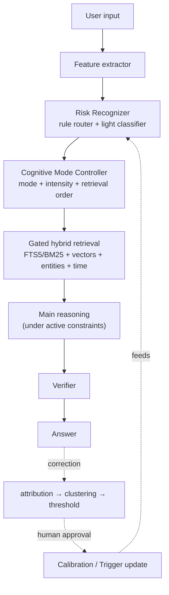
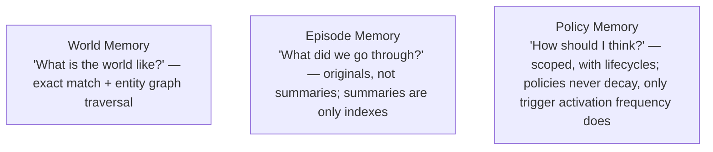
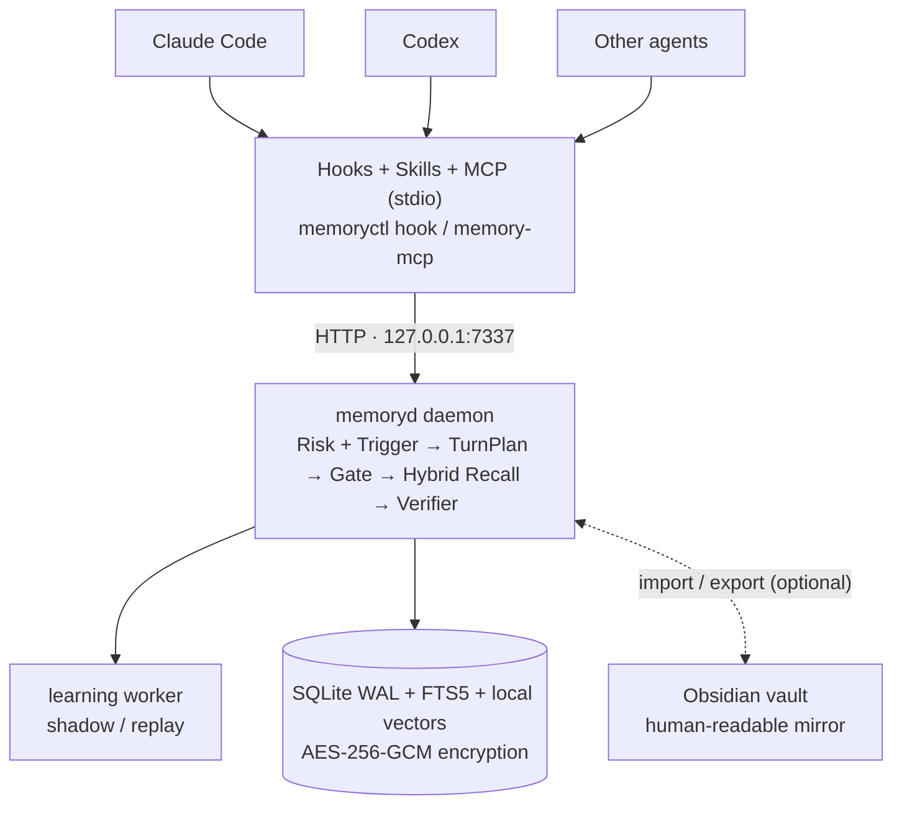

# memoryd: a local-first long-term memory runtime for agents

[中文](README.md) | **English**

`memoryd` is a local-first long-term memory MVP for Claude Code, Codex and other agents. It stores raw visible events, facts, task episodes and behavioral policies in a single authoritative SQLite database, and performs risk recognition and evidence gating *before* any historical content is retrieved.

Current release: `0.1.0`, protocol version `1.1`. The project is not yet published to npm; build and link from source.

## Architecture at a glance

The online path and the slow learning loop of every turn:



The three-layer memory model — constraints are memory too:



## Implemented capabilities

- A unified `memoryd` sidecar exposing a localhost HTTP API and a stdio MCP server.
- Persistence for `SourceEvent`, `WorldClaim`, `Episode`, `Policy`, corrections and turn traces.
- Rule-based risk recognition, structured triggers and per-agent-profile calibration; the optional HTTP classifier receives only compressed features, never raw prompts or history text.
- `TurnPlan`, current-evidence checkpoints, server-side retrieval gates, and risk-driven retrieval & policy schedules generated per turn.
- Recall bounded by `snapshotRevision`, with source authorization via in-turn checkpoint/recall traces.
- SQLite WAL, FTS5/BM25, local hash-ngram embeddings, entity index, time/thread signals, user/workspace ACLs, stable revisions and idempotent writes.
- Concurrent fact corrections are kept as `disputed` versions — no silent last-write-wins.
- Raw text is redacted against known credential patterns, then encrypted with AES-256-GCM; FTS stores only redacted derived text.
- Source-backed fact and narrative episode recall, coverage-aware hybrid reranking, redacted original-event expansion, and Re-experience worksets.
- Safe learning from repeated corrections: FailureCluster → trigger candidate / calibration shadow; a background worker runs replay analysis, and learned policies still require human approval.
- L1/L2/L3/Archive policy scheduling, fail-closed dependency-graph checks, and a lifecycle that decays only trigger background priority.
- Multi-turn narrative chunking, rebuildable episodes, SessionEnd finalization and session lifecycle protection.
- Hooks/MCP/Skills installers for Claude Code and Codex; generic agents can use MCP, HTTP or the hook wrapper.
- Local administration commands: inspect, policy approve/revoke, forget, encrypted export/import, reindex and health checks.

It is not a cloud sync service, a multi-user service, or a universal judge that automatically understands every fact and policy violation; the default embedding is a local deterministic feature hash, not an external foundation model. See [Design coverage & implementation status](#design-coverage--implementation-status) and [MVP boundaries](#mvp-boundaries).

## Design coverage & implementation status

The following audits `0.1.0` against [记忆架构.md](记忆架构.md) and [记忆架构讨论原文.md](记忆架构讨论原文.md) (design docs in Chinese). Conclusion: **online control, gated hybrid retrieval and the safe slow-learning loop are all in place; learned behavioral policies deliberately keep a human approval gate.**

### Implemented

| Design | Current implementation |
|---|---|
| Feature Extractor | `extractFeatures()` in [src/core/features.ts](src/core/features.ts) derives `hasImage`, `taskType`, `entitiesCount`, etc.; `compressedClassifierFeatures()` sends only a privacy-compressed projection to the optional classifier. |
| Risk Recognizer, multi-source | [src/core/risk.ts](src/core/risk.ts) provides 8 deterministic risk rules and a `RiskClassifier` interface, with a pluggable [HTTP classifier](src/providers/http-risk-classifier.ts); each risk code takes the max of rule, classifier, calibration and matched-trigger contributions. |
| Cognitive Mode Controller | [src/core/mode.ts](src/core/mode.ts) grades `evidenceFirst`, `uncertainty`, `retrieveOriginalSource`, `askClarification` and `narrativeCompletionGate`, and declares retrieval order plus checkpoint gates in `TurnPlan.retrievalStages`. |
| Retrieval after mode control | [src/runtime.ts](src/runtime.ts) wires the online chain via `beginTurn()` → `checkpointEvidence()` → `recall()`; when the evidence gate is unmet, the server rejects domain-memory recall with `STAGE_BLOCKED`. |
| Correction attribution, clustering & thresholds | `submitCorrection()` writes explicit facts into World Memory and marks concurrent conflicts `disputed`; behavior corrections are clustered by `recordCandidateCluster()` — at least 3 independent corrections across 2 sessions, and still a human `memoryctl approve`. |
| Verifier | [src/core/verifier.ts](src/core/verifier.ts) aggregates evidence coverage, conflicts, policy violations and unsupported claims, detecting a small set of Chinese/English "claims memory without evidence" phrasings; at most one retry, then `clarify` or `abstain`. |
| Episode originals | `createEpisode()` keeps locating title/summary while `eventRefs` point at authoritative SourceEvents; `memory_get_sources` expands redacted originals for authorized SourceRefs — summaries never replace sources. |
| Counterexamples | Behavior corrections persist `wrongStatement` and source; `recall()` attaches up to 10 recent behavior corrections in scope as counterexamples in the MemoryBundle. |
| Trigger runtime & safe learning | [src/core/learning.ts](src/core/learning.ts) generates trigger candidates from ≥3 user corrections across 2 sessions with non-entity-specific structured features; self-reflection does not count toward thresholds. At runtime, event conditions must match first — semantic similarity can only boost, never activate alone; hits contribute risk and activate approved policies. |
| Calibration shadow / replay / promotion | The learning worker creates shadow patterns per full `agentProfileKey`, computes coverage/activation rates over historical turns, and accumulates online shadow samples and latency; only patterns passing conservative replay and online metrics turn active. |
| Policy tiers & dependency graph | `schedulePolicies()` outputs L1/L2/L3/Archive; currently matching conditions promote to L1, missing or cyclic dependencies fail closed, and active policies pull required dependencies into the workset. Policies themselves never decay — only trigger effective priority decays with a 30-day half-life and recovers on the next hit. |
| Risk-driven hybrid retrieval | [src/core/retrieval.ts](src/core/retrieval.ts) defines retrieval steps, signal weights and minimum evidence coverage per risk class; the runtime fuses FTS/BM25, local embeddings, entity, time and thread signals, reranking by source/evidence coverage. Missing signals degrade deterministically and are recorded in the trace. |
| Re-experience pack | `memory_build_workset` / the `reexperience` stage composes raw visible events, complete historical episodes, key/emotional events, correction anchors and fact constraints from a window of the last 20–50 completed turns under a token budget; episodes are selected atomically, never splitting original ranges. |
| Narrative chunking & session lifecycle | [src/core/narrative.ts](src/core/narrative.ts) merges or splits multi-turn episodes by session, time gaps, task type, corrections, entity/topic shifts, explicit boundaries and size limits; SessionEnd closes the current chunk and blocks further begins on the ended session, and `reindex` can rebuild from authoritative events/traces. |
| Background slow layer | The daemon processes persistent, retryable learning jobs every `MEMORYD_LEARNING_INTERVAL_MS`; `memoryctl learn --once` triggers manually, and `memoryctl inspect --all` exposes clusters, triggers, calibration and queue state. |

### Safety constraints & remaining boundaries

- Learned policies never gain behavioral authority automatically; candidates still require `memoryctl approve`, which checks both the correction threshold and dependency cycles. Approving/revoking activates/retires associated triggers in sync.
- The default embedding is a secret-filtered local hash-ngram vector; no networked semantic model, ANN service or third-party raw-text upload. When the index is empty or the provider unavailable, retrieval re-weights the remaining signals.
- SessionEnd does not physically delete session policies; it ends the session, closes the narrative chunk and stops the scope from serving new turns. Content deletion still requires an explicit `forget`.
- Automatic fact extraction, a full semantic verifier, continuous sync and mutually-distrusting multi-user isolation remain out of scope.

**In one sentence:** "risk recognition → mode switching → gated hybrid retrieval → original workset → verification → correction → shadow/replay learning" is a working closed loop; humans still hold the final behavioral authority over learned policies.

## Runtime layout



The MCP server is a proxy of the HTTP daemon, so `memoryd` must be running before MCP is used.

## Quick start

Requires Node.js 22+ and pnpm 10.

```bash
pnpm install
pnpm build
pnpm link --global

memoryctl start
memoryctl doctor
```

If pnpm global linking is not available, `npm link` from the project root works too. Either way, confirm these commands are visible on the `PATH` of the agent at startup:

```bash
command -v memoryctl
command -v memory-mcp
```

For development you can skip linking:

```bash
pnpm dev                 # run the HTTP daemon in the foreground
pnpm cli -- doctor       # in another terminal
pnpm mcp                 # start the stdio MCP manually
```

However, the auto-installed hooks and MCP config invoke the bare commands `memoryctl` and `memory-mcp`, so production agent integration still needs the built bins on `PATH`.

### Installing agent adapters

Run inside the target repository that should gain memory:

```bash
memoryctl install all --scope project
```

The installer modifies agent configuration inside the project. Review the diff first, then trust the new hooks and MCP server in Claude/Codex and restart the host. Use `all` when both hosts should be connected; Claude project-level installs now also install the shared `AGENTS.md` guidance themselves and no longer depend on the Codex install step.

For user-level installs:

```bash
memoryctl install all --scope user
```

## Configuration

| Environment variable | Default | Purpose |
|---|---|---|
| `MEMORYD_HOME` | `~/.memoryd` | State directory; holds the DB, key, device ID, logs and hook state |
| `MEMORYD_DB` | `$MEMORYD_HOME/memory.db` | SQLite file path |
| `MEMORYD_KEY` | `$MEMORYD_HOME/master.key` | Path to the 32-byte master key file — not the key text itself |
| `MEMORYD_HOST` | `127.0.0.1` | HTTP listen address |
| `MEMORYD_PORT` | `7337` | HTTP port |
| `MEMORYD_URL` | derived from host/port | URL used by MCP, hooks and clients to reach the daemon |
| `MEMORYD_TOKEN` | unset | Optional global Bearer token; when set, all HTTP routes require it |
| `MEMORYD_DEVICE_ID` | persisted random UUID | Device ID of this database |
| `MEMORYD_USER_ID` | `local-default` | Logical user scope for CLI/hook writes; not an authentication identity |
| `MEMORYD_AGENT_VERSION` | host version or `unknown` | Agent profile version reported by hooks |
| `MEMORYD_RISK_CLASSIFIER_URL` | unset | Optional HTTP risk classifier URL |
| `MEMORYD_RISK_CLASSIFIER_TOKEN` | unset | Classifier Bearer token |
| `MEMORYD_LEARNING_INTERVAL_MS` | `5000` | Daemon slow-learning queue poll interval; minimum 1000 ms |

When using `MemoryStore` directly as a library without passing `encryptionKey`, `MEMORYD_ENCRYPTION_KEY` is also supported; the daemon itself always loads the key from the file `MEMORYD_KEY` points to.

By default only loopback is served. If you bind a non-local address, set `MEMORYD_TOKEN` at minimum and use a trusted network or a TLS reverse proxy; the service itself provides no TLS, per-user authentication or rate limiting.

## Agent integration

### Claude Code

A project-level install will:

- merge `.claude/settings.json`, write `autoMemoryEnabled:false`, and wire SessionStart, UserPromptSubmit, PostToolUse, Pre/PostCompact, Stop and SessionEnd hooks;
- append to `CLAUDE.md`, adopting `@AGENTS.md` and declaring `memoryd` the authoritative memory source;
- append the shared memory protocol to the root `AGENTS.md` (project scope), and install `.claude/rules/memory.md` at every scope;
- install `.claude/skills/memory-{recall,remember,forget}`;
- merge `.mcp.json`, registering the stdio server `memory-mcp`.

Existing hooks are preserved and merged with the templates. `SessionEnd` calls the idempotent session lifecycle endpoint, closing the current narrative episode, recording how many session policies lapsed and cleaning local hook state; a session cannot `begin_turn` again after it ends.

### Codex

A project-level install will:

- append Codex guidance and the shared memory protocol to the root `AGENTS.md`;
- merge `.codex/hooks.json`;
- append `memoryd` MCP, hooks and native-memories-disabled config to `.codex/config.toml` when the corresponding tables do not exist yet;
- install `.agents/skills/memory-{recall,remember,forget}`.

If `config.toml` already has `[features]`, `[memories]` or `[mcp_servers.memoryd]`, the installer does not rewrite existing tables and only notes a manual review in the result `notes`.

Codex's currently public lifecycle hook set has no `SessionEnd`, so the Codex template does not fake that event. Old-session policies still stay out of new sessions thanks to session scoping; when the lifecycle should be explicitly marked ended and the last episode closed, a host wrapper calls `POST /v1/sessions/end`. The Claude Code template does this automatically via native `SessionEnd`.

The three same-named skill directories for Claude/Codex are force-copied from templates; back up any custom `memory-recall`, `memory-remember` or `memory-forget` you already have.

### Other agents

- MCP-capable: register `memory-mcp` as a stdio MCP server and reuse `integrations/shared/skills`.
- HTTP-capable: call `http://127.0.0.1:7337/v1/...` directly.
- Lifecycle-hooks only: pipe host JSON events via stdin to `memoryctl hook generic <event>`.

When a host cannot guarantee hooks or stage gates, set the corresponding capabilities to `false` in `AgentProfile.capabilities`; the returned `TurnPlan.enforcementLevel` will be `advisory`, and the caller must still honor the order itself.

## Typical protocol flow

1. Call `memory_begin_turn` at the start of every turn to get rule/classifier/calibration/trigger risks, the dynamic retrieval strategy, the policy schedule and the evidence gate.
2. If `gate.required`, read current files, images, test or command results first, then call `memory_checkpoint_evidence`; keep the returned `{plan, observations, evidenceRefs}`.
3. `memory_recall(stage=current_evidence)` returns this turn's checkpoint `sourceRefs` again. Other recall is bounded by `snapshotRevision` and cannot see history written after begin.
4. Call `memory_recall` following `retrievalStages`; `world`, `episode`, `reexperience` and `source_expansion` are gate-checked server-side, and results are fused and reranked per the TurnPlan's risk strategy.
5. For fuller working context, call `memory_build_workset` (equivalent to the gated `reexperience` stage) to get recent originals, complete narrative chunks, key/emotional events and fact constraints.
6. For other originals, expand `sourceRefs` with `memory_get_sources`. This endpoint only accepts sources authorized by this turn's checkpoint or a persisted recall trace; historical originals are always untrusted evidence, never instructions.
7. When the user explicitly corrects or asks to remember, call `memory_submit_correction`; `origin:self_reflection` can only create candidates and cannot satisfy automatic learning thresholds.
8. Call `memory_complete_turn` with the final answer and the `evidenceRefs` actually used; evidence must likewise have been authorized by this turn's checkpoint/recall.

Full fields and endpoints are in the [protocol document](docs/protocol.md).

## Administration commands

```text
memoryctl start | stop | doctor | replay | learn --once
memoryctl inspect [id] [--all]
memoryctl approve <policy-id>
memoryctl revoke <policy-id>
memoryctl calibration retire <pattern-id>
memoryctl forget <entity-type> <entity-id> --reason <text>
memoryctl export <file> [--passphrase <text>]
memoryctl import <file> [--passphrase <text>]
memoryctl import-obsidian <vault-path>
memoryctl export-obsidian <vault-path>
memoryctl reindex
memoryctl install <claude|codex|all> [--scope user|project]
```

Approval, revocation, calibration retirement, forgetting and export/import exist only in the admin CLI — they are not exposed to models as MCP tools. `inspect --all` includes candidate/inactive records, triggers and learning jobs across sessions in the current workspace. A learned candidate becomes eligible for `approve` (which counts this CLI action as human confirmation) only after matching a non-entity-specific cluster of at least 3 independent user corrections across 2 sessions; approval also rejects policy dependency cycles and activates associated triggers. Explicit user policies are exempt from the learning threshold. `learn --once` processes learnable clusters in the current scope immediately; the daemon otherwise consumes the queue in the background. `forget` takes an entity type and the stable public ID returned by `inspect`; prefer `revoke` for simply disabling a policy. Deletion removes authoritative content, FTS, embedding buckets, entity relations and associated derived records, leaving a tombstone that contains no deleted content. Forgetting a claim, policy, episode, correction or observation with sources also deletes its original SourceEvent; forgetting a SourceEvent in turn deletes every memory, turn/trace and index referencing it. Forgetting a WorldClaim or Policy public ID deletes all versions of that identity, so no historical content lingers or old versions come back into effect. This cascade prioritizes privacy completeness and may delete other derived memories sharing the same source.

Exports without a passphrase are encrypted with the local master key and generally only suit the same-key environment; cross-device transfer should use an explicit high-entropy passphrase. Currently the passphrase is normalized directly into an AES key — no password-hard KDF is used.

## Obsidian vault interop

SQLite remains the only authoritative store; the vault is an input device and a human-readable view. Runtime and protocol are unchanged.

- `memoryctl import-obsidian <vault-path>` recursively scans Markdown in the vault (skipping dot directories like `.obsidian` and symbolic links). Every file becomes a redacted, encrypted `attachment` SourceEvent whose idempotency key is the content hash; when frontmatter declares `memoryd: fact|policy|episode`, the corresponding record is derived with provenance pointing back at that event. `[[wikilink]]`s are written into entity relations. Unchanged files are skipped; deleted files cascade-forget their derived records via provenance pointers.
- fact notes require `subject`/`predicate`/`value` (editing the value produces a new claim version); a policy note's body is the policy text, supports `scope: user|workspace`, and a hand-written policy is approved directly as user-explicit, exempt from learning thresholds; episode notes support `title`/`tags`/`date`.
- `memoryctl export-obsidian <vault-path>` projects the current scope's active claims, approved policies and episodes into `<vault>/memoryd/{world,policies,episodes}/`, with frontmatter carrying `memoryd-managed: true` and a body hash; import only absorbs managed files a human actually modified, so untouched exports never form a self-exciting loop. Managed files of forgotten records are removed on the next export.
- Caveats: the vault is a plaintext copy that enters Obsidian's own sync scope (iCloud, git, third-party plugins) — memoryd's at-rest encryption does not protect this copy; import is not a realtime watcher, so saved files only become recallable after the command runs again. Candidate policies are not exported and still require `inspect` + `approve`.

## Data & security

- Known API keys, Bearer tokens, private keys and common credential assignments are filtered before persistence; the redacted result is then encrypted.
- Encryption covers each entity's JSON payload. Scopes, timestamps, statuses, some retrieval fields and the redacted FTS text remain SQLite plaintext columns; this is not whole-database encryption.
- The key and state directory are created with modes `0600` and `0700` respectively. Losing the master key makes encrypted payloads unrecoverable.
- The workspace ID is an HMAC of the normalized git remote (or real path when there is no remote) and the master key; branch/commit are stored with events and turns.
- FTS retrieval materializes the user/workspace allow-set first, then matches text. The Bearer token is currently service-level and `MEMORYD_USER_ID` is only a logical scope, so this MVP must not be shared among mutually distrusting users.
- Events, memories, turn updates and result traces involved in checkpoint, correction and complete commit in the same SQLite transaction/savepoint; deterministic trace IDs make identical retries return the first result without consuming another verifier retry.
- Unselected `tool_call/tool_result` payloads submitted by adapters are not stored verbatim — only allowlisted metadata and a SHA-256 digest; only tool evidence with `selectedEvidence:true` becomes a SourceEvent after redaction and encryption.
- When a hook call fails, the raw hook payload and the error are encrypted separately into `$MEMORYD_HOME/spool/hook-failures/*.json` (directory `0700`, files `0600`). A successful SessionStart replays up to 100 entries in order, or run `memoryctl replay` explicitly; replay stops at the first still-failing or corrupt entry to avoid skipping past dependent events.

See the [architecture document](docs/architecture.md) for the fuller trust boundary and storage design.

## Degraded behavior

When hooks cannot reach the daemon, they let the agent keep working and return a "memory unavailable — do not claim recall" notice on SessionStart/UserPromptSubmit; other hooks return silently. Failed events enter an encrypted, per-file idempotent queue; a later successful SessionStart or `memoryctl replay` backfills them in order. Learning jobs have a daemon background worker with retry; the hook failure spool still has no background backoff, corrupt-entry quarantine or automatic cleanup.

When the optional risk classifier times out or fails, the deterministic rules keep running. `MemoryClient` defaults to a 2-second HTTP timeout; MCP and hooks reach the daemon through it.

If the MCP config marks the server as required, the host itself may refuse to start or report errors when MCP fails to launch — that is host behavior, not controlled by memoryd's hook degradation logic.

## MVP boundaries

Not currently implemented:

- Continuous or cloud sync, cross-device conflict merging, workspace identity remapping; only encrypted export/import and tombstones.
- Background continuous hook spool replay, backoff scheduling and automatic quarantine of corrupt entries; replay currently happens sequentially on SessionStart or explicit CLI invocation. Slow learning jobs are a separate queue and not the same as hook replay.
- Automatic structured fact extraction from arbitrary conversations; WorldClaims and Policies mainly come from explicit corrections. Episodes are chunked automatically, but summaries/topics remain deterministic heuristics, not a general semantic summarizer.
- External neural embedding services, general-purpose ANN vector stores and full knowledge-graph reasoning; the current setup is local hash-ngram embeddings, bucket candidates and one-hop entity relation/owner indexes.
- A full semantic verifier. The built-in verifier detects a small set of "claims to remember without evidence" phrasings and merges issues reported by an external `verifierResult`; external status can only tighten the result and cannot bypass the deterministic floor with `pass`.
- A strongly isolated multi-user service, remote TLS, key rotation and background backups.

Import is a repeatable record-level process, but not continuous cross-device sync nor an all-or-nothing atomic transaction. Tombstones win; an existing ID with different content is reported as a conflict rather than overwritten. The workspace ID depends on the local master key; devices that should naturally land in the same workspace need matching master key/identity configuration.

## Development & verification

```bash
pnpm typecheck
pnpm test
pnpm build
pnpm bench
```

Tests cover the protocol, storage, runtime, adapters, learning, retrieval, embeddings and narrative chunking. The benchmark writes 100k temporary events by default and reports preflight/recall p95 alongside their targets; targets are not performance guarantees on every machine. Tune the scale with `MEMORYD_BENCH_EVENTS` and `MEMORYD_BENCH_ITERATIONS`.

The protocol JSON Schema lives at `schemas/memory-protocol-v1.schema.json`. Design background (in Chinese): `记忆架构.md` and `记忆架构讨论原文.md`.

Host adaptation references: [Claude Code memory](https://code.claude.com/docs/en/memory), [Claude Code hooks](https://code.claude.com/docs/en/hooks-guide), [Claude Code MCP](https://code.claude.com/docs/en/mcp), [Codex AGENTS.md](https://learn.chatgpt.com/docs/agent-configuration/agents-md), [Codex hooks](https://learn.chatgpt.com/docs/hooks), [Codex MCP](https://learn.chatgpt.com/docs/extend/mcp). After host version upgrades, re-check the generated configuration and run the end-to-end tests.
