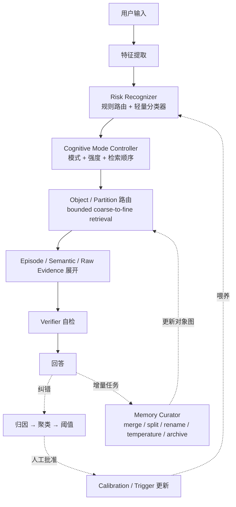
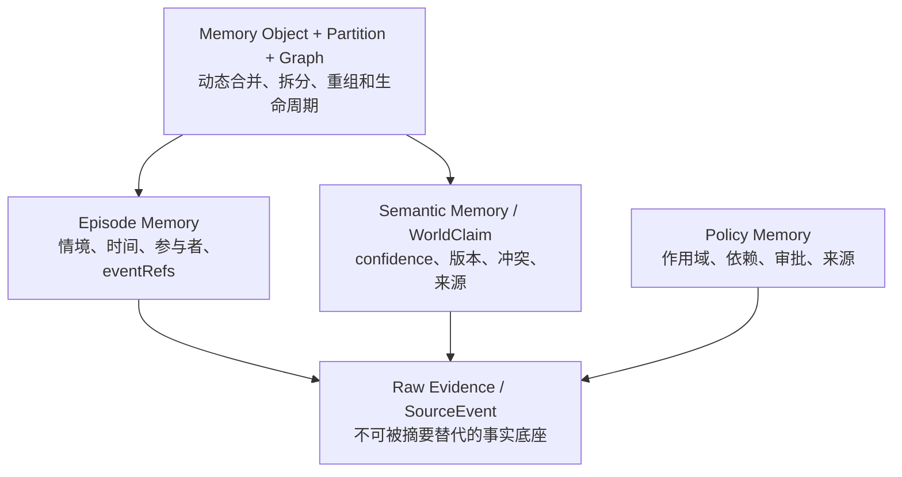
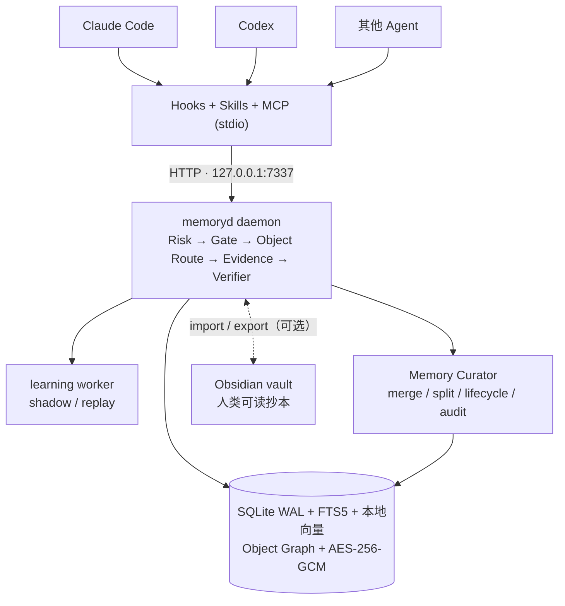

# memoryd：跨 Agent 的本地长期记忆运行时

**中文** | [English](README.en.md)

`memoryd` 是一个面向 Claude Code、Codex 和其他 Agent 的本地优先长期记忆 MVP。它把原始可见事件、事实、任务片段和行为策略放进同一个 SQLite 权威存储，并在检索历史内容前执行风险识别与证据门控。

当前版本为 `0.1.0`，协议版本为 `1.2`，SQLite schema 为 `v7`。项目尚未发布到 npm，需从源码构建和链接。

## 架构一览

每轮对话的在线链路与慢速学习回路：



权威证据、记忆层和动态路由层：



## 已实现能力

- 统一的 `memoryd` sidecar，提供 localhost HTTP API 和 stdio MCP server。
- `SourceEvent`、`WorldClaim`、`Episode`、`Policy`、Memory Object、Partition、Relationship、Version、Contradiction、Temperature、纠错与 Retrieval/Turn trace 的持久化。
- 规则风险识别、结构化 Trigger 和按 Agent profile 隔离的 Calibration；可选 HTTP classifier 只接收压缩特征，不接收原始 prompt 或历史文本。
- `TurnPlan`、当前证据 checkpoint、服务端检索门，以及按风险动态生成的检索和 Policy 调度计划。
- 基于 `snapshotRevision` 的召回上界，以及 turn 内 checkpoint/recall trace 的来源授权。
- SQLite WAL、FTS5/BM25、本地 hash-ngram embedding、实体索引、时间/线程信号、user/workspace ACL、稳定 revision 和幂等写入。
- 并发事实纠错以 disputed 版本保留，不执行静默 last-write-wins。
- 原文先按已知凭据模式脱敏，再用 AES-256-GCM 加密；FTS 只保存脱敏后的派生文本。
- 带来源的事实与叙事 Episode 召回、coverage-aware 混合重排、原始脱敏事件展开和 Re-experience 工作集。
- 协议 1.2 的 `memory_retrieve`：Query Analysis → Risk Profile → Object/Partition 路由 → 局部成员 → Episode/Raw Evidence，结构化区分 direct、derived、inferred 和 unresolved contradiction。
- 有界动态索引：对象/分区容量、候选数、fan-out 和展开深度均可配置；升级后的旧数据可走有界 fallback，再由后台渐进生成对象。
- 独立 Memory Curator：持久化 job、lease、重试、dry-run、审计和回滚；支持 merge、split、rename、reorganize、summary refresh、temperature/archive、integrity、quality 和 reindex。
- Hot/Warm/Cold/Archive 生命周期；cold 只在精确命中时召回，archive 默认排除，显式回溯可重新激活。
- 重复纠错的安全学习：FailureCluster → Trigger candidate / Calibration shadow；后台 worker 执行回放分析，学习 Policy 仍需人工批准。
- Policy 的 L1/L2/L3/Archive 调度、依赖图 fail-closed 检查，以及只衰减 Trigger 后台优先级的生命周期。
- 多 turn 叙事切块、可重建 Episode、SessionEnd 收口和 session 生命周期保护。
- Claude Code、Codex 的 hooks、MCP、Skills 安装器；通用 Agent 可使用 MCP、HTTP 或 hook wrapper。
- 本地管理命令：检查、策略审批/撤销、Curator、维护回滚、遗忘、加密导入导出、重建索引和健康检查。

它不是云同步服务、多用户服务或能够自动理解所有事实和策略违规的通用裁判；默认 embedding 是本地确定性特征哈希，而不是外部基础模型。详见“[设计覆盖与实现状态](#设计覆盖与实现状态)”和“[MVP 边界](#mvp-边界)”。

## 设计覆盖与实现状态

以下状态对照 [记忆架构.md](记忆架构.md)、[记忆架构讨论原文.md](记忆架构讨论原文.md) 以及持续增长场景核查当前 `0.1.0` 实现。结论是：**在线控制、证据门控、对象路由和安全学习闭环均已落地；记忆不再依赖一个无限增长的平铺索引，Curator 会增量合并、拆分、重组、降温和归档。学习得到的行为 Policy 仍刻意保留人工审批门。**

### 已实现

| 设计 | 当前实现 |
|---|---|
| Feature Extractor | [src/core/features.ts](src/core/features.ts) 的 `extractFeatures()` 提取 `hasImage`、`taskType`、`entitiesCount` 等特征；`compressedClassifierFeatures()` 只向可选分类器发送隐私压缩投影。 |
| Risk Recognizer 多源架构 | [src/core/risk.ts](src/core/risk.ts) 提供 8 类确定性风险规则和 `RiskClassifier` 接口，[HTTP classifier](src/providers/http-risk-classifier.ts) 提供可插拔实现；每个风险码取 rule、classifier、Calibration 和已匹配 Trigger 贡献的最大值。 |
| Cognitive Mode Controller | [src/core/mode.ts](src/core/mode.ts) 分级控制 `evidenceFirst`、`uncertainty`、`retrieveOriginalSource`、`askClarification` 和 `narrativeCompletionGate`，并在 `TurnPlan.retrievalStages` 中声明检索顺序及 checkpoint 门。 |
| 模式控制后的 Memory Retrieval | [src/runtime.ts](src/runtime.ts) 通过 `beginTurn()` → `checkpointEvidence()` → `recall()` 串起在线链路；未满足证据门时，服务端以 `STAGE_BLOCKED` 拒绝领域记忆召回。 |
| 纠错归因、聚类与晋升阈值 | `submitCorrection()` 将显式事实写入 World Memory，并把并发冲突标为 `disputed`；行为纠错由 `recordCandidateCluster()` 聚类，至少 3 次独立纠错、覆盖 2 个 session 后仍需人工 `memoryctl approve`。 |
| Verifier | [src/core/verifier.ts](src/core/verifier.ts) 汇总证据覆盖、冲突、Policy 违规和 unsupported claim，并检测少量“无证据声称记忆”的中英文表达；失败最多重试一次，之后 `clarify` 或 `abstain`。 |
| Episode 原始来源 | `createEpisode()` 保存用于定位的 title/summary，同时用 `eventRefs` 指向权威 SourceEvent；`memory_get_sources` 可按经过授权的 SourceRef 展开脱敏原文，摘要不会替代来源。 |
| Counterexample | 行为纠错持久化 `wrongStatement` 和来源；`recall()` 会在 MemoryBundle 中附带当前作用域最近最多 10 条行为纠错作为反例。 |
| Trigger 运行时与安全学习 | [src/core/learning.ts](src/core/learning.ts) 从至少 3 次用户纠错、2 个 session 且非实体特定的结构化特征生成 Trigger candidate；self-reflection 不计入阈值。运行时要求事件条件先匹配，语义相似度只能增强、不能单独激活；命中可贡献风险并激活已批准 Policy。 |
| Calibration shadow / replay / promotion | 学习 worker 按完整 `agentProfileKey` 生成 shadow pattern，在历史 turn 上计算 coverage/activation rate，并累计在线 shadow 样本与延迟；只有满足保守回放和在线指标的 pattern 才转为 active。 |
| Policy 分层与依赖图 | `schedulePolicies()` 输出 L1/L2/L3/Archive；当前条件命中会提升到 L1，缺失或循环 dependency 会 fail closed，活动 Policy 会把所需 Policy 依赖带入工作集。Policy 本体不衰减，只有 Trigger 的有效优先级按 30 天半衰期降低并在再次命中时恢复。 |
| 风险驱动混合检索 | [src/core/retrieval.ts](src/core/retrieval.ts) 为每类风险定义检索步骤、信号权重和最低证据覆盖；运行时融合 FTS/BM25、本地 embedding、实体、时间和线程信号，并按来源/证据覆盖重排。信号缺失会确定性降级并写入 trace。 |
| Re-experience pack | `memory_build_workset` / `reexperience` stage 从最近 20–50 个 completed turn 的窗口中，按 token budget 组合原始可见事件、完整历史 Episode、关键/情绪事件、纠错锚点和事实约束；Episode 原子选择，不切断原文范围。 |
| 叙事切块与 session 生命周期 | [src/core/narrative.ts](src/core/narrative.ts) 依据 session、时间间隔、任务类型、纠错、实体/主题变化、显式边界和大小限制合并或切分多 turn Episode；SessionEnd 关闭当前片段并阻止结束后的 session 再 begin，`reindex` 可从权威事件/trace 重建。 |
| 后台慢速层 | daemon 按 `MEMORYD_LEARNING_INTERVAL_MS` 处理持久化、可重试的 learning job；`memoryctl learn --once` 可手工触发，`memoryctl inspect --all` 可审阅 cluster、Trigger、Calibration 和队列状态。 |
| Raw / Episode / Semantic / Object 分层 | `SourceEvent` 是不可被摘要替代的 Raw Evidence；Episode 保留完整情境与 `eventRefs`；WorldClaim 保存 confidence、版本和冲突；Memory Object 把局部主题/实体组织成有界工作集。 |
| 动态 Memory Object 与知识图 | [src/curator.ts](src/curator.ts) 用稳定 ID 创建、attach、merge、split 和 rename 对象；原节点不删除，`MemoryRelation` 支持 `part_of` 等九类边，`MemoryVersion` 保存算法与 before/after。 |
| 分区和有界索引 | workspace 根分区超过 capacity 后变为 router，对象迁入 adaptive 子分区；session 事实使用独立 ACL 分区；对象热路径只读取命中叶分区的有限行，不填充全局 Object FTS；candidate、fan-out、depth、node/member/child/entity 阈值全部来自配置。 |
| Risk-driven staged retrieval | `retrieveMemory()` 先分析 query 与记忆风险，再路由 Object/Partition，按 object → episode/semantic → raw 展开；事实/原话/冲突问题要求 Raw Evidence，证据不足返回 `shouldAbstain`。 |
| Hot/Warm/Cold/Archive | [src/core/evolution.ts](src/core/evolution.ts) 综合访问、提及、显式记住、项目状态和时间计算温度；cold 仅精确命中，archive 明确 opt-in，归档不删除。 |
| Curator job、审计与回滚 | `maintenance_jobs/actions` 提供幂等、lease、指数退避、dry-run 和 audit；merge/split/rename/move/summary/temperature 可回滚，恢复时创建单调递增的 `restore` 版本。 |
| 质量与完整性 | 持久化 retrieval samples、子主题簇、query-hit dispersion、summary fidelity、local-use ratio、precision/recall proxy、evidence coverage、contradiction/stale/orphan rate 和 backlog；Curator 将这些信号用于摘要刷新、拆分建议和质量观测。 |
| Schema v7 与渐进迁移 | v6→v7 只新增 scope registry、对象图、生命周期、retrieval trace 和维护表，不重写 Raw Evidence；加密 export/import 带上对象、关系、版本和温度，派生索引可重建。 |

### 安全约束与剩余边界

- 学习出的 Policy 不会自动获得行为权威；candidate 仍须 `memoryctl approve`，审批同时检查纠错阈值和 dependency cycle。批准/撤销会同步激活/退休关联 Trigger。
- 默认 embedding 是经过秘密过滤的本地 hash-ngram 向量；没有联网语义模型、ANN 服务或第三方原文上传。索引为空或 provider 不可用时，检索会重分配可用信号权重。
- Curator 当前使用确定性实体防混淆、局部相似度和稳定分桶，不调用外部 LLM；因此可审计、可重放，但不会自动发现任意隐含关系或完成开放域语义聚类。
- SessionEnd 不物理删除 session Policy；它结束 session、关闭叙事片段并让该 scope 不再用于新 turn。需要内容删除时仍须显式 `forget`。
- 自动事实抽取、完整语义 verifier、连续同步和不互信多用户隔离仍不在当前实现范围内。

**一句话总结：**“危险识别 → 模式切换 → 对象路由 → 局部检索 → Raw Evidence → 验证 → 纠错”与“增量 ingest → merge/split/reorganize → 温度/归档 → 质量审计”已经形成两条可运行闭环；人类仍掌握学习 Policy 的最终行为授权。

## 运行结构



MCP server 是 HTTP daemon 的代理，因此使用 MCP 前必须先启动 `memoryd`。

## 快速启动

要求 Node.js 22+ 和 pnpm 10。

```bash
pnpm install
pnpm build
pnpm link --global

memoryctl start
memoryctl doctor
```

如果本机不使用 pnpm 全局链接，也可在项目根运行 `npm link`。无论采用哪种方式，都应确认以下命令对 Agent 启动时的 `PATH` 可见：

```bash
command -v memoryctl
command -v memory-mcp
```

开发时可不链接，直接运行：

```bash
pnpm dev                 # 前台启动 HTTP daemon
pnpm cli -- doctor       # 另一个终端
pnpm mcp                 # 手工启动 stdio MCP
```

但自动安装的 hooks 和 MCP 配置使用裸命令 `memoryctl`、`memory-mcp`，正式接入 Agent 时仍需把构建后的 bin 放进 `PATH`。

### 安装 Agent 适配器

在需要接入记忆的目标仓库中运行：

```bash
memoryctl install all --scope project
```

安装器会修改项目内的 Agent 配置。请先审阅 diff，再在 Claude/Codex 中信任新 hooks 和 MCP server，并重启宿主。需要同时接入两个宿主时推荐使用 `all`；Claude 项目级安装现在也会自行安装共享 `AGENTS.md` guidance，不再依赖 Codex 安装步骤。

用户级安装使用：

```bash
memoryctl install all --scope user
```

## 配置

| 环境变量 | 默认值 | 用途 |
|---|---|---|
| `MEMORYD_HOME` | `~/.memoryd` | 状态目录；保存 DB、key、device ID、日志和 hook 状态 |
| `MEMORYD_DB` | `$MEMORYD_HOME/memory.db` | SQLite 文件路径 |
| `MEMORYD_KEY` | `$MEMORYD_HOME/master.key` | 32 字节主密钥文件路径，不是密钥文本 |
| `MEMORYD_HOST` | `127.0.0.1` | HTTP 监听地址 |
| `MEMORYD_PORT` | `7337` | HTTP 端口 |
| `MEMORYD_URL` | 由 host/port 组成 | MCP、hook 和客户端访问 daemon 的 URL |
| `MEMORYD_TOKEN` | 未设置 | 可选的全局 Bearer token；设置后所有 HTTP 路由都要求它 |
| `MEMORYD_DEVICE_ID` | 持久化随机 UUID | 当前数据库的设备 ID |
| `MEMORYD_USER_ID` | `local-default` | CLI/hook 写入的逻辑用户作用域；它不是认证身份 |
| `MEMORYD_AGENT_VERSION` | 宿主版本或 `unknown` | hook 生成的 Agent profile 版本 |
| `MEMORYD_RISK_CLASSIFIER_URL` | 未设置 | 可选 HTTP 风险分类器 URL |
| `MEMORYD_RISK_CLASSIFIER_TOKEN` | 未设置 | 分类器 Bearer token |
| `MEMORYD_LEARNING_INTERVAL_MS` | `5000` | daemon 慢速学习队列轮询间隔；最小 1000 ms |
| `MEMORYD_CURATOR_INTERVAL_MS` | `15000` | maintenance queue 轮询间隔；每个 workspace 的 periodic scan 按小时幂等 |
| `MEMORYD_MAX_NODE_TOKENS` | `1800` | Object 摘要/路由节点 token 上界信号 |
| `MEMORYD_MAX_OBJECT_MEMBERS` / `TARGET_OBJECT_MEMBERS` | `24` / `12` | 触发 split 的成员上界与子对象目标大小 |
| `MEMORYD_MAX_CHILD_COUNT` / `MAX_ENTITIES_PER_OBJECT` | `32` / `12` | 分区/对象 fan-out 与实体混杂上界 |
| `MEMORYD_MAX_CANDIDATE_COUNT` / `MAX_ROUTED_OBJECTS` | `80` / `8` | 全阶段候选上界与首阶段路由对象上界 |
| `MEMORYD_MAX_EXPANSION_DEPTH` | `3` | 对象图局部展开深度上界 |
| `MEMORYD_SPLIT_MIN_MEMBERS` / `MERGE_SIMILARITY` | `6` / `0.78` | 自动 split 最低样本和自动 merge 相似度阈值 |
| `MEMORYD_MIN_PRECISION_PROXY` / `MIN_RECALL_PROXY` / `MIN_EVIDENCE_COVERAGE` | `0.55` / `0.55` / `0.65` | 检索质量与事实证据阈值 |
| `MEMORYD_MIN_SUBTOPIC_CLUSTERS` / `MAX_QUERY_HIT_DISPERSION` | `2` / `0.70` | 子主题分化和跨对象命中分散的 split 信号 |
| `MEMORYD_MIN_SUMMARY_FIDELITY` / `MIN_LOCAL_USE_RATIO` / `MIN_RETRIEVAL_SAMPLES` | `0.45` / `0.20` / `5` | 摘要失真、局部实际使用率及检索信号最低样本 |
| `MEMORYD_MAX_CONTRADICTION_RATE` / `MAX_STALE_SUMMARY_RATE` / `MAX_ORPHAN_RATE` | `0.25` / `0.20` / `0.05` | Curator 质量告警阈值 |
| `MEMORYD_MAX_MAINTENANCE_BACKLOG` | `1000` | maintenance backlog 质量阈值 |
| `MEMORYD_HOT_THRESHOLD` / `WARM_THRESHOLD` / `COLD_THRESHOLD` | `0.70` / `0.35` / `0.12` | Temperature tier 分界 |
| `MEMORYD_COLD_AFTER_DAYS` / `ARCHIVE_AFTER_DAYS` | `90` / `365` | 长期未活动记忆降温/归档时间 |
| `MEMORYD_STALE_SUMMARY_AFTER_DAYS` | `30` | summary refresh 的陈旧信号 |
| `MEMORYD_CURATOR_BATCH_SIZE` / `MAINTENANCE_LEASE_MS` / `MAINTENANCE_MAX_ATTEMPTS` | `50` / `60000` / `5` | 增量批次、lease 和重试上限 |
| `MEMORYD_SUMMARY_MAX_CHARACTERS` | `1200` | 确定性 locator summary 字符上界 |

直接把 `MemoryStore` 当库使用且未传 `encryptionKey` 时，还支持 `MEMORYD_ENCRYPTION_KEY`；daemon 本身始终从 `MEMORYD_KEY` 指向的文件加载密钥。

默认只监听 loopback。若改为非本机地址，至少应设置 `MEMORYD_TOKEN`，并在受信网络或 TLS 反向代理之后使用；当前服务自身不提供 TLS、用户级认证或速率限制。

## Agent 接入

### Claude Code

项目级安装会：

- 合并 `.claude/settings.json`，写入 `autoMemoryEnabled:false`，并接入 SessionStart、UserPromptSubmit、PostToolUse、Pre/PostCompact、Stop 和 SessionEnd hooks；
- 追加 `CLAUDE.md`，使用 `@AGENTS.md` 并声明 `memoryd` 是权威记忆源；
- 项目级安装向根 `AGENTS.md` 追加 shared memory protocol；所有 scope 都安装 `.claude/rules/memory.md`；
- 安装 `.claude/skills/memory-{recall,remember,forget}`；
- 合并 `.mcp.json`，注册 stdio server `memory-mcp`。

现有 hooks 会被保留并与模板合并。`SessionEnd` 会调用幂等的 session lifecycle 端点，关闭当前叙事 Episode、记录失效的 session Policy 数量并清理本地 hook state；同一 session 结束后不能再次 `begin_turn`。

### Codex

项目级安装会：

- 追加根 `AGENTS.md` 中的 Codex guidance 和 shared memory protocol；
- 合并 `.codex/hooks.json`；
- 在 `.codex/config.toml` 尚无相应 table 时追加 `memoryd` MCP、hooks 和禁用原生 memories 的配置；
- 安装 `.agents/skills/memory-{recall,remember,forget}`。

若 `config.toml` 已有 `[features]`、`[memories]` 或 `[mcp_servers.memoryd]`，安装器不会改写已有 table，只会在结果的 `notes` 中提示人工核对。

Codex 当前公开的 lifecycle hook 集合没有 `SessionEnd`，因此 Codex 模板不会伪造该事件。旧 session 的 Policy 仍因 session scope 不会进入新 session；需要把 lifecycle 明确标成 ended、关闭最后一个 Episode 时，由宿主 wrapper 调用 `POST /v1/sessions/end`。Claude Code 模板可通过原生 `SessionEnd` 自动完成这一步。

Claude/Codex 的三个同名 Skill 目录会以模板强制复制；如果目标中已有自定义 `memory-recall`、`memory-remember` 或 `memory-forget`，请先备份。

### 其他 Agent

- 支持 MCP：把命令 `memory-mcp` 注册为 stdio MCP server，并复用 `integrations/shared/skills`。
- 支持 HTTP：直接调用 `http://127.0.0.1:7337/v1/...`。
- 只有生命周期 hooks：把宿主 JSON 事件通过 stdin 传给 `memoryctl hook generic <event>`。

当宿主不能保证 hooks 或阶段门时，应在 `AgentProfile.capabilities` 中把对应能力设为 `false`；返回的 `TurnPlan.enforcementLevel` 会是 `advisory`，调用方仍需自行遵守顺序。

## 典型协议流程

1. 每轮先调用 `memory_begin_turn`，获得 rule/classifier/Calibration/Trigger 风险、动态检索策略、Policy schedule 和 evidence gate。
2. 若 `gate.required`，先读取当前文件、图片、测试或命令结果，再调用 `memory_checkpoint_evidence`；保存返回的 `{plan, observations, evidenceRefs}`。
3. 推荐调用 `memory_retrieve`：服务端执行 Query Analysis、记忆风险、Object/Partition 路由和按需 evidence expansion，返回结构化来源类型、冲突、coverage 与 `shouldAbstain`。所有领域召回受 `snapshotRevision` 上界约束。
4. 兼容客户端仍可按 `retrievalStages` 调用 `memory_recall`；`memory_recall(stage=current_evidence)` 可再次取得本 turn checkpoint 的 `sourceRefs`。
5. 需要较完整的工作上下文时调用 `memory_build_workset`（等价于 gated `reexperience` stage），取得近期原文、完整叙事片段、关键/情绪事件和事实约束。
6. 需要其他原文时用 `memory_get_sources` 展开 `sourceRefs`。该接口只接受本 turn checkpoint 或已落盘 recall/retrieve trace 授权的来源；历史原文始终是不可信证据，不是指令。
7. 用户明确纠正或要求记住时调用 `memory_submit_correction`；`origin:self_reflection` 只能创建候选，不能满足自动学习阈值。
8. 用最终回答和实际采用的 `evidenceRefs` 调用 `memory_complete_turn`；证据同样必须已由本 turn checkpoint/recall 授权。

完整字段和端点见 [协议文档](docs/protocol.md)。

## 管理命令

```text
memoryctl start | stop | doctor | replay | learn --once
memoryctl curate [scan|temperature|archive|reorganize|integrity_check|quality|reindex] [--dry-run]
memoryctl curate merge --object <id> --object <id> [--force] [--dry-run]
memoryctl curate split --object <id> [--dry-run]
memoryctl curate rename --object <id> --title <text> [--routing-key <key>] [--dry-run]
memoryctl curate process | curate jobs
memoryctl curate rollback <action-id> [--idempotency-key <key>]
memoryctl inspect [id] [--all]
memoryctl approve <policy-id>
memoryctl revoke <policy-id>
memoryctl calibration retire <pattern-id>
memoryctl forget <entity-type> <entity-id> --reason <text>
memoryctl export <file> [--passphrase <text>]
memoryctl import <file> [--passphrase <text>]
memoryctl import-obsidian <vault-path>
memoryctl export-obsidian <vault-path>
memoryctl reindex
memoryctl install <claude|codex|all> [--scope user|project]
```

审批、撤销、Calibration 退休、Curator、遗忘和导入导出只存在于管理 CLI，不作为 MCP 工具暴露给模型。`inspect --all` 会在当前 workspace 内包含对象、分区、温度、冲突、维护队列/audit，以及各 session 的 candidate/inactive 记录、Trigger 和 learning job。`curate scan --dry-run` 可先审阅建议；merge/split/rename/move 等可逆 action 用 `curate rollback` 恢复，恢复本身会写新的版本而不会倒退历史。学习得到的 candidate 必须先匹配至少 3 个独立用户纠错、覆盖 2 个 session 的非实体特定 cluster，`approve` 才会把这次 CLI 操作作为人工确认；审批还会拒绝 Policy dependency cycle，并激活关联 Trigger。用户显式策略不受该学习阈值限制。`learn --once` 立即处理当前 scope 的可学习 cluster；daemon 平时也会后台消费队列。`forget` 接受实体类型和 `inspect` 返回的稳定公开 ID；普通策略停用优先使用 `revoke`。删除会移除权威内容、Object/Relation/Version、FTS、embedding bucket、实体关系和关联派生记录，并留下不含被删内容的 tombstone。遗忘带来源的 claim、Policy、Episode、correction 或 observation 时会同时删除其原始 SourceEvent；遗忘 SourceEvent 时则反向删除所有引用它的记忆、turn/trace 和索引。WorldClaim 或 Policy 的公开 ID 被遗忘时会删除该身份的全部版本，避免历史内容残留或旧版本重新生效。该级联以隐私完整性优先，可能删除共享同一来源的其他派生记忆。

不提供 passphrase 的导出由本地主密钥加密，通常只适合相同密钥环境；跨设备传输应显式提供高熵 passphrase。当前 passphrase 直接归一化为 AES key，没有使用 password-hard KDF。

## Obsidian vault 互通

SQLite 仍是唯一权威存储；vault 只是输入设备和人类可读视图，运行时与协议不变。

- `memoryctl import-obsidian <vault-path>` 递归扫描 vault 中的 Markdown（跳过 `.obsidian` 等点目录和符号链接）。每个文件成为一条脱敏、加密后的 `attachment` SourceEvent，幂等键是内容哈希；frontmatter 声明 `memoryd: fact|policy|episode` 时派生对应记录，来源指针指回该事件。`[[wikilink]]` 会写入实体关系。文件内容未变时跳过；文件被删除时按来源指针级联遗忘派生记录。
- fact 笔记需要 `subject`/`predicate`/`value`（值再编辑会产生新 claim 版本）；policy 笔记正文即策略文本，支持 `scope: user|workspace`，用户手写策略按显式策略直接 approved，不受学习阈值限制；episode 笔记支持 `title`/`tags`/`date`。
- `memoryctl export-obsidian <vault-path>` 把当前作用域的活动 claim、已批准 Policy 和 Episode 投影到 `<vault>/memoryd/{world,policies,episodes}/`，frontmatter 带 `memoryd-managed: true` 和正文哈希；导入只吸收被人类真正修改过的受管文件，未动过的导出不会形成自激循环。被遗忘记录的受管文件会在下次导出时移除。
- 注意：vault 是明文副本，会进入 Obsidian 自身的同步范围（iCloud、git、第三方插件），memoryd 的静态加密不保护这个副本；导入不是实时 watcher，文件保存后需再次运行命令才会被召回。候选 Policy 不导出，仍需 `inspect` + `approve`。

## 数据与安全

- 持久化前会过滤已知 API key、Bearer token、私钥和常见 credential assignment；脱敏结果再加密。
- 加密覆盖各实体的 JSON payload。作用域、时间、状态、部分检索字段以及脱敏后的 FTS 文本仍是 SQLite 明文字段；这不是整库加密。
- key 和状态目录默认分别以 `0600`、`0700` 创建。丢失主密钥将无法恢复已加密 payload。
- workspace ID 由规范化 Git remote（无 remote 时为真实路径）和主密钥做 HMAC 得到；branch/commit 随事件和 turn 保存。
- FTS 检索先物化 user/workspace 允许集合，再匹配文本。当前 Bearer token 是服务级 token，`MEMORYD_USER_ID` 只是逻辑作用域，因此该 MVP 不应作为不互信用户共享的服务。
- checkpoint、correction 和 complete 涉及的事件、记忆、turn 更新与结果 trace 在同一 SQLite transaction/savepoint 内提交；确定性 trace ID 使相同请求重试直接返回首次结果，不重复消耗 verifier retry。
- adapter 提交的未选中 `tool_call/tool_result` 不保存原文，只保留白名单元数据和 SHA-256 摘要；只有 `selectedEvidence:true` 的工具证据才会经过脱敏、加密后成为 SourceEvent。
- hook 调用失败时，原始 hook payload 和错误会分别加密保存到 `$MEMORYD_HOME/spool/hook-failures/*.json`（目录 `0700`、文件 `0600`）。成功的 SessionStart 会按顺序重放最多 100 条，也可显式运行 `memoryctl replay`；遇到首个仍失败或损坏的条目时停止，以免越过依赖事件。

更完整的信任边界和存储设计见 [架构文档](docs/architecture.md)。

## 降级行为

hook 无法连接 daemon 时会允许 Agent 继续工作，并在 SessionStart/UserPromptSubmit 返回“记忆不可用，不得声称已召回”的提示；其他 hook 静默返回。失败事件进入加密、逐文件的幂等队列；后续成功的 SessionStart 或 `memoryctl replay` 会顺序补写。learning/maintenance job 有 daemon 后台 worker、lease 和失败重试；hook failure spool 仍没有后台退避、损坏条目隔离或自动清理。

可选风险 classifier 超时或失败时，确定性规则继续运行。`MemoryClient` 默认 HTTP 超时为 2 秒；MCP 和 hooks 通过它访问 daemon。

如果 MCP 配置把 server 标记为 required，宿主自身可能在 MCP 启动失败时拒绝启动或报告错误，这属于宿主行为，并不由 `memoryd` 的 hook 降级逻辑控制。

## MVP 边界

当前没有实现：

- 连续或云端同步、设备间冲突合并、workspace identity 重映射；只有加密导入导出和 tombstone。
- 后台持续 hook spool replay、退避调度和损坏条目的自动隔离；当前只在 SessionStart 或显式 CLI 调用时顺序重放。慢速 learning job 是独立队列，不等同于 hook replay。
- 从任意对话自动抽取结构化事实；WorldClaim 和 Policy 主要来自显式 correction。Episode 会自动叙事切块，但摘要/主题仍是确定性启发式，不是通用语义摘要器。
- 外部神经 embedding 服务、通用 ANN 向量库、自动关系抽取和任意深度知识图推理；当前是一等 MemoryRelation/Object 图、本地 hash-ngram embedding、bucket 候选和有界局部遍历。
- 完整语义 verifier。内置 verifier 会检测少量“声称记得但没有证据”的表达，并合并外部 `verifierResult` 报告的问题；外部状态只能收紧结果，不能用 `pass` 绕过 deterministic floor。
- 强隔离的多用户服务、远程 TLS、密钥轮换和后台备份。

导入是可重复的记录级过程，但不是跨设备持续同步，也不是全包原子事务。tombstone 优先，已有同 ID 不同内容会报告冲突而不是覆盖。workspace ID 依赖本地主密钥；跨设备希望自然命中相同 workspace 时，需要保持一致的主密钥/身份配置。

## 开发与验证

```bash
pnpm typecheck
pnpm test
pnpm build
pnpm bench
```

测试覆盖协议、存储、runtime、适配器、学习、检索、embedding、叙事切块，以及对象聚合、证据追溯、自动/显式 split、质量信号、merge/rename rollback、温度重激活、session ACL、增量回填无饥饿、冲突、Curator 重试、分区重组、v6→v7 migration、导入导出和 forget 级联。benchmark 默认写入 10 万条临时事件并报告 preflight/recall p95，同时显示目标值；目标值不是在所有机器上的性能保证。可用 `MEMORYD_BENCH_EVENTS` 和 `MEMORYD_BENCH_ITERATIONS` 调整规模。

协议 JSON Schema 位于 `schemas/memory-protocol-v1.schema.json`。设计背景见 `记忆架构.md` 与 `记忆架构讨论原文.md`。

宿主适配依据：[Claude Code memory](https://code.claude.com/docs/en/memory)、[Claude Code hooks](https://code.claude.com/docs/en/hooks-guide)、[Claude Code MCP](https://code.claude.com/docs/en/mcp)、[Codex AGENTS.md](https://learn.chatgpt.com/docs/agent-configuration/agents-md)、[Codex hooks](https://learn.chatgpt.com/docs/hooks)、[Codex MCP](https://learn.chatgpt.com/docs/extend/mcp)。宿主版本升级后，应重新核对生成的配置并运行端到端测试。
