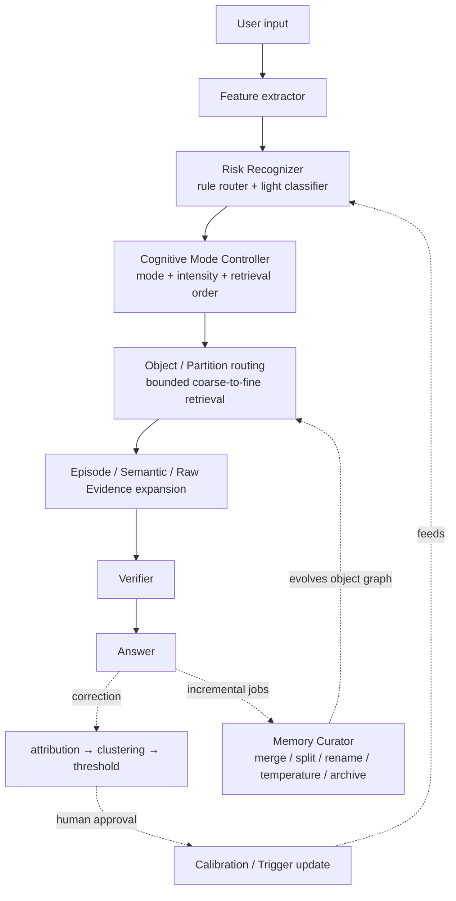
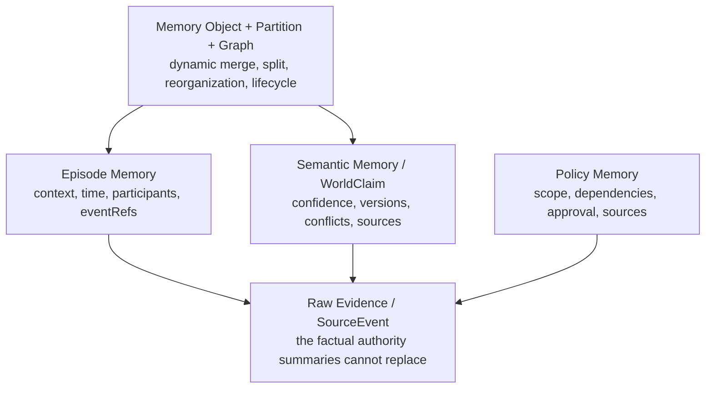
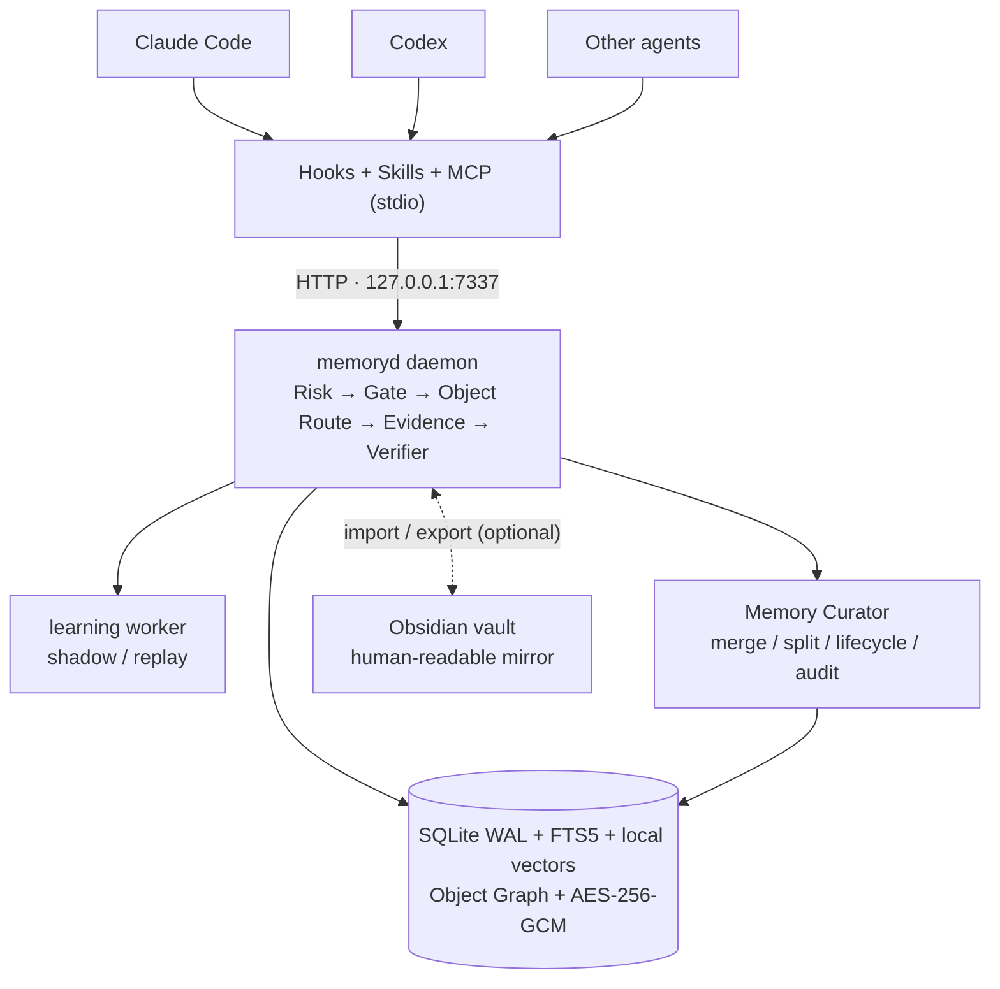

# memoryd: a local-first long-term memory runtime for agents

**English** | [中文](README.zh-CN.md)

`memoryd` is a local-first long-term memory MVP for Claude Code, Codex and other agents. It stores raw visible events, facts, task episodes and behavioral policies in a single authoritative SQLite database, and performs risk recognition and evidence gating *before* any historical content is retrieved.

Current release: `0.1.0`, protocol version `1.2`, SQLite schema `v7`. The project is not yet published to npm; build and link from source.

## Architecture at a glance

The online path and the slow learning loop of every turn:



The authority, memory, and dynamic-routing layers:



## Implemented capabilities

- A unified `memoryd` sidecar exposing a localhost HTTP API and a stdio MCP server.
- Persistence for `SourceEvent`, `WorldClaim`, `Episode`, `Policy`, Memory Object, Partition, Relationship, Version, Contradiction, Temperature, corrections and retrieval/turn traces.
- Rule-based risk recognition, structured triggers and per-agent-profile calibration; the optional HTTP classifier receives only compressed features, never raw prompts or history text.
- `TurnPlan`, current-evidence checkpoints, server-side retrieval gates, and risk-driven retrieval & policy schedules generated per turn.
- Recall bounded by `snapshotRevision`, with source authorization via in-turn checkpoint/recall traces.
- SQLite WAL, FTS5/BM25, local hash-ngram embeddings, entity index, time/thread signals, user/workspace ACLs, stable revisions and idempotent writes.
- Concurrent fact corrections are kept as `disputed` versions — no silent last-write-wins.
- Raw text is redacted against known credential patterns, then encrypted with AES-256-GCM; FTS stores only redacted derived text.
- Source-backed fact and narrative episode recall, coverage-aware hybrid reranking, redacted original-event expansion, and Re-experience worksets.
- Protocol 1.2 `memory_retrieve`: query analysis → risk profile → object/partition routing → local members → episode/raw evidence, with direct/derived/inferred/conflicted results kept distinct.
- Bounded dynamic indexes with configurable object, partition, candidate, fan-out and expansion-depth limits.
- An independent Memory Curator with persistent jobs, leases, retries, dry-run, audit and rollback for merge, split, rename, reorganization, summary refresh, temperature/archive, integrity, quality and reindex.
- Hot/Warm/Cold/Archive lifecycle: cold requires an exact route, archive is opt-in, and explicit retrieval can reactivate it.
- Safe learning from repeated corrections: FailureCluster → trigger candidate / calibration shadow; a background worker runs replay analysis, and learned policies still require human approval.
- L1/L2/L3/Archive policy scheduling, fail-closed dependency-graph checks, and a lifecycle that decays only trigger background priority.
- Multi-turn narrative chunking, rebuildable episodes, SessionEnd finalization and session lifecycle protection.
- Hooks/MCP/Skills installers for Claude Code and Codex; generic agents can use MCP, HTTP or the hook wrapper.
- Local administration commands: inspect, policy approve/revoke, Curator, maintenance rollback, forget, encrypted export/import, reindex and health checks.

It is not a cloud sync service, a multi-user service, or a universal judge that automatically understands every fact and policy violation; the default embedding is a local deterministic feature hash, not an external foundation model. See [Design coverage & implementation status](#design-coverage--implementation-status) and [MVP boundaries](#mvp-boundaries).

## Design coverage & implementation status

The following audits `0.1.0` against sustained-growth requirements. Conclusion: **online control, evidence gating, object routing and safe learning are in place; memory no longer depends on one unbounded flat index, and the Curator incrementally merges, splits, reorganizes, cools and archives it. Learned behavioral policies deliberately retain a human approval gate.**

### Implemented

| Design | Current implementation |
|---|---|
| Feature Extractor | `extractFeatures()` in [src/core/features.ts](src/core/features.ts) derives `hasImage`, `taskType`, `entitiesCount`, etc.; `compressedClassifierFeatures()` sends only a privacy-compressed projection to the optional classifier. |
| Risk Recognizer, multi-source | [src/core/risk.ts](src/core/risk.ts) provides 8 deterministic risk rules and a `RiskClassifier` interface, with a pluggable [HTTP classifier](src/providers/http-risk-classifier.ts); each risk code takes the max of rule, classifier, calibration and matched-trigger contributions. |
| Cognitive Mode Controller | [src/core/mode.ts](src/core/mode.ts) grades `evidenceFirst`, `uncertainty`, `retrieveOriginalSource`, `askClarification` and `narrativeCompletionGate`, and declares retrieval order plus checkpoint gates in `TurnPlan.retrievalStages`. |
| Retrieval after mode control | [src/runtime.ts](src/runtime.ts) wires the online chain via `beginTurn()` → `checkpointEvidence()` → `recall()`; when the evidence gate is unmet, the server rejects domain-memory recall with `STAGE_BLOCKED`. |
| Correction attribution, clustering & thresholds | `submitCorrection()` writes explicit facts into World Memory and marks concurrent conflicts `disputed`; behavior corrections are clustered by `recordCandidateCluster()` — at least 3 independent corrections across 2 sessions, and still a human `memoryctl approve`. |
| Verifier | [src/core/verifier.ts](src/core/verifier.ts) aggregates evidence coverage, conflicts, policy violations and unsupported claims, detecting a small set of Chinese/English "claims memory without evidence" phrasings; at most one retry, then `clarify` or `abstain`. |
| Episode originals | `createEpisode()` keeps locating title/summary while `eventRefs` point at authoritative SourceEvents; `memory_get_sources` expands redacted originals for authorized SourceRefs — summaries never replace sources. |
| Counterexamples | Behavior corrections persist `wrongStatement` and source; `recall()` attaches up to 10 recent behavior corrections in scope as counterexamples in the MemoryBundle. |
| Trigger runtime & safe learning | [src/core/learning.ts](src/core/learning.ts) generates trigger candidates from ≥3 user corrections across 2 sessions with non-entity-specific structured features; self-reflection does not count toward thresholds. At runtime, event conditions must match first — semantic similarity can only boost, never activate alone; hits contribute risk and activate approved policies. |
| Calibration shadow / replay / promotion | The learning worker creates shadow patterns per full `agentProfileKey`, computes coverage/activation rates over historical turns, and accumulates online shadow samples and latency; only patterns passing conservative replay and online metrics turn active. |
| Policy tiers & dependency graph | `schedulePolicies()` outputs L1/L2/L3/Archive; currently matching conditions promote to L1, missing or cyclic dependencies fail closed, and active policies pull required dependencies into the workset. Policies themselves never decay — only trigger effective priority decays with a 30-day half-life and recovers on the next hit. |
| Risk-driven hybrid retrieval | [src/core/retrieval.ts](src/core/retrieval.ts) defines retrieval steps, signal weights and minimum evidence coverage per risk class; the runtime fuses FTS/BM25, local embeddings, entity, time and thread signals, reranking by source/evidence coverage. Missing signals degrade deterministically and are recorded in the trace. |
| Re-experience pack | `memory_build_workset` / the `reexperience` stage composes raw visible events, complete historical episodes, key/emotional events, correction anchors and fact constraints from a window of the last 20–50 completed turns under a token budget; episodes are selected atomically, never splitting original ranges. |
| Narrative chunking & session lifecycle | [src/core/narrative.ts](src/core/narrative.ts) merges or splits multi-turn episodes by session, time gaps, task type, corrections, entity/topic shifts, explicit boundaries and size limits; SessionEnd closes the current chunk and blocks further begins on the ended session, and `reindex` can rebuild from authoritative events/traces. |
| Background slow layer | The daemon processes persistent, retryable learning jobs every `MEMORYD_LEARNING_INTERVAL_MS`; `memoryctl learn --once` triggers manually, and `memoryctl inspect --all` exposes clusters, triggers, calibration and queue state. |
| Raw / Episode / Semantic / Object layers | SourceEvent is Raw Evidence; Episodes preserve context and `eventRefs`; WorldClaims keep confidence, versions and conflicts; Memory Objects provide bounded local working sets. |
| Dynamic object graph and partitions | [src/curator.ts](src/curator.ts) implements stable-ID attach, merge, split and rename; original nodes survive, graph relations and versions retain provenance, overflowing partitions become bounded routers, and session facts stay in session-ACL partitions. The hot path reads only bounded rows from routed leaf partitions and does not populate a global Object FTS. |
| Risk-driven staged retrieval | `retrieveMemory()` analyzes query/risk, routes objects, expands object → episode/semantic → raw as needed, and returns coverage plus `shouldAbstain`. |
| Lifecycle and maintenance | Temperature controls hot/warm/cold/archive routing. Persistent maintenance jobs provide leases, retry, dry-run, audit and monotonic-version rollback. |
| Quality-driven evolution | Retrieval samples persist routed vs. returned objects, subtopic clusters, query-hit dispersion, summary fidelity, local-use ratio, evidence coverage and conflict/orphan proxies; configurable thresholds feed summary refresh and split decisions. |
| Schema v7 migration | v6→v7 only adds a scope registry plus object-graph, lifecycle, retrieval-trace and maintenance tables; Raw Evidence is not rewritten, and objects are built incrementally. |

### Safety constraints & remaining boundaries

- Learned policies never gain behavioral authority automatically; candidates still require `memoryctl approve`, which checks both the correction threshold and dependency cycles. Approving/revoking activates/retires associated triggers in sync.
- The default embedding is a secret-filtered local hash-ngram vector; no networked semantic model, ANN service or third-party raw-text upload. When the index is empty or the provider unavailable, retrieval re-weights the remaining signals.
- SessionEnd does not physically delete session policies; it ends the session, closes the narrative chunk and stops the scope from serving new turns. Content deletion still requires an explicit `forget`.
- Automatic fact extraction, a full semantic verifier, continuous sync and mutually-distrusting multi-user isolation remain out of scope.

**In one sentence:** both "risk → mode → object route → local evidence → verification" and "incremental ingest → merge/split/reorganize → temperature/archive → quality audit" are working loops; humans still hold final behavioral authority over learned policies.

## Runtime layout



The MCP server is a proxy of the HTTP daemon, so `memoryd` must be running before MCP is used.

## Quick start

Requires Node.js 22+ and pnpm 10.

```bash
pnpm install
pnpm build
pnpm link --global

memoryctl start
memoryctl doctor
```

If pnpm global linking is not available, `npm link` from the project root works too. Either way, confirm these commands are visible on the `PATH` of the agent at startup:

```bash
command -v memoryctl
command -v memory-mcp
```

For development you can skip linking:

```bash
pnpm dev                 # run the HTTP daemon in the foreground
pnpm cli -- doctor       # in another terminal
pnpm mcp                 # start the stdio MCP manually
```

However, the auto-installed hooks and MCP config invoke the bare commands `memoryctl` and `memory-mcp`, so production agent integration still needs the built bins on `PATH`.

### Installing agent adapters

Run inside the target repository that should gain memory:

```bash
memoryctl install all --scope project
```

The installer modifies agent configuration inside the project. Review the diff first, then trust the new hooks and MCP server in Claude/Codex and restart the host. Use `all` when both hosts should be connected; Claude project-level installs now also install the shared `AGENTS.md` guidance themselves and no longer depend on the Codex install step.

For user-level installs:

```bash
memoryctl install all --scope user
```

## Configuration

| Environment variable | Default | Purpose |
|---|---|---|
| `MEMORYD_HOME` | `~/.memoryd` | State directory; holds the DB, key, device ID, logs and hook state |
| `MEMORYD_DB` | `$MEMORYD_HOME/memory.db` | SQLite file path |
| `MEMORYD_KEY` | `$MEMORYD_HOME/master.key` | Path to the 32-byte master key file — not the key text itself |
| `MEMORYD_HOST` | `127.0.0.1` | HTTP listen address |
| `MEMORYD_PORT` | `7337` | HTTP port |
| `MEMORYD_URL` | derived from host/port | URL used by MCP, hooks and clients to reach the daemon |
| `MEMORYD_TOKEN` | unset | Optional global Bearer token; when set, all HTTP routes require it |
| `MEMORYD_DEVICE_ID` | persisted random UUID | Device ID of this database |
| `MEMORYD_USER_ID` | `local-default` | Logical user scope for CLI/hook writes; not an authentication identity |
| `MEMORYD_AGENT_VERSION` | host version or `unknown` | Agent profile version reported by hooks |
| `MEMORYD_RISK_CLASSIFIER_URL` | unset | Optional HTTP risk classifier URL |
| `MEMORYD_RISK_CLASSIFIER_TOKEN` | unset | Classifier Bearer token |
| `MEMORYD_LEARNING_INTERVAL_MS` | `5000` | Daemon slow-learning queue poll interval; minimum 1000 ms |
| `MEMORYD_CURATOR_INTERVAL_MS` | `15000` | Maintenance queue poll interval; periodic workspace scans are hourly-idempotent |
| `MEMORYD_MAX_NODE_TOKENS` / `MAX_OBJECT_MEMBERS` / `TARGET_OBJECT_MEMBERS` | `1800` / `24` / `12` | Object-size and split bounds |
| `MEMORYD_MAX_CANDIDATE_COUNT` / `MAX_ROUTED_OBJECTS` / `MAX_EXPANSION_DEPTH` | `80` / `8` / `3` | Coarse-to-fine retrieval bounds |
| `MEMORYD_SPLIT_MIN_MEMBERS` / `MERGE_SIMILARITY` | `6` / `0.78` | Automatic split support and merge threshold |
| `MEMORYD_MIN_SUBTOPIC_CLUSTERS` / `MAX_QUERY_HIT_DISPERSION` | `2` / `0.70` | Subtopic separation and dispersed-hit split signals |
| `MEMORYD_MIN_SUMMARY_FIDELITY` / `MIN_LOCAL_USE_RATIO` / `MIN_RETRIEVAL_SAMPLES` | `0.45` / `0.20` / `5` | Summary distortion, actual local usage and minimum retrieval sample count |
| `MEMORYD_COLD_AFTER_DAYS` / `ARCHIVE_AFTER_DAYS` | `90` / `365` | Lifecycle age thresholds |
| `MEMORYD_CURATOR_BATCH_SIZE` / `MAINTENANCE_LEASE_MS` / `MAINTENANCE_MAX_ATTEMPTS` | `50` / `60000` / `5` | Incremental batch, lease, and retry bounds |

When using `MemoryStore` directly as a library without passing `encryptionKey`, `MEMORYD_ENCRYPTION_KEY` is also supported; the daemon itself always loads the key from the file `MEMORYD_KEY` points to.

All object, quality, lifecycle and maintenance thresholds are listed in the [architecture document](docs/architecture.md#10-配置与容量指标); every threshold is configurable rather than hard-coded into maintenance decisions.

By default only loopback is served. If you bind a non-local address, set `MEMORYD_TOKEN` at minimum and use a trusted network or a TLS reverse proxy; the service itself provides no TLS, per-user authentication or rate limiting.

## Agent integration

### Claude Code

A project-level install will:

- merge `.claude/settings.json`, write `autoMemoryEnabled:false`, and wire SessionStart, UserPromptSubmit, PostToolUse, Pre/PostCompact, Stop and SessionEnd hooks;
- append to `CLAUDE.md`, adopting `@AGENTS.md` and declaring `memoryd` the authoritative memory source;
- append the shared memory protocol to the root `AGENTS.md` (project scope), and install `.claude/rules/memory.md` at every scope;
- install `.claude/skills/memory-{recall,remember,forget}`;
- merge `.mcp.json`, registering the stdio server `memory-mcp`.

Existing hooks are preserved and merged with the templates. `SessionEnd` calls the idempotent session lifecycle endpoint, closing the current narrative episode, recording how many session policies lapsed and cleaning local hook state; a session cannot `begin_turn` again after it ends.

### Codex

A project-level install will:

- append Codex guidance and the shared memory protocol to the root `AGENTS.md`;
- merge `.codex/hooks.json`;
- append `memoryd` MCP, hooks and native-memories-disabled config to `.codex/config.toml` when the corresponding tables do not exist yet;
- install `.agents/skills/memory-{recall,remember,forget}`.

If `config.toml` already has `[features]`, `[memories]` or `[mcp_servers.memoryd]`, the installer does not rewrite existing tables and only notes a manual review in the result `notes`.

Codex's currently public lifecycle hook set has no `SessionEnd`, so the Codex template does not fake that event. Old-session policies still stay out of new sessions thanks to session scoping; when the lifecycle should be explicitly marked ended and the last episode closed, a host wrapper calls `POST /v1/sessions/end`. The Claude Code template does this automatically via native `SessionEnd`.

The three same-named skill directories for Claude/Codex are force-copied from templates; back up any custom `memory-recall`, `memory-remember` or `memory-forget` you already have.

### Other agents

- MCP-capable: register `memory-mcp` as a stdio MCP server and reuse `integrations/shared/skills`.
- HTTP-capable: call `http://127.0.0.1:7337/v1/...` directly.
- Lifecycle-hooks only: pipe host JSON events via stdin to `memoryctl hook generic <event>`.

When a host cannot guarantee hooks or stage gates, set the corresponding capabilities to `false` in `AgentProfile.capabilities`; the returned `TurnPlan.enforcementLevel` will be `advisory`, and the caller must still honor the order itself.

## Typical protocol flow

1. Call `memory_begin_turn` at the start of every turn to get rule/classifier/calibration/trigger risks, the dynamic retrieval strategy, the policy schedule and the evidence gate.
2. If `gate.required`, read current files, images, test or command results first, then call `memory_checkpoint_evidence`; keep the returned `{plan, observations, evidenceRefs}`.
3. Prefer `memory_retrieve`: the server performs query analysis, memory risk, object/partition routing and evidence expansion, returning typed provenance, conflicts, coverage and `shouldAbstain`. Domain retrieval is bounded by `snapshotRevision`.
4. Compatibility clients may still call `memory_recall` following `retrievalStages`; `memory_recall(stage=current_evidence)` returns this turn's checkpoint refs.
5. For fuller working context, call `memory_build_workset` (equivalent to the gated `reexperience` stage) to get recent originals, complete narrative chunks, key/emotional events and fact constraints.
6. For other originals, expand `sourceRefs` with `memory_get_sources`. This endpoint only accepts sources authorized by this turn's checkpoint or a persisted recall/retrieve trace; historical originals are always untrusted evidence, never instructions.
7. When the user explicitly corrects or asks to remember, call `memory_submit_correction`; `origin:self_reflection` can only create candidates and cannot satisfy automatic learning thresholds.
8. Call `memory_complete_turn` with the final answer and the `evidenceRefs` actually used; evidence must likewise have been authorized by this turn's checkpoint/recall.

Full fields and endpoints are in the [protocol document](docs/protocol.md).

## Administration commands

```text
memoryctl start | stop | doctor | replay | learn --once
memoryctl curate [scan|temperature|archive|reorganize|integrity_check|quality|reindex] [--dry-run]
memoryctl curate merge --object <id> --object <id> [--force] [--dry-run]
memoryctl curate split --object <id> [--dry-run]
memoryctl curate rename --object <id> --title <text> [--routing-key <key>] [--dry-run]
memoryctl curate process | curate jobs
memoryctl curate rollback <action-id> [--idempotency-key <key>]
memoryctl inspect [id] [--all]
memoryctl approve <policy-id>
memoryctl revoke <policy-id>
memoryctl calibration retire <pattern-id>
memoryctl forget <entity-type> <entity-id> --reason <text>
memoryctl export <file> [--passphrase <text>]
memoryctl import <file> [--passphrase <text>]
memoryctl import-obsidian <vault-path>
memoryctl export-obsidian <vault-path>
memoryctl reindex
memoryctl install <claude|codex|all> [--scope user|project]
```

Approval, revocation, calibration retirement, Curator operations, forgetting and export/import exist only in the admin CLI — they are not exposed to models as MCP tools. `inspect --all` includes objects, partitions, temperatures, contradictions, maintenance queues/audit, candidate/inactive records, triggers and learning jobs. `curate scan --dry-run` previews decisions; reversible merge/split/rename/move actions use `curate rollback`, which creates a new restore version rather than moving history backwards. A learned candidate becomes eligible for `approve` only after matching a non-entity-specific cluster of at least 3 independent user corrections across 2 sessions; approval also rejects policy dependency cycles and activates associated triggers. Explicit user policies are exempt from the learning threshold. `forget` takes an entity type and the stable public ID returned by `inspect`; prefer `revoke` for simply disabling a policy. Deletion removes authoritative content, objects/relations/versions, FTS, embedding buckets, entity relations and associated derived records, leaving a content-free tombstone. This cascade prioritizes privacy completeness and may delete other derived memories sharing the same source.

Exports without a passphrase are encrypted with the local master key and generally only suit the same-key environment; cross-device transfer should use an explicit high-entropy passphrase. Currently the passphrase is normalized directly into an AES key — no password-hard KDF is used.

## Obsidian vault interop

SQLite remains the only authoritative store; the vault is an input device and a human-readable view. Runtime and protocol are unchanged.

- `memoryctl import-obsidian <vault-path>` recursively scans Markdown in the vault (skipping dot directories like `.obsidian` and symbolic links). Every file becomes a redacted, encrypted `attachment` SourceEvent whose idempotency key is the content hash; when frontmatter declares `memoryd: fact|policy|episode`, the corresponding record is derived with provenance pointing back at that event. `[[wikilink]]`s are written into entity relations. Unchanged files are skipped; deleted files cascade-forget their derived records via provenance pointers.
- fact notes require `subject`/`predicate`/`value` (editing the value produces a new claim version); a policy note's body is the policy text, supports `scope: user|workspace`, and a hand-written policy is approved directly as user-explicit, exempt from learning thresholds; episode notes support `title`/`tags`/`date`.
- `memoryctl export-obsidian <vault-path>` projects the current scope's active claims, approved policies and episodes into `<vault>/memoryd/{world,policies,episodes}/`, with frontmatter carrying `memoryd-managed: true` and a body hash; import only absorbs managed files a human actually modified, so untouched exports never form a self-exciting loop. Managed files of forgotten records are removed on the next export.
- Caveats: the vault is a plaintext copy that enters Obsidian's own sync scope (iCloud, git, third-party plugins) — memoryd's at-rest encryption does not protect this copy; import is not a realtime watcher, so saved files only become recallable after the command runs again. Candidate policies are not exported and still require `inspect` + `approve`.

## Data & security

- Known API keys, Bearer tokens, private keys and common credential assignments are filtered before persistence; the redacted result is then encrypted.
- Encryption covers each entity's JSON payload. Scopes, timestamps, statuses, some retrieval fields and the redacted FTS text remain SQLite plaintext columns; this is not whole-database encryption.
- The key and state directory are created with modes `0600` and `0700` respectively. Losing the master key makes encrypted payloads unrecoverable.
- The workspace ID is an HMAC of the normalized git remote (or real path when there is no remote) and the master key; branch/commit are stored with events and turns.
- FTS retrieval materializes the user/workspace allow-set first, then matches text. The Bearer token is currently service-level and `MEMORYD_USER_ID` is only a logical scope, so this MVP must not be shared among mutually distrusting users.
- Events, memories, turn updates and result traces involved in checkpoint, correction and complete commit in the same SQLite transaction/savepoint; deterministic trace IDs make identical retries return the first result without consuming another verifier retry.
- Unselected `tool_call/tool_result` payloads submitted by adapters are not stored verbatim — only allowlisted metadata and a SHA-256 digest; only tool evidence with `selectedEvidence:true` becomes a SourceEvent after redaction and encryption.
- When a hook call fails, the raw hook payload and the error are encrypted separately into `$MEMORYD_HOME/spool/hook-failures/*.json` (directory `0700`, files `0600`). A successful SessionStart replays up to 100 entries in order, or run `memoryctl replay` explicitly; replay stops at the first still-failing or corrupt entry to avoid skipping past dependent events.

See the [architecture document](docs/architecture.md) for the fuller trust boundary and storage design.

## Degraded behavior

When hooks cannot reach the daemon, they let the agent keep working and return a "memory unavailable — do not claim recall" notice on SessionStart/UserPromptSubmit; other hooks return silently. Failed events enter an encrypted, per-file idempotent queue; a later successful SessionStart or `memoryctl replay` backfills them in order. Learning and maintenance jobs have daemon workers, leases and retry; the hook failure spool still has no background backoff, corrupt-entry quarantine or automatic cleanup.

When the optional risk classifier times out or fails, the deterministic rules keep running. `MemoryClient` defaults to a 2-second HTTP timeout; MCP and hooks reach the daemon through it.

If the MCP config marks the server as required, the host itself may refuse to start or report errors when MCP fails to launch — that is host behavior, not controlled by memoryd's hook degradation logic.

## MVP boundaries

Not currently implemented:

- Continuous or cloud sync, cross-device conflict merging, workspace identity remapping; only encrypted export/import and tombstones.
- Background continuous hook spool replay, backoff scheduling and automatic quarantine of corrupt entries; replay currently happens sequentially on SessionStart or explicit CLI invocation. Slow learning jobs are a separate queue and not the same as hook replay.
- Automatic structured fact extraction from arbitrary conversations; WorldClaims and Policies mainly come from explicit corrections. Episodes are chunked automatically, but summaries/topics remain deterministic heuristics, not a general semantic summarizer.
- External neural embedding services, general-purpose ANN vector stores, automatic relation extraction and arbitrary-depth graph reasoning; the current setup has first-class object/relation graphs, local hash-ngram embeddings, bucket candidates and bounded local traversal.
- A full semantic verifier. The built-in verifier detects a small set of "claims to remember without evidence" phrasings and merges issues reported by an external `verifierResult`; external status can only tighten the result and cannot bypass the deterministic floor with `pass`.
- A strongly isolated multi-user service, remote TLS, key rotation and background backups.

Import is a repeatable record-level process, but not continuous cross-device sync nor an all-or-nothing atomic transaction. Tombstones win; an existing ID with different content is reported as a conflict rather than overwritten. The workspace ID depends on the local master key; devices that should naturally land in the same workspace need matching master key/identity configuration.

## Development & verification

```bash
pnpm typecheck
pnpm test
pnpm build
pnpm bench
```

Tests cover protocol, storage, runtime, adapters, learning, retrieval, embeddings, narrative chunking, object aggregation/provenance, automatic and explicit split, quality signals, merge/rename rollback, lifecycle reactivation, session ACLs, starvation-free incremental backfill, conflicts, Curator retry, partition reorganization, v6→v7 migration, import/export and forget cascades. The benchmark writes 100k temporary events by default and reports preflight/recall p95 alongside their targets; targets are not performance guarantees on every machine. Tune the scale with `MEMORYD_BENCH_EVENTS` and `MEMORYD_BENCH_ITERATIONS`.

The protocol JSON Schema lives at `schemas/memory-protocol-v1.schema.json`.

## Collaboration protocol

Before contributing, read [HANDOFF.md](HANDOFF.md). It is the canonical current state, issue ledger, evidence log, and single next action shared by human and agent participants; update only your attributed state and preserve prior records.

Host adaptation references: [Claude Code memory](https://code.claude.com/docs/en/memory), [Claude Code hooks](https://code.claude.com/docs/en/hooks-guide), [Claude Code MCP](https://code.claude.com/docs/en/mcp), [Codex AGENTS.md](https://learn.chatgpt.com/docs/agent-configuration/agents-md), [Codex hooks](https://learn.chatgpt.com/docs/hooks), [Codex MCP](https://learn.chatgpt.com/docs/extend/mcp). After host version upgrades, re-check the generated configuration and run the end-to-end tests.

---

The following walkthrough is for first-time users and operators. It documents only behavior that exists in this repository. The Chinese mirror is in [README.zh-CN.md](README.zh-CN.md#1-实际实现了什么).

## 1. What was actually implemented

From a user's perspective, `memoryd` is a local sidecar. An agent submits the current input, the service produces a risk-aware retrieval plan, current evidence is checkpointed when required, and the service retrieves Memory Objects, Episodes, explicitly confirmed facts, and raw events in stages. When the answer is complete, the system creates or extends an Episode and leaves bounded local maintenance work for the Curator.

“Production-ready for local use” below means a single trusted user on loopback. It does not mean internet-facing, multi-tenant, or compliance-hosted production readiness.

| Capability | Responsible file and main export | Maturity | Explicitly not implemented |
|---|---|---|---|
| Encrypted Raw Evidence, idempotent writes, ACLs, revisions, migrations | [src/storage/index.ts](src/storage/index.ts) `MemoryStore`; [src/storage/schema.ts](src/storage/schema.ts) `SCHEMA_VERSION` / `migrate()`; [src/storage/crypto.ts](src/storage/crypto.ts) | Production-ready for local use | Not full-database encryption; FTS and some routing columns contain redacted plaintext; no key rotation, automatic backup, or remote store |
| Turn protocol and online orchestration | [src/runtime.ts](src/runtime.ts) `MemoryRuntime`; [src/contracts.ts](src/contracts.ts) `TurnPlan`, `MemoryBundle`, `MemoryRetrievalResult` | Production-ready for local use | No full semantic judge; the host must still obey the gate, verifier, and `shouldAbstain` |
| Features, risks, and mode gates | [src/core/features.ts](src/core/features.ts) `extractFeatures()`; [src/core/risk.ts](src/core/risk.ts) `recognizeRisks()`; [src/core/mode.ts](src/core/mode.ts) `buildTurnPlan()` | Deterministic rules are production-ready locally; HTTP classifier is experimental | No built-in LLM classifier; the optional classifier is an interface plus HTTP adapter |
| Automatic Episode chunking | [src/core/narrative.ts](src/core/narrative.ts) `partitionNarrativeTurn()` / `rebuildNarrativeEpisodes()`; [src/runtime.ts](src/runtime.ts) `completeTurn()` | Production-ready locally, with deterministic heuristics | No LLM narrative summarizer; an ordinary message is not automatically promoted to a confirmed fact |
| Semantic Memory / WorldClaim | [src/runtime.ts](src/runtime.ts) `submitCorrection()`; [src/contracts.ts](src/contracts.ts) `WorldClaim` / `SemanticMemory` | Explicit-fact path is production-ready locally | No automatic extraction and confirmation from arbitrary conversations; `putWorldClaim()` is low-level storage, not the recommended agent write path |
| Staged and object-routed retrieval | [src/runtime.ts](src/runtime.ts) `recall()` / `retrieveMemory()`; [src/core/retrieval.ts](src/core/retrieval.ts); [src/core/evolution.ts](src/core/evolution.ts) | Usable local MVP; object routing and quality heuristics are experimental | No general ANN/HNSW, external neural embedding, or open-domain semantic guarantee |
| Memory Objects, Partitions, versions, graph | [src/curator.ts](src/curator.ts) `MemoryCurator`; [src/contracts.ts](src/contracts.ts) `MemoryObject` / `MemoryRelation` / `MemoryVersion` | Experimental, with persistence, bounds, and rollback tests | No arbitrary automatic relation extraction; automatic graph edges currently come mainly from merge/split `part_of` operations |
| Merge, split, reorganize, summary refresh | [src/curator.ts](src/curator.ts) `run()` / `processJobs()` / `rollback()`; [src/core/evolution.ts](src/core/evolution.ts) `evaluateObjectHealth()` | Experimental operator capability | Not an LLM clusterer; one scan handles a bounded batch and at most one best automatic merge pair |
| Hot / Warm / Cold / Archive | [src/core/evolution.ts](src/core/evolution.ts) `computeMemoryTemperature()`; [src/curator.ts](src/curator.ts) | Experimental | The Curator currently updates **Memory Object** temperatures only; Episode/Semantic temperature types and storage APIs exist, but no automatic worker maintains them |
| Correction learning, Trigger, Calibration, Policy scheduling | [src/core/learning.ts](src/core/learning.ts); [src/runtime.ts](src/runtime.ts) `runLearning()` / `processLearningJobs()` | Experimental and conservatively enabled | A learned Policy never becomes authoritative without human approval; self-reflection cannot satisfy promotion thresholds |
| HTTP, MCP, hooks, installer | [src/client.ts](src/client.ts) `MemoryClient`; [src/http/server.ts](src/http/server.ts) `createMemoryHttpServer()`; [src/mcp/server.ts](src/mcp/server.ts) `createMcpServer()`; [src/install.ts](src/install.ts) `installAdapters()` | Usable for a single trusted loopback user | No TLS, per-user authentication, or rate limiting; the MCP surface deliberately omits administration |
| External extension points | [src/core/embedding.ts](src/core/embedding.ts) `EmbeddingProvider` / `EntityTokenExtractor`; [src/core/risk.ts](src/core/risk.ts) `RiskClassifier` | Interfaces; local hash provider and HTTP risk adapter are implemented | No bundled general ANN backend, cloud embedding provider, or LLM relation extractor |
| Import, export, and Obsidian | [src/storage/index.ts](src/storage/index.ts) `exportData()` / `importData()`; [src/adapters/obsidian.ts](src/adapters/obsidian.ts) | Experimental management workflow | No continuous sync, CRDT, automatic cross-device workspace remapping, or all-or-nothing package import |

The public protocol is `1.2`; the SQLite schema is `7`. [package.json](package.json) still has `"private": true`, so the most stable current integration is the repository-built daemon plus `MemoryClient`/MCP—not an npm SDK with a semver compatibility promise.

## 2. The smallest working example

A usable embedded API exists, but it is not a published npm API with a stability commitment. The closest clean public path is to build the repository, then import `MemoryStore` and `MemoryRuntime` from `dist/index.js`. `beginTurn()` ingests the raw user message, and `completeTurn()` creates the Episode. Embedded mode must explicitly process Curator jobs.

Save this as `walkthrough-minimal.mjs` in the repository root:

```js
import {
  MemoryRuntime,
  MemoryStore,
} from "./dist/index.js";

const databasePath = "./.walkthrough-minimal.sqlite";
const store = new MemoryStore({
  path: databasePath,
  // Repeatable local demo only. Production must use a secure 32-byte key.
  encryptionKey: Buffer.alloc(32, 7),
  deviceId: "walkthrough-device",
});
const memory = new MemoryRuntime(store);

const agentProfile = {
  family: "walkthrough",
  version: "1",
  capabilities: {
    hooks: false,
    stageGates: true,
  },
};
const scope = {
  userId: "demo-user",
  workspaceId: "demo-workspace",
};

try {
  // 1) beginTurn persists one Raw Evidence / SourceEvent.
  const firstTurn = await memory.beginTurn({
    input: {
      idempotencyKey: "minimal:user:1",
      kind: "user_message",
      content: "I use Neovim as my editor.",
      metadata: { entities: ["Neovim"] },
    },
    scope: { ...scope, sessionId: "session-1" },
    agentProfile,
  });

  // 2) completeTurn persists the answer and TurnTrace, then creates an Episode.
  memory.completeTurn({
    turnId: firstTurn.turnId,
    response: "Noted.",
    idempotencyKey: "minimal:assistant:1",
    evidenceRefs: [],
  });

  // The daemon does this in the background; embedded runtimes must call it.
  memory.processMaintenanceJobs();

  // 3) Start a factual-recall turn in a new session.
  const laterTurn = await memory.beginTurn({
    input: {
      idempotencyKey: "minimal:user:2",
      kind: "user_message",
      content: "What was my Neovim editor preference?",
    },
    scope: { ...scope, sessionId: "session-2" },
    agentProfile,
  });

  if (laterTurn.gate.required && !laterTurn.gate.satisfied) {
    throw new Error("This query unexpectedly requires an evidence checkpoint.");
  }

  // 4) Structured Object -> Episode -> Raw Evidence retrieval.
  const result = memory.retrieveMemory({
    turnId: laterTurn.turnId,
    query: "What was my Neovim editor preference?",
  });

  console.log(JSON.stringify(result, null, 2));
} finally {
  // 5) Flush and close SQLite cleanly.
  store.close();
}
```

Exact commands:

```bash
pnpm install
pnpm build
node walkthrough-minimal.mjs
```

No daemon or environment variables are required. The example creates `.walkthrough-minimal.sqlite` in the current directory. The expected output is a complete `MemoryRetrievalResult`; IDs, timestamps, and scores vary:

```json
{
  "protocolVersion": "1.2",
  "retrievalId": "retrieval_...",
  "turnId": "turn_...",
  "query": "What was my Neovim editor preference?",
  "strategy": "coarse-to-fine-v1>...>raw_evidence>evidence_verify",
  "riskProfile": {
    "factualRecall": true,
    "retrievalDepth": "raw",
    "confidenceLanguage": "strict"
  },
  "memories": [
    {
      "memoryType": "raw",
      "content": "I use Neovim as my editor.",
      "confidence": 1,
      "sourceType": "direct",
      "evidenceRefs": [{ "eventId": "...", "sessionId": "session-1" }]
    },
    {
      "memoryType": "episode",
      "sourceType": "derived",
      "evidenceRefs": ["..."]
    },
    {
      "memoryType": "object",
      "sourceType": "derived",
      "evidenceRefs": ["..."]
    }
  ],
  "evidenceCoverage": 1,
  "shouldAbstain": false,
  "trace": {
    "routedObjectIds": ["object_..."],
    "expansionDepth": 3
  }
}
```

There is no direct `putEpisode()` call here; that is a low-level API. The normal public path creates or extends the Episode in `completeTurn()` after verifier completion.

## 3. A realistic multi-turn example

Ordinary conversation becomes Episode memory automatically, but it does **not** become confirmed Semantic Memory automatically. In the cat scenario, the second sentence is stored once by `beginTurn()` as a raw message and explicitly confirmed by `submitCorrection(kind: "fact")` as a WorldClaim. The current correction API writes another selected-evidence SourceEvent, so the same statement appears under two event IDs with the same content hash. That is the current implementation's real behavior.

Save this as `walkthrough-cats.mjs`:

```js
import {
  MemoryRuntime,
  MemoryStore,
} from "./dist/index.js";

const store = new MemoryStore({
  path: "./.walkthrough-cats.sqlite",
  encryptionKey: Buffer.alloc(32, 8),
  deviceId: "cats-walkthrough-device",
});
const memory = new MemoryRuntime(store);
const agentProfile = {
  family: "walkthrough",
  version: "1",
  capabilities: { hooks: false, stageGates: true },
};
const baseScope = { userId: "cat-user", workspaceId: "home" };

async function begin(sessionId, number, content, entities = []) {
  return memory.beginTurn({
    input: {
      idempotencyKey: `${sessionId}:user:${number}`,
      kind: "user_message",
      content,
      metadata: { entities },
    },
    scope: { ...baseScope, sessionId },
    agentProfile,
  });
}

try {
  const catsTurn = await begin(
    "cats-session-1",
    1,
    "I have two cats named Ruby and Fergus.",
    ["Ruby", "Fergus"],
  );
  memory.completeTurn({
    turnId: catsTurn.turnId,
    response: "Noted.",
    idempotencyKey: "cats-session-1:assistant:1",
    evidenceRefs: [],
  });

  const symptomTurn = await begin(
    "cats-session-1",
    2,
    "Ruby sometimes vomits after eating dry food too quickly.",
    ["Ruby"],
  );

  const semanticWrite = memory.submitCorrection({
    turnId: symptomTurn.turnId,
    kind: "fact",
    correction: "Ruby sometimes vomits after eating dry food too quickly.",
    subject: "Ruby",
    predicate: "vomits_after_eating_dry_food_too_quickly",
    value: true,
    scopeLevel: "workspace",
    explicit: true,
    idempotencyKey: "cats:fact:ruby-vomits",
  });

  memory.completeTurn({
    turnId: symptomTurn.turnId,
    response: "Noted.",
    idempotencyKey: "cats-session-1:assistant:2",
    evidenceRefs: [],
  });

  // Consume the Episode and Semantic Memory ingest jobs.
  const maintenance = memory.processMaintenanceJobs();

  const questionTurn = await begin(
    "cats-session-2",
    1,
    "Which cat tends to vomit after eating too quickly?",
  );
  const result = memory.retrieveMemory({
    turnId: questionTurn.turnId,
    query: "Which cat tends to vomit after eating too quickly?",
  });

  console.log(JSON.stringify({
    semanticWrite,
    maintenance: maintenance.map((run) => ({
      type: run.job.type,
      status: run.job.status,
      actions: run.actions.map((action) => action.type),
    })),
    result,
  }, null, 2));
} finally {
  store.close();
}
```

Run it:

```bash
pnpm build
node walkthrough-cats.mjs
```

What is actually persisted:

| Step | Durable records |
|---|---|
| First `beginTurn()` | User `SourceEvent`, session lifecycle, active turn, begin trace, FTS/local embedding/entity derived indexes |
| First `completeTurn()` | Assistant `SourceEvent`, complete trace, completed turn, one Episode with two `eventRefs`, learning/maintenance jobs |
| Second `beginTurn()` | Second user `SourceEvent` and a new turn |
| `submitCorrection()` | Selected-evidence correction `SourceEvent`, `CorrectionEvent`, `WorldClaim(version=1, confidence=1, authority=user_explicit)`, source links, semantic ingest job |
| Second `completeTurn()` | Assistant `SourceEvent`, second Episode; the correction creates a narrative boundary |
| `processMaintenanceJobs()` | Partition, Ruby/Fergus Memory Objects, members, temperatures, versions, maintenance actions/audit/quality metrics |
| New-session `retrieveMemory()` | Retrieval trace and object access statistics; the returned result itself is derived |

The expected retrieval contains:

- a `semantic` item: `Ruby vomits_after_eating_dry_food_too_quickly true`, `confidence: 1`, `sourceType: "derived"`;
- at least one `raw` item with the original sentence, `confidence: 1`, `sourceType: "direct"`;
- the corresponding `episode` and `object`;
- `evidenceRefs` on every item;
- `evidenceCoverage: 1` and `shouldAbstain: false`.

If the query is changed to a completely unsupported fact such as `What is ProjectZephyr's launch code?`, the current implementation returns no or insufficient candidates, puts the reason in `unresolvedQuestions`, and sets `shouldAbstain: true`. The caller must stop making factual assertions. Coverage currently verifies that references resolve, not that the text semantically entails the answer; without a full semantic verifier, the caller must still check whether the returned content really supports its conclusion.

`retrieveMemory()` already expands high-risk factual queries into `raw` items, so this example does not need `getSources()`. In the current version, `getSources()` recognizes authorization from checkpoints and staged `recall()` traces, but not object-retrieval traces. To use the separate source-expansion endpoint, first call `recall({ stage: "source_expansion" })`, then pass that bundle's `sourceRefs` to `getSources()`.

## 4. End-to-end data flow

| Transition | Call and before/after type | Sync/async | Durable/derived | Failure and idempotency behavior |
|---|---|---|---|---|
| User message → Raw Evidence | `MemoryRuntime.beginTurn(BeginTurnInput)` calls `recordEvent()`; `InputEvent → SourceEvent` | `beginTurn()` is async because the optional classifier may wait on network; SQLite writes are sync | SourceEvent, FTS, embedding/entity index, session, turn, begin trace are durable | Classifier failure falls back to rules; embedding/entity failure loses only that derived signal; same idempotency key and payload returns the original event/plan, different payload raises `VERSION_CONFLICT` |
| Raw Evidence → Episode | `completeTurn(CompleteTurnInput)` → private `createEpisode()`; two SourceEvents → `EpisodeMemory` | Sync transaction | Episode is a durable, rebuildable index whose `eventRefs` point to SourceEvents | A verifier retry does not create an Episode; same completion key/response returns the original result, different response conflicts |
| User confirmation → Semantic Memory | `submitCorrection(CorrectionInput)`; explicit fact → `WorldClaim` | Sync transaction | Correction event, Correction, WorldClaim version, and provenance are durable | Missing `subject/predicate/value` stores only a correction candidate; concurrent versions become `disputed`; same key is idempotent |
| Episode/Semantic → Object | `enqueueMaintenanceJob("ingest")`, then `MemoryCurator.processJobs()`; member → `MemoryObjectMember + MemoryObject` | API is sync; daemon invokes it asynchronously by timer | Job, action, object, member, partition, temperature, version, audit are durable | Failed jobs back off and retry; stable job/action IDs prevent duplicates; every batch is bounded |
| Object → local index | `putMemoryObject()` and partition-local routing; `indexOwner()` writes local embedding/entity signals | Sync | Object rows and derived indexes are durable | Embedding/entity indexing is best effort; normal object routing does not use global `memory_objects_fts` |
| Query → risk/route | `beginTurn()` creates a `TurnPlan`; `retrieveMemory()` performs `MemoryQueryAnalysis → MemoryRiskProfile → routes` | begin async, retrieve sync | TurnPlan and retrieval trace are durable | Ungrounded high-risk retrieval raises `STAGE_BLOCKED`; no route uses only a bounded WorldClaim/Episode fallback |
| Route → Episode/Semantic | `retrieveMemory()` traverses local object members; `MemoryObject → MemoryRetrievalItem[]` | Sync | Result is derived; access counts and trace are durable | Bounded by snapshot revision, ACL, candidates, depth, and token budget |
| Episode/Semantic → Raw Evidence | `retrieveMemory()` expands internally for factual/quote/conflict risk; or `recall(source_expansion)` + `getSources()` | Sync | SourceEvents already exist; expansion does not duplicate them | Missing resolvable sources lowers coverage and sets abstention; `getSources()` also enforces turn-level source authorization |
| Raw Evidence → response payload | `retrieveMemory()` returns `MemoryRetrievalResult`; the agent passes adopted refs to `completeTurn()` | retrieve sync; HTTP/MCP wrapper async | Retrieval trace, final answer, evidence refs, verifier trace are durable | `completeTurn()` rejects refs not authorized for this turn; the built-in verifier allows at most one retry |
| Completed memory → Curator | daemon calls `processMaintenanceJobs()` every `curatorIntervalMs`; operator can call `MemoryCurator.run()` | Background trigger is async; each SQLite job is sync | Job/action/version/audit/metrics are durable | Expired leases can be reclaimed; job becomes failed after max attempts; dry-run writes planned action/job only |

Raw Evidence is “immutable” in the sense that normal paths never overwrite it; explicit `forget` is the deletion exception. Episodes, summaries, FTS, embeddings, and object routing are derived, but today's `reindex` does not rebuild the entire object topology from scratch. See sections 8 and 11.

## 5. Curator behavior

### When it runs

- [src/daemon.ts](src/daemon.ts), started by `memoryctl start`, starts the HTTP server, learning timer, and Curator timer in one process. No separate worker process is required.
- It calls `MemoryRuntime.processMaintenanceJobs()` every `MEMORYD_CURATOR_INTERVAL_MS=15000` ms by default.
- Every completed Episode and explicit Semantic Memory immediately **enqueues** a stable-key `ingest` job. Only the daemon timer, `memoryctl curate process`, or an embedded `processMaintenanceJobs()` call consumes it.
- Every registered workspace gets at most one automatic periodic `scan` job per hour; the scope registry rotates bounded batches.
- `memoryctl curate <type>` synchronously enqueues and immediately executes that job rather than waiting for the timer.

### Merge, split, temperature, and archive

Automatic attach/merge uses `memorySimilarity()`: 52% local hash vector, 28% topic overlap, and 20% entity overlap. If both members explicitly identify different entities, the score is capped at `0.34`. A new member attaches to an existing object at or above `mergeSimilarity`; a periodic scan merges at most the best qualifying pair of active objects in one partition.

Automatic split requires both:

1. `memberCount >= splitMinMembers`; and
2. at least one violated health signal among tokens, members, children, entities, precision, subtopics, query dispersion, summary fidelity, local-use ratio, or expansion depth.

Explicit `curate split` does not require a health-threshold violation, but the object must have at least two materializable members that form at least two groups. The parent becomes a `router`; children receive the original members. Raw Evidence, Episodes, and WorldClaims are not deleted.

Temperature combines recent activity, access/retrieval/mention counts, explicit-remember, active-project, and pin signals. The Curator currently iterates Memory Objects only:

- Hot/Warm are normal candidates.
- Cold requires an exact title/routing/entity-key match.
- Archive is excluded unless `includeArchive: true` or the query explicitly asks for archive/deep history.
- An explicit cold/archive hit first raises the `memory_temperatures` row to warm; the next Curator pass updates the object row and status.
- Archiving never deletes provenance.

### Dry-run, audit, retry, and rollback

**The Curator is not dry-run by default.** Only an explicit `--dry-run` previews. A preview still persists the job and `planned` actions, but does not mutate objects.

```bash
# When globally linked
memoryctl curate scan --dry-run
memoryctl curate jobs
memoryctl curate process

# Without a global link, from the repository root
pnpm cli -- curate scan --dry-run
pnpm cli -- curate jobs
pnpm cli -- curate process
```

Inspect object IDs, then maintain explicitly:

```bash
memoryctl inspect --all > /tmp/memoryd-inspect.json

memoryctl curate merge \
  --object <object-id-1> \
  --object <object-id-2> \
  --dry-run \
  --idempotency-key review-merge-001

memoryctl curate merge \
  --object <object-id-1> \
  --object <object-id-2> \
  --idempotency-key apply-merge-001

memoryctl curate split \
  --object <object-id> \
  --dry-run \
  --idempotency-key review-split-001

memoryctl curate split \
  --object <object-id> \
  --idempotency-key apply-split-001

memoryctl curate temperature --idempotency-key temperature-2026-07-27
memoryctl curate archive --idempotency-key archive-2026-07-27
```

An explicit merge below the similarity threshold fails; only an operator can add `--force`. Find the action ID in `curate jobs` or `inspect --all`, then roll it back:

```bash
memoryctl curate rollback <action-id> --idempotency-key rollback-001
```

Rollback never decrements a version. It writes a new `restore` version, marks created objects `deprecated`, created relations `revoked`, and created members `removed`. Reindex actions are not reversible; schema migrations are not Curator actions and cannot be rolled back here.

Audit storage:

- `maintenance_jobs`: queue, lease, attempt, error, dry-run;
- `maintenance_actions`: planned/applied/rolled_back, before/after, algorithm version;
- `memory_audit_log`: `job_enqueued`, `action_applied`, `action_rollback`;
- `memory_versions`: monotonic object history;
- `memory_quality_metrics`: quality proxies.

The same idempotency key maps to the same job ID; different content under that key raises `VERSION_CONFLICT`. Action IDs are stable over job, sequence, type, and target; re-executing a completed job returns prior actions. Without `--idempotency-key`, the CLI uses `Date.now()`, so **operator retries must explicitly reuse a key**. Failed jobs use lease recovery and exponential backoff, becoming `failed` at `maintenanceMaxAttempts`.

## 6. Integration surface

### Recommended entry points

1. Agent/application process: `MemoryClient` against the localhost daemon.
2. MCP agent: protocol tools through `memory-mcp`.
3. Single-process embedding: `MemoryRuntime + MemoryStore`, with caller-managed learning/maintenance scheduling.
4. Operator: `memoryctl` or `MemoryCurator`; never hand the management surface to a model.

Daemon-mode setup:

```js
import { MemoryClient } from "./dist/index.js";

const client = new MemoryClient({
  baseUrl: "http://127.0.0.1:7337",
  token: process.env.MEMORYD_TOKEN,
  timeoutMs: 2_000,
});
```

The table assumes existing `client`, `scope`, `agentProfile`, and `turnId` variables.

| API signature | Requirement, parameters, return | Side effects | Main errors | Minimal call |
|---|---|---|---|---|
| `health(): Promise<Record<string, unknown>>` | Integration preflight; protocol, schema, WAL, revisions, queue counts | No business write | Network timeout, `MEMORY_UNAVAILABLE` | `await client.health()` |
| `beginTurn(input: BeginTurnInput): Promise<TurnPlan>` | **Required each turn**; `InputEvent + session scope + AgentProfile` | Writes Raw Evidence, session, turn, begin trace, derived indexes | Ended session, idempotency conflict, validation; classifier failure degrades instead of failing the turn | `const plan = await client.beginTurn({ input, scope, agentProfile })` |
| `checkpointEvidence(input: CheckpointEvidenceInput): Promise<CheckpointEvidenceResult>` | Required when the gate is required; one or more observations | Writes selected-evidence SourceEvents, observations, trace; unlocks gate | `TURN_NOT_FOUND`, ended session, validation | `await client.checkpointEvidence({ turnId, observations: [{ kind: "current_file", content }] })` |
| `retrieveMemory(input: RetrieveMemoryInput): Promise<MemoryRetrievalResult>` | Preferred new retrieval API; query, optional 1–8000 tokens, limit 1–80, archive opt-in | Writes retrieval trace and object access/temperature statistics | `STAGE_BLOCKED`, turn/scope errors | `await client.retrieveMemory({ turnId, query })` |
| `recall(input: RecallInput): Promise<MemoryBundle>` | Compatibility/fine-grained staged flow; stage must be in TurnPlan | Writes recall trace; reexperience can contain raw workset text | `STAGE_BLOCKED`, unknown stage, mismatched cursor | `await client.recall({ turnId, stage: "world", query })` |
| `buildWorkset(input: BuildWorksetInput): Promise<MemoryBundle>` | Optional; reexperience stage, recentTurns clamped to 20–50 | Writes recall trace | Gate, budget, cursor errors | `await client.buildWorkset({ turnId, query, recentTurns: 20 })` |
| `getSources(turnId, refs): Promise<SourceEvent[]>` | Optional; expands authorized staged-recall/checkpoint/Policy refs, max 50 | No business write | `SCOPE_DENIED`, hash/session mismatch, not found | `await client.getSources(turnId, bundle.sourceRefs)` |
| `recordEvent(input: RecordEventInput): Promise<SourceEvent>` | Optional adapter API, not MCP; hook tool/attachment events | Writes SourceEvent and derived indexes; unselected tool body is discarded | Ended session, idempotency/ACL conflict | `await client.recordEvent({ input, scope, agentProfile, selectedEvidence: true })` |
| `submitCorrection(input: CorrectionInput): Promise<Record<string, unknown>>` | Optional but public fact/behavior confirmation path | Writes correction evidence and Correction; qualifying fact writes WorldClaim, behavior writes Policy/candidate | Turn/session/scope/idempotency errors | `await client.submitCorrection({ turnId, kind: "fact", correction, subject, predicate, value, explicit: true, idempotencyKey })` |
| `completeTurn(input: CompleteTurnInput): Promise<CompleteTurnResult>` | **Required each turn**; final visible answer, adopted refs, optional external verifier report | Writes assistant SourceEvent, trace, turn status, Episode, jobs | Unauthorized ref, repeated completion with different response, retry then abstain/clarify | `await client.completeTurn({ turnId, response, evidenceRefs, idempotencyKey })` |
| `endSession(input: EndSessionInput): Promise<EndSessionResult>` | Optional but recommended when a host session ends | Ends lifecycle, closes latest Episode, reports session-Policy count, enqueues learning job | Reused key with different payload, scope error | `await client.endSession({ scope, idempotencyKey: "end:s1" })` |

HTTP bodies are validated by Zod schemas in [src/schemas.ts](src/schemas.ts); requests over 2 MiB are rejected. Public protocol errors:

- `INVALID_REQUEST`: bad field, stage, cursor, or request body;
- `TURN_NOT_FOUND` / `NOT_FOUND`;
- `STAGE_BLOCKED`: current-evidence gate not satisfied;
- `SCOPE_DENIED`: ACL, Bearer token, or turn-source authorization failure;
- `VERSION_CONFLICT`: idempotency key reused with different content, ended session, etc.;
- `MEMORY_UNAVAILABLE`: unmapped server failure or client-side HTTP wrapping.

### MCP surface

MCP currently exposes:

```text
memory_begin_turn
memory_checkpoint_evidence
memory_recall
memory_retrieve
memory_build_workset
memory_get_sources
memory_submit_correction
memory_complete_turn
```

MCP does not expose `recordEvent`, `endSession`, or Curator/forget/import/approve administration. `memory-mcp` is an HTTP client and requires a running daemon.

### Operator API

Public `MemoryCurator` signatures:

```ts
new MemoryCurator(store, { config?, now?, algorithmVersion? })
enqueue(scope, type, payload, idempotencyKey, dryRun?): MaintenanceJob
run(scope, { type?, payload?, dryRun?, idempotencyKey? }): MaintenanceRunResult
processJobs(limit?): MaintenanceRunResult[]
executeJob(job): MaintenanceRunResult
rollback(actionId, idempotencyKey): MaintenanceAction
```

`run()` defaults to `type: "scan"` and `dryRun: false`. Operators should prefer `memoryctl`; embedded services can use the class directly.

### Internal APIs external callers should not use

The root export is broad today, but treat these as implementation details:

- `MemoryStore.putWorldClaim()`, `putEpisode()`, `putMemoryObject()`, and other table-level CRUD;
- the raw `MemoryStore.database` better-sqlite3 handle;
- scoring, bucketing, and ranking helpers under `src/core/*`;
- private `MemoryRuntime.createEpisode()` / `indexOwner()`;
- schema table names, encrypted envelopes, and `encrypted_payload`;
- the empty compatibility table `memory_objects_fts`.

These APIs have no independent semver promise. External agents should not bypass `beginTurn → gate → retrieve/recall → completeTurn`.

## 7. Configuration

### Process and connection environment variables

| Name | Type; default; valid value | Behavior | Reindex/migration | Development recommendation | Production recommendation |
|---|---|---|---|---|---|
| `MEMORYD_HOME` | path; `~/.memoryd` | Root for DB, key, device ID, log, spool | Changing selects a new instance; no schema migration | Isolated temporary directory | Persistent local volume with mode `0700` |
| `MEMORYD_DB` | path; `$MEMORYD_HOME/memory.db` | SQLite file | Copy together with the key; restart | Dedicated demo DB | Backed-up local SSD |
| `MEMORYD_KEY` | path; `$MEMORYD_HOME/master.key` | Daemon's base64url-encoded 32-byte master-key file | Cannot be replaced directly; old payload becomes undecryptable | Auto-generated default | Mode `0600`, separately backed up |
| `MEMORYD_HOST` | string; `127.0.0.1` | HTTP listen host | Restart only | Default | Keep loopback; trusted reverse proxy for remote |
| `MEMORYD_PORT` | numeric string; `7337`; code only calls `parseInt` | HTTP port | Restart | `7337` | Stable port in 1–65535 |
| `MEMORYD_URL` | URL; composed from host/port | Daemon URL for clients, MCP, hooks | None | Default | Loopback URL or TLS-proxy URL |
| `MEMORYD_TOKEN` | string; unset | Service-wide Bearer token | Restart, no reindex | Optional on loopback | At least 32 random bytes; still not user auth |
| `MEMORYD_DEVICE_ID` | string; persistent random UUID | Database device identity | Mismatch with existing DB refuses open | Automatic | Stable and backed up |
| `MEMORYD_USER_ID` | string; `local-default` | Logical user scope for CLI/hooks | Changing selects another logical user | Explicit demo user | Stable; never treat as credential |
| `MEMORYD_AGENT_VERSION` | string; host version or `unknown` | Hook Agent profile/calibration key | None | `dev` | Actual host version |
| `MEMORYD_RISK_CLASSIFIER_URL` | URL; unset | Enables optional compressed-feature classifier | None | Unset | Set only for a validated low-latency owned service |
| `MEMORYD_RISK_CLASSIFIER_TOKEN` | string; unset | Classifier Bearer token | None | Unset | Inject from secret manager |
| `MEMORYD_LEARNING_INTERVAL_MS` | integer; `5000`; min `1000` | Learning queue timer | Restart | `1000`–`5000` | `5000` or higher |
| `MEMORYD_CURATOR_INTERVAL_MS` | integer; `15000`; min `1000` | Maintenance timer | Restart | `1000` for demos | `15000`, raise with load |
| `MEMORYD_ENCRYPTION_KEY` | key/passphrase; unset; direct store only | Embedded key when constructor omits `encryptionKey` | No key-rotation migration | Pass an explicit Buffer in tests | Prefer key file over plaintext environment |

### MemoryEvolutionConfig environment variables

Invalid integers fall back to defaults; constrained integers clamp to their minimum; probabilities clamp to `[0,1]`. There is no cross-field validation, so do not set `targetObjectMembers > maxObjectMembers`, and preserve `hot > warm > cold`. None requires schema migration. After structure/temperature changes, run `memoryctl curate scan`; retrieval limits apply immediately.

| Environment variable | Type, default, code range | Actual current use | Dev / production recommendation | Rebuild |
|---|---|---|---|---|
| `MEMORYD_MAX_NODE_TOKENS` | int `1800`, min 128 | Object split health signal | 600 demo / 1800 prod | No; scan |
| `MEMORYD_MAX_CHILD_COUNT` | int `32`, min 2 | Object child split signal and root partition capacity | 8 / 32 | No; reorganize/scan |
| `MEMORYD_MAX_OBJECT_MEMBERS` | int `24`, min 2 | Member overflow split signal | 6 / 24 | No; scan |
| `MEMORYD_TARGET_OBJECT_MEMBERS` | int `12`, min 1 | Split child target size | 3 / 12 | No |
| `MEMORYD_MAX_CANDIDATE_COUNT` | int `80`, min 4 | Routing, retrieval, Curator candidate bound | 20 / 80 | No |
| `MEMORYD_MAX_ROUTED_OBJECTS` | int `8`, min 1 | First-stage partition/object fan-out | 4 / 8 | No |
| `MEMORYD_MAX_EXPANSION_DEPTH` | int `3`, min 1 | Partition/object traversal and health signal | 2 / 3 | No |
| `MEMORYD_MAX_ENTITIES_PER_OBJECT` | int `12`, min 2 | Entity-mixing split signal | 4 / 12 | No |
| `MEMORYD_SPLIT_MIN_MEMBERS` | int `6`, min 2 | Minimum automatic split members | 4 / 6 | No |
| `MEMORYD_MERGE_SIMILARITY` | number `0.78`, [0,1] | Attach/automatic merge threshold | 0.65 demo only / 0.78+ prod | No |
| `MEMORYD_MIN_PRECISION_PROXY` | number `0.55`, [0,1] | Low precision triggers split | 0.55 / 0.55 | No |
| `MEMORYD_MIN_RECALL_PROXY` | number `0.55`, [0,1] | **Declared but not read by current decision logic** | Keep default | No |
| `MEMORYD_MIN_EVIDENCE_COVERAGE` | number `0.65`, [0,1] | Factual retrieval abstention gate | 0.5 / 0.65–0.8 | No |
| `MEMORYD_MIN_SUBTOPIC_CLUSTERS` | int `2`, min 2 | Supported subtopic count split signal | 2 / 2 | No |
| `MEMORYD_MAX_QUERY_HIT_DISPERSION` | number `0.70`, [0,1] | Split signal after enough dispersed route samples | 0.7 / 0.7 | No |
| `MEMORYD_MIN_SUMMARY_FIDELITY` | number `0.45`, [0,1] | Low summary/member similarity split signal | 0.45 / 0.45 | No |
| `MEMORYD_MIN_LOCAL_USE_RATIO` | number `0.20`, [0,1] | Low local use after enough samples | 0.2 / 0.2 | No |
| `MEMORYD_MIN_RETRIEVAL_SAMPLES` | int `5`, min 1 | Sample floor for dispersion/local-use | 2 / 5+ | No |
| `MEMORYD_MAX_CONTRADICTION_RATE` | number `0.25`, [0,1] | **Configured/reported metric only; no action trigger** | Keep default | No |
| `MEMORYD_MAX_STALE_SUMMARY_RATE` | number `0.20`, [0,1] | **Configured/reported metric only; no action trigger** | Keep default | No |
| `MEMORYD_MAX_ORPHAN_RATE` | number `0.05`, [0,1] | **Configured/reported only; integrity job detaches individual orphans** | Keep default | No |
| `MEMORYD_MAX_MAINTENANCE_BACKLOG` | int `1000`, min 1 | **Configured/reported only; no throttle or alert** | 100 / 1000 | No |
| `MEMORYD_HOT_THRESHOLD` | number `0.70`, [0,1] | Object hot tier | 0.7 / 0.7 | No; temperature |
| `MEMORYD_WARM_THRESHOLD` | number `0.35`, [0,1] | Object warm tier | 0.35 / 0.35 | No; temperature |
| `MEMORYD_COLD_THRESHOLD` | number `0.12`, [0,1] | Object cold/archive boundary | 0.12 / 0.12 | No; temperature |
| `MEMORYD_COLD_AFTER_DAYS` | int `90`, min 1 | Forces old warm object to cold | 1–7 demo / 90 | No |
| `MEMORYD_ARCHIVE_AFTER_DAYS` | int `365`, min 1 | Archives an old, low-score object | 2–30 demo / 365 | No |
| `MEMORYD_STALE_SUMMARY_AFTER_DAYS` | int `30`, min 1 | `refreshSummary` time signal | 1 / 30 | No; refresh |
| `MEMORYD_CURATOR_BATCH_SIZE` | int `50`, min 1 | Scope/job/object incremental batch | 10 / 50 | No |
| `MEMORYD_MAINTENANCE_LEASE_MS` | int `60000`, min 1000 | Running-job lease recovery | 5000 / 60000+ | No |
| `MEMORYD_MAINTENANCE_MAX_ATTEMPTS` | int `5`, min 1 | Terminal-failure threshold | 3 / 5 | No |
| `MEMORYD_SUMMARY_MAX_CHARACTERS` | int `1200`, min 128 | Deterministic locator-summary bound | 400 / 1200 | No; refresh summaries |

The benchmark also reads three test-only positive integers: `MEMORYD_BENCH_EVENTS=100000`, `MEMORYD_BENCH_ITERATIONS=100`, and `MEMORYD_BENCH_BATCH_SIZE=5000`. They do not affect the daemon.

### Programmatic configuration

| Constructor | Fields and defaults | Range/impact |
|---|---|---|
| `MemoryStoreOptions` | required `path`; `encryptionKey?`; `deviceId?`; `readonly=false`; `now=Date` | File DB without a key creates `<db>.key`; `:memory:` creates random key; readonly does not migrate and write APIs fail; `now` is mainly a test hook |
| `MemoryRuntimeOptions` | `classifier?`; `classifierTimeoutMs=1500`; `embeddingProvider=LocalHashEmbeddingProvider`; `entityExtractor=DefaultEntityTokenExtractor`; `evolutionConfig?`; `curator?` | `embeddingProvider:false` disables vectors; changing provider/model/dimensions needs reindex; timeout is not clamped |
| `MemoryClientOptions` | `baseUrl=http://127.0.0.1:7337`; `token?`; `timeoutMs=2000` | AbortController timeout; no automatic retry |
| `MemoryCurator` options | `config?`; `now?`; `algorithmVersion="curator-v1"` | Changing algorithmVersion changes stable merge/split/object/action IDs; do not casually change in production |
| `LocalHashEmbeddingOptions` | `dimensions=384`; `characterNgrams=[2,5]`; `wordNgrams=[1,3]`; `synonyms?`; `includeDefaultSynonyms=true` | dimensions 32–16384; ngrams require `1 <= min <= max <= 8`; any change should rebuild embedding/entity indexes |
| `HttpRiskClassifierOptions` | required `url`; `bearerToken?` | Request contains schema-v1 compressed features and Agent profile only; response is `{ risks: Record<RiskCode, number> }` |

## 8. Persistence and migration

### Files, schema, automatic migration

The daemon defaults to:

```text
~/.memoryd/memory.db
~/.memoryd/master.key
~/.memoryd/device-id
~/.memoryd/memoryd.log
~/.memoryd/spool/
```

Direct `new MemoryStore({ path: "/x/memory.db" })` without a key uses `/x/memory.db.key`, which differs from the daemon's `MEMORYD_KEY` rule.

Current `SCHEMA_VERSION = 7`. A writable `MemoryStore` reads `PRAGMA user_version` on open and runs every missing migration in order. Each version uses `BEGIN IMMEDIATE`; it advances user_version only on success and rolls back that version on failure. A database newer than 7 is rejected. A readonly store does not migrate.

### Backup

Portable application-level encrypted export:

```bash
memoryctl export "$HOME/memoryd-backup-$(date +%Y%m%d).json.enc" \
  --passphrase '<strong-backup-passphrase>'
```

Restore is an idempotent record-level import, not an all-or-nothing package transaction:

```bash
memoryctl import "$HOME/memoryd-backup-20260727.json.enc" \
  --passphrase '<strong-backup-passphrase>'
memoryctl reindex
```

For a full SQLite snapshot including operational jobs/audit, back up the matching key as well. These commands assume default paths:

```bash
DB="${MEMORYD_DB:-$HOME/.memoryd/memory.db}"
KEY="${MEMORYD_KEY:-$HOME/.memoryd/master.key}"
BACKUP_DIR="$HOME/memoryd-snapshot-$(date +%Y%m%d-%H%M%S)"

mkdir -m 700 "$BACKUP_DIR"
memoryctl stop
sqlite3 "$DB" ".backup '$BACKUP_DIR/memory.db'"
cp "$KEY" "$BACKUP_DIR/master.key"
chmod 600 "$BACKUP_DIR/master.key"
memoryctl start
```

There are no down migrations. Schema rollback means stopping the daemon and restoring a **matching DB and key**:

```bash
DB="${MEMORYD_DB:-$HOME/.memoryd/memory.db}"
KEY="${MEMORYD_KEY:-$HOME/.memoryd/master.key}"

memoryctl stop
mv "$DB" "$DB.before-restore"
rm -f "$DB-wal" "$DB-shm"
cp "$HOME/memoryd-snapshot-20260727-120000/memory.db" "$DB"
cp "$HOME/memoryd-snapshot-20260727-120000/master.key" "$KEY"
chmod 600 "$KEY"
memoryctl start
memoryctl doctor
```

Do not confuse Curator action rollback with schema rollback.

### Manual inspection

The SQLite CLI can see non-sensitive routing columns and encrypted envelopes, but cannot decrypt `encrypted_payload`:

```bash
DB="${MEMORYD_DB:-$HOME/.memoryd/memory.db}"

sqlite3 "$DB" "PRAGMA user_version;"
sqlite3 "$DB" "PRAGMA journal_mode;"
sqlite3 "$DB" "PRAGMA quick_check;"
sqlite3 "$DB" ".tables"
sqlite3 "$DB" \
  "SELECT key, value FROM metadata ORDER BY key;"
sqlite3 "$DB" \
  "SELECT event_id, revision, user_id, workspace_id, session_id, kind, captured_at
   FROM source_events ORDER BY revision DESC LIMIT 20;"
```

Application-level inspection:

```bash
memoryctl doctor
memoryctl inspect --all
memoryctl curate jobs
```

`inspect --all` derives scope from the **current working directory's** Git remote/real path and the master key. Run it at the integrated project root.

### Immutable versus rebuildable data

| Data | Semantics |
|---|---|
| `source_events` | Authoritative and append-only; only explicit forget cascades delete them |
| `turns`, `corrections`, explicit WorldClaims/Policies, tombstones | Audit/authority state; do not discard as a “rebuild” |
| Episode | Durable derived index; `memoryctl reindex` rebuilds narrative Episodes for the current scope from completed turns and traces |
| FTS, embedding buckets, entity-owner edges, source links | Derived; `memoryctl reindex` rebuilds them |
| Memory Object/Partition/Relation/Version/Temperature | Durable derived state included in export; Curator can incrementally backfill/evolve it, but there is no public “delete and rebuild the complete topology from zero” command |
| Retrieval/quality/maintenance traces | Operational audit, not factual authority; export preserves some evolution metadata |

`MemoryRuntime.rebuildDerivedIndexes()` reads at most 5,000 owners per type, so embedding/entity backfill for a very large database is not yet a fully paginated task. `MemoryStore.reindex()` traverses all base rows for FTS/source links, but does not regenerate object topology. Back up and validate a copy before production migration.

## 9. Validation checklist

Common setup:

```bash
pnpm install
pnpm build
pnpm typecheck
```

Each action below is independently runnable. `-t` uses an existing repository test name and does not touch the production database; `--reporter verbose` displays the failed assertion.

| Acceptance item | Setup and action | Expected result | Failure inspection |
|---|---|---|---|
| Exact factual recall | Run section 3's `node walkthrough-cats.mjs`; then `pnpm exec vitest run tests/runtime.test.ts -t "versions explicit facts and recalls them with exact source provenance" --reporter verbose` | Ruby claim and direct raw event both return; confidence/coverage 1, no abstention | Inspect `riskProfile.retrievalDepth`, `memories[].sourceType`, `evidenceRefs`, and test diff |
| Cross-session Episode recall | Cat writes use `cats-session-1`; query uses `cats-session-2` | Result contains session-1 Episode/Raw Evidence under the same user/workspace | Inspect `memoryctl inspect --all` Episodes; verify distinct session IDs and equal workspace ID |
| Evidence provenance | `pnpm exec vitest run tests/runtime.test.ts -t "returns direct source references and expands them through the scoped source endpoint" --reporter verbose` | Every high-level claim/Episode resolves to an exact SourceRef; hash/session match | Inspect `SCOPE_DENIED` details, source hash, and `source_links` |
| Abstention on missing evidence | `pnpm exec vitest run tests/evolving-memory.test.ts -t "abstains from factual reconstruction when no evidence can be resolved" --reporter verbose` | Raw depth, coverage 0, `shouldAbstain: true`, nonempty unresolved questions | Inspect route/local/raw/verify candidate counts in retrieval trace |
| Duplicate ingestion safety | Run `walkthrough-cats.mjs` twice; then `pnpm exec vitest run tests/runtime.test.ts -t "makes correction and completion retries idempotent" --reporter verbose` | No duplicate event/claim/Episode; same key returns prior result; changed payload conflicts | Count by idempotency key in SQL; inspect `VERSION_CONFLICT` |
| Merge behavior | `pnpm exec vitest run tests/evolving-memory.test.ts -t "merges as a reversible graph operation while retaining original nodes" --reporter verbose` | New aggregate active; originals merged; `part_of`, version, action/audit exist; raw survives | Inspect object statuses, relations, versions, maintenance action |
| Split behavior | `pnpm exec vitest run tests/evolving-memory.test.ts -t "suggests an over-limit split in dry-run, applies it, and retrieves the correct child" --reporter verbose` | Dry-run only plans; applied parent is router, children are bounded, query hits correct child | Inspect action reason, parent/member statuses, route trace; ensure at least two materializable members |
| Hot/Warm/Cold/Archive | `pnpm exec vitest run tests/evolving-memory.test.ts -t "keeps cold memory out of default routing and reactivates it on an exact query" --reporter verbose`; in a demo DB, lower cold/archive days and run `memoryctl curate temperature` | Cold is not unconditional; exact hit warms it; archive is opt-in | Inspect `memoryTemperatures` and object status with `inspect --all`; verify threshold ordering |
| Restart persistence | Run cat demo, close it, reopen the same DB and query; daemon mode: `memoryctl stop && memoryctl start && memoryctl doctor` | Prior claim/Episode/object remains retrievable; schema/revision persist | Check DB/key paths and device ID; ensure a new `MEMORYD_HOME` was not selected |
| Migration safety | `pnpm exec vitest run tests/evolution-storage.test.ts -t "upgrades a v6 database in place without changing authoritative events" --reporter verbose` | v6→v7 preserves raw event ID/content/hash and creates new tables | Inspect user_version and quick_check; rerun against a backup copy |
| Curator idempotency/retry | First run `pnpm exec vitest run tests/evolving-memory.test.ts -t "aggregates similar episodes without losing raw evidence and remains idempotent" --reporter verbose`, then run the same file with `-t "retries a failed maintenance job without duplicating partial actions"` | Same key produces no duplicate object/action; failed job safely retries without duplicate partial actions | Inspect attempts/status, unique `(job_id, sequence)`, and audit |

Full regression:

```bash
pnpm test
pnpm build
git diff --check
```

For operator acceptance against a real instance, start with an isolated `MEMORYD_HOME`. Do not point low merge/split/lifecycle demo thresholds at the daily database:

```bash
export MEMORYD_HOME="$PWD/.memoryd-acceptance"
export MEMORYD_USER_ID="acceptance-user"
memoryctl start
memoryctl doctor
memoryctl curate scan --dry-run --idempotency-key acceptance-scan-001
```

## 10. Observability and debugging

### What the current CLI exposes

```bash
memoryctl doctor
memoryctl inspect --all
memoryctl inspect <stable-id> --all
memoryctl curate jobs
memoryctl curate quality --dry-run
memoryctl curate integrity_check --dry-run
```

`inspect --all` decrypts and lists in-scope claims, policies, episodes, corrections, clusters, triggers, calibration, learning jobs, partitions, objects, contradictions, temperatures, maintenance jobs, and audit. It currently does **not** list full Raw SourceEvent, MemoryRelation, MemoryVersion, RetrievalTrace, MaintenanceAction, or quality-metric payloads.

### Runnable decrypted debug script

Save as `inspect-memory.mjs` in the repository root and run from the target workspace root:

```js
import {
  loadConfig,
  loadOrCreateMasterKey,
  MemoryStore,
  resolveWorkspaceIdentity,
} from "./dist/index.js";

const config = loadConfig();
const key = loadOrCreateMasterKey(config.keyPath);
const workspace = resolveWorkspaceIdentity(process.cwd(), key);
const scope = {
  userId: process.env.MEMORYD_USER_ID ?? "local-default",
  workspaceId: workspace.workspaceId,
};
const store = new MemoryStore({
  path: config.databasePath,
  encryptionKey: key,
  deviceId: config.deviceId,
  readonly: true,
});

try {
  const turns = store.listTurns(scope, {
    includeAllSessions: true,
    limit: 5_000,
  });
  const jobs = store.listMaintenanceJobs(scope, undefined, 5_000);

  const report = {
    health: store.health(),
    rawEvidence: store.listSourceEvents(scope, {
      includeAllSessions: true,
      limit: 5_000,
    }),
    episodes: store.listEpisodes(scope, undefined, 5_000),
    semanticMemories: store.listWorldClaims(scope, true, undefined, true),
    memoryObjects: store.listMemoryObjects(scope, { limit: 5_000 }),
    relationships: store.listMemoryRelations(scope, {
      includeInactive: true,
      limit: 5_000,
    }),
    versions: store.listMemoryObjects(scope, { limit: 5_000 })
      .flatMap((object) => store.listMemoryVersions("object", object.objectId)),
    retrievalTraces: store.listRetrievalTracesForScope(scope, 5_000),
    turnTraces: turns.flatMap((turn) => store.listTraces(turn.turnId)),
    curatorJobs: jobs,
    curatorActions: jobs.flatMap((job) =>
      store.listMaintenanceActions(job.jobId)),
    curatorAudit: store.listMaintenanceAudit(scope, 5_000),
    temperatures: store.listMemoryTemperatures(scope),
    contradictions: store.listContradictions(scope, {
      includeResolved: true,
      limit: 5_000,
    }),
    quality: store.listMemoryQualityMetrics(scope, undefined, 5_000),
    failedJobs: {
      maintenance: store.listMaintenanceJobs(scope, "failed", 5_000),
      learning: store.listLearningJobs("failed", scope),
    },
  };

  console.log(JSON.stringify(report, null, 2));
} finally {
  store.close();
}
```

```bash
pnpm build
node inspect-memory.mjs > /tmp/memoryd-report.json
```

The report contains decrypted user content. Treat it as sensitive and delete it promptly.

### SQL metadata queries

Raw/derived payloads use AES-GCM envelopes. SQL is useful for capacity, status, and references—not plaintext:

```bash
DB="${MEMORYD_DB:-$HOME/.memoryd/memory.db}"

# Counts by layer
sqlite3 -header -column "$DB" "
SELECT 'source_events' AS table_name, count(*) AS rows FROM source_events
UNION ALL SELECT 'episodes', count(*) FROM episodes
UNION ALL SELECT 'world_claims', count(*) FROM world_claims
UNION ALL SELECT 'memory_objects', count(*) FROM memory_objects
UNION ALL SELECT 'memory_relations', count(*) FROM memory_relations
UNION ALL SELECT 'retrieval_traces', count(*) FROM retrieval_traces;"

# Objects, temperature, partition
sqlite3 -header -column "$DB" "
SELECT object_id, partition_id, title, status, temperature,
       token_estimate, member_count, child_count, version, updated_at
FROM memory_objects
ORDER BY updated_at DESC LIMIT 100;"

sqlite3 -header -column "$DB" "
SELECT memory_type, memory_id, tier, score, access_count,
       retrieval_count, mention_count, last_accessed_at
FROM memory_temperatures
ORDER BY score DESC LIMIT 100;"

# Relations and contradictions
sqlite3 -header -column "$DB" "
SELECT relation_id, from_type, from_id, relation_type,
       to_type, to_id, status, confidence, version
FROM memory_relations
ORDER BY updated_at DESC LIMIT 100;"

sqlite3 -header -column "$DB" "
SELECT contradiction_id, old_claim_id, old_claim_version,
       new_claim_id, new_claim_version, preferred_claim_id,
       status, version, updated_at
FROM contradictions
ORDER BY updated_at DESC LIMIT 100;"

# Visible RetrievalTrace metrics
sqlite3 -header -column "$DB" "
SELECT retrieval_id, turn_id, user_id, workspace_id, session_id,
       evidence_coverage, should_abstain, created_at
FROM retrieval_traces
ORDER BY created_at DESC LIMIT 100;"

# Curator queue, actions, failures
sqlite3 -header -column "$DB" "
SELECT job_id, job_type, status, dry_run, attempts,
       available_at, leased_at, completed_at, last_error
FROM maintenance_jobs
ORDER BY revision DESC LIMIT 100;"

sqlite3 -header -column "$DB" "
SELECT action_id, job_id, sequence, action_type, target_type,
       target_id, status, reversible, created_at, applied_at, rolled_back_at
FROM maintenance_actions
ORDER BY revision DESC LIMIT 100;"

sqlite3 -header -column "$DB" "
SELECT job_id, job_type, attempts, available_at, last_error
FROM learning_jobs WHERE status = 'failed'
UNION ALL
SELECT job_id, job_type, attempts, available_at, last_error
FROM maintenance_jobs WHERE status = 'failed';"

# SQL proxy for orphan Episode members
sqlite3 -header -column "$DB" "
SELECT m.object_id, m.member_type, m.member_id
FROM memory_object_members AS m
LEFT JOIN episodes AS e
  ON m.member_type = 'episode' AND e.episode_id = m.member_id
WHERE m.status = 'active'
  AND m.member_type = 'episode'
  AND e.episode_id IS NULL;"
```

Debug a retrieval in this order:

1. risk, gate, snapshot, and strategy in the begin trace;
2. routed/returned IDs and stage candidate counts in the retrieval trace;
3. every item's `sourceType`, confidence, and refs;
4. unresolved contradiction, coverage, and `shouldAbstain`;
5. temperature/access changes caused by the query;
6. maintenance backlog, failed jobs, and audit.

## 11. Known boundaries

| Missing or risky area | Practical impact |
|---|---|
| Generic ANN | The default is a 384-dimensional local hash-ngram vector plus bucket candidates, not a learned semantic space. Common morphology, ngrams, and built-in synonyms work; open-domain paraphrases, long-distance cross-language semantics, and million-scale nearest-neighbor quality should not be treated like HNSW/vector DB behavior. |
| LLM automatic relation extraction | `MemoryRelation` and CRUD exist, and the Curator writes structural `part_of` edges. It does not infer arbitrary `caused_by`, personal relationships, etc. A missing graph edge does not mean the relationship is false. |
| Full semantic verifier | The built-in verifier checks reference counts, externally reported issues, and a small set of “claims memory without evidence” phrases. `evidenceCoverage=1` means refs resolve, not that evidence entails the answer; callers must perform semantic judgment. |
| Strong multi-tenant authentication | The Bearer token is service-wide, and `userId` is a client-provided logical scope. Do not share one daemon among mutually untrusted users. |
| Built-in TLS | The server is HTTP-only. Keep loopback; remote access needs a TLS reverse proxy/tunnel and network ACL. |
| Automatic fact extraction | Ordinary user statements enter Raw/Episode only. Only explicit correction or low-level calls create WorldClaims, so omitting confirmation leaves Episode-level recall only. |
| Public SDK stability | The package is unpublished and `"private": true`; root exports include low-level storage/core. External applications should lock to protocol 1.2 and `MemoryClient`. |
| `getSources()` and object-retrieval trace | Authorization currently reads only `kind === "recall"` traces, not `kind === "object_retrieval"`. `retrieveMemory()` returns raw content itself; use staged recall for separate expansion. |
| Automatic temperature coverage | The model supports episode/semantic/object temperatures, but the Curator maintains objects only. Do not assume Episode or WorldClaim auto-archive. |
| Configured but unenforced quality thresholds | `minimumRecallProxy` and maximum contradiction/stale/orphan/backlog fields are partly reporting-only or unused. Setting them does not create automatic alerts or blocks. |
| Full object-topology rebuild | Reindex rebuilds FTS/source links/local signals and can rebuild Episodes, but does not replace the object graph from zero; large-runtime backfill also has a 5,000-owner-per-type limit. |
| Deterministic Curator | It is auditable and replayable, but entity extraction, similarity, and stable buckets can miss implicit synonyms or form imperfect groups when entities are unclear. Dry-run first. |
| Encryption-at-rest scope | `encrypted_payload` uses AES-GCM, but redacted FTS text, titles, subject/predicate, routing columns, and some metadata remain plaintext. This is not SQLCipher whole-database encryption. |
| Backup, key rotation, HA | No automatic mechanism. A lost key makes payload unrecoverable. The daemon is a single local process without HA or rate limiting. |
| Continuous sync | Export/import is repeatable record-level processing, but not atomic as a whole. There is no CRDT, online multi-device merge, or automatic workspace-identity mapping. |
| Snapshot semantics | `snapshotRevision` is a turn visibility ceiling, not complete MVCC at arbitrary history; this turn's checkpoint is the allowed post-snapshot exception. |
| Incomplete CLI observability | `inspect --all` omits some raw/graph/trace/action/quality payloads; use section 10's script or SQL. |
| Port/cross-threshold validation | Port is only parsed; hot/warm/cold and target/max relationships are not cross-validated. Invalid combinations can cause startup or maintenance surprises. |

Unselected tool-call/result bodies are replaced with a discarded-content placeholder and hash. This protects privacy but means memoryd cannot later recover that tool body. Evidence that matters must be written with `selectedEvidence: true` or checkpointed.

## 12. Recommended next step

**Improve the public API.**

The repository already has broad unit/integration coverage and the minimal example runs, but users must understand `submitCorrection` to confirm a fact, manually drive the Curator in embedded mode, and navigate an overly broad root export, an unpublished package, and inconsistent `getSources` authorization between retrieval modes. The next step should be one stable high-level SDK facade that owns the turn lifecycle, conditional checkpoint, explicit fact confirmation, object retrieval/source expansion, and embedded-worker lifecycle, while marking storage/core exports non-public. Runtime code should not change until that API design is explicitly approved.
