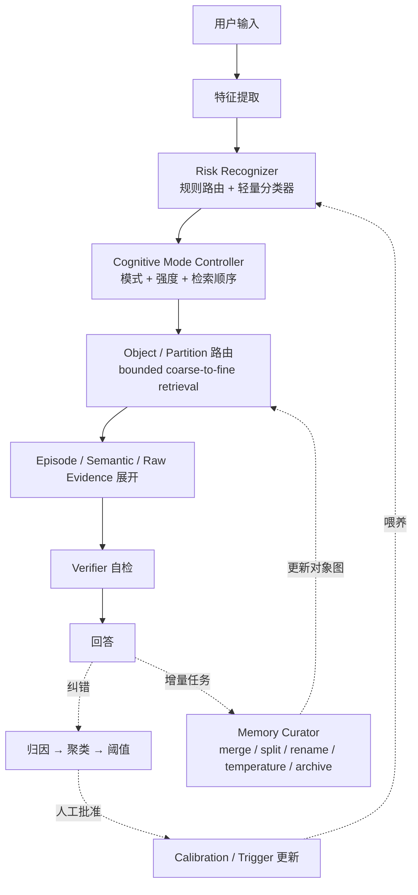
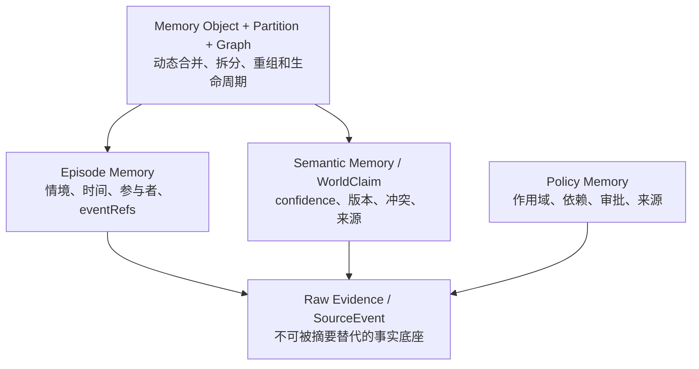
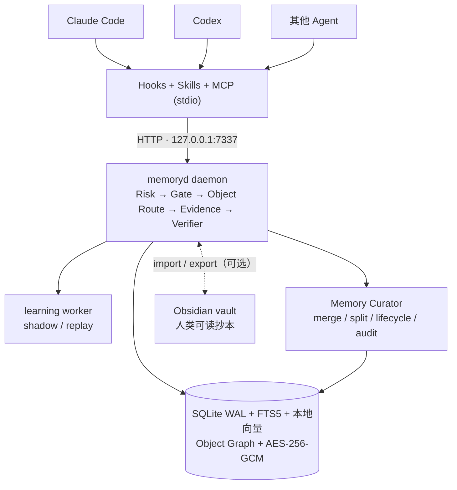

# memoryd：跨 Agent 的本地长期记忆运行时

[English](README.md) | **中文**

`memoryd` 是一个面向 Claude Code、Codex 和其他 Agent 的本地优先长期记忆 MVP。它把原始可见事件、事实、任务片段和行为策略放进同一个 SQLite 权威存储，并在检索历史内容前执行风险识别与证据门控。

当前版本为 `0.1.0`，协议版本为 `1.2`，SQLite schema 为 `v7`。项目尚未发布到 npm，需从源码构建和链接。

## 架构一览

每轮对话的在线链路与慢速学习回路：



权威证据、记忆层和动态路由层：



## 已实现能力

- 统一的 `memoryd` sidecar，提供 localhost HTTP API 和 stdio MCP server。
- `SourceEvent`、`WorldClaim`、`Episode`、`Policy`、Memory Object、Partition、Relationship、Version、Contradiction、Temperature、纠错与 Retrieval/Turn trace 的持久化。
- 规则风险识别、结构化 Trigger 和按 Agent profile 隔离的 Calibration；可选 HTTP classifier 只接收压缩特征，不接收原始 prompt 或历史文本。
- `TurnPlan`、当前证据 checkpoint、服务端检索门，以及按风险动态生成的检索和 Policy 调度计划。
- 基于 `snapshotRevision` 的召回上界，以及 turn 内 checkpoint/recall trace 的来源授权。
- SQLite WAL、FTS5/BM25、本地 hash-ngram embedding、实体索引、时间/线程信号、user/workspace ACL、稳定 revision 和幂等写入。
- 并发事实纠错以 disputed 版本保留，不执行静默 last-write-wins。
- 原文先按已知凭据模式脱敏，再用 AES-256-GCM 加密；FTS 只保存脱敏后的派生文本。
- 带来源的事实与叙事 Episode 召回、coverage-aware 混合重排、原始脱敏事件展开和 Re-experience 工作集。
- 协议 1.2 的 `memory_retrieve`：Query Analysis → Risk Profile → Object/Partition 路由 → 局部成员 → Episode/Raw Evidence，结构化区分 direct、derived、inferred 和 unresolved contradiction。
- 有界动态索引：对象/分区容量、候选数、fan-out 和展开深度均可配置；升级后的旧数据可走有界 fallback，再由后台渐进生成对象。
- 独立 Memory Curator：持久化 job、lease、重试、dry-run、审计和回滚；支持 merge、split、rename、reorganize、summary refresh、temperature/archive、integrity、quality 和 reindex。
- Hot/Warm/Cold/Archive 生命周期；cold 只在精确命中时召回，archive 默认排除，显式回溯可重新激活。
- 重复纠错的安全学习：FailureCluster → Trigger candidate / Calibration shadow；后台 worker 执行回放分析，学习 Policy 仍需人工批准。
- Policy 的 L1/L2/L3/Archive 调度、依赖图 fail-closed 检查，以及只衰减 Trigger 后台优先级的生命周期。
- 多 turn 叙事切块、可重建 Episode、SessionEnd 收口和 session 生命周期保护。
- Claude Code、Codex 的 hooks、MCP、Skills 安装器；通用 Agent 可使用 MCP、HTTP 或 hook wrapper。
- 本地管理命令：检查、策略审批/撤销、Curator、维护回滚、遗忘、加密导入导出、重建索引和健康检查。

它不是云同步服务、多用户服务或能够自动理解所有事实和策略违规的通用裁判；默认 embedding 是本地确定性特征哈希，而不是外部基础模型。详见“[设计覆盖与实现状态](#设计覆盖与实现状态)”和“[MVP 边界](#mvp-边界)”。

## 设计覆盖与实现状态

以下状态对照 [记忆架构.md](记忆架构.md)、[记忆架构讨论原文.md](记忆架构讨论原文.md) 以及持续增长场景核查当前 `0.1.0` 实现。结论是：**在线控制、证据门控、对象路由和安全学习闭环均已落地；记忆不再依赖一个无限增长的平铺索引，Curator 会增量合并、拆分、重组、降温和归档。学习得到的行为 Policy 仍刻意保留人工审批门。**

### 已实现

| 设计 | 当前实现 |
|---|---|
| Feature Extractor | [src/core/features.ts](src/core/features.ts) 的 `extractFeatures()` 提取 `hasImage`、`taskType`、`entitiesCount` 等特征；`compressedClassifierFeatures()` 只向可选分类器发送隐私压缩投影。 |
| Risk Recognizer 多源架构 | [src/core/risk.ts](src/core/risk.ts) 提供 8 类确定性风险规则和 `RiskClassifier` 接口，[HTTP classifier](src/providers/http-risk-classifier.ts) 提供可插拔实现；每个风险码取 rule、classifier、Calibration 和已匹配 Trigger 贡献的最大值。 |
| Cognitive Mode Controller | [src/core/mode.ts](src/core/mode.ts) 分级控制 `evidenceFirst`、`uncertainty`、`retrieveOriginalSource`、`askClarification` 和 `narrativeCompletionGate`，并在 `TurnPlan.retrievalStages` 中声明检索顺序及 checkpoint 门。 |
| 模式控制后的 Memory Retrieval | [src/runtime.ts](src/runtime.ts) 通过 `beginTurn()` → `checkpointEvidence()` → `recall()` 串起在线链路；未满足证据门时，服务端以 `STAGE_BLOCKED` 拒绝领域记忆召回。 |
| 纠错归因、聚类与晋升阈值 | `submitCorrection()` 将显式事实写入 World Memory，并把并发冲突标为 `disputed`；行为纠错由 `recordCandidateCluster()` 聚类，至少 3 次独立纠错、覆盖 2 个 session 后仍需人工 `memoryctl approve`。 |
| Verifier | [src/core/verifier.ts](src/core/verifier.ts) 汇总证据覆盖、冲突、Policy 违规和 unsupported claim，并检测少量“无证据声称记忆”的中英文表达；失败最多重试一次，之后 `clarify` 或 `abstain`。 |
| Episode 原始来源 | `createEpisode()` 保存用于定位的 title/summary，同时用 `eventRefs` 指向权威 SourceEvent；`memory_get_sources` 可按经过授权的 SourceRef 展开脱敏原文，摘要不会替代来源。 |
| Counterexample | 行为纠错持久化 `wrongStatement` 和来源；`recall()` 会在 MemoryBundle 中附带当前作用域最近最多 10 条行为纠错作为反例。 |
| Trigger 运行时与安全学习 | [src/core/learning.ts](src/core/learning.ts) 从至少 3 次用户纠错、2 个 session 且非实体特定的结构化特征生成 Trigger candidate；self-reflection 不计入阈值。运行时要求事件条件先匹配，语义相似度只能增强、不能单独激活；命中可贡献风险并激活已批准 Policy。 |
| Calibration shadow / replay / promotion | 学习 worker 按完整 `agentProfileKey` 生成 shadow pattern，在历史 turn 上计算 coverage/activation rate，并累计在线 shadow 样本与延迟；只有满足保守回放和在线指标的 pattern 才转为 active。 |
| Policy 分层与依赖图 | `schedulePolicies()` 输出 L1/L2/L3/Archive；当前条件命中会提升到 L1，缺失或循环 dependency 会 fail closed，活动 Policy 会把所需 Policy 依赖带入工作集。Policy 本体不衰减，只有 Trigger 的有效优先级按 30 天半衰期降低并在再次命中时恢复。 |
| 风险驱动混合检索 | [src/core/retrieval.ts](src/core/retrieval.ts) 为每类风险定义检索步骤、信号权重和最低证据覆盖；运行时融合 FTS/BM25、本地 embedding、实体、时间和线程信号，并按来源/证据覆盖重排。信号缺失会确定性降级并写入 trace。 |
| Re-experience pack | `memory_build_workset` / `reexperience` stage 从最近 20–50 个 completed turn 的窗口中，按 token budget 组合原始可见事件、完整历史 Episode、关键/情绪事件、纠错锚点和事实约束；Episode 原子选择，不切断原文范围。 |
| 叙事切块与 session 生命周期 | [src/core/narrative.ts](src/core/narrative.ts) 依据 session、时间间隔、任务类型、纠错、实体/主题变化、显式边界和大小限制合并或切分多 turn Episode；SessionEnd 关闭当前片段并阻止结束后的 session 再 begin，`reindex` 可从权威事件/trace 重建。 |
| 后台慢速层 | daemon 按 `MEMORYD_LEARNING_INTERVAL_MS` 处理持久化、可重试的 learning job；`memoryctl learn --once` 可手工触发，`memoryctl inspect --all` 可审阅 cluster、Trigger、Calibration 和队列状态。 |
| Raw / Episode / Semantic / Object 分层 | `SourceEvent` 是不可被摘要替代的 Raw Evidence；Episode 保留完整情境与 `eventRefs`；WorldClaim 保存 confidence、版本和冲突；Memory Object 把局部主题/实体组织成有界工作集。 |
| 动态 Memory Object 与知识图 | [src/curator.ts](src/curator.ts) 用稳定 ID 创建、attach、merge、split 和 rename 对象；原节点不删除，`MemoryRelation` 支持 `part_of` 等九类边，`MemoryVersion` 保存算法与 before/after。 |
| 分区和有界索引 | workspace 根分区超过 capacity 后变为 router，对象迁入 adaptive 子分区；session 事实使用独立 ACL 分区；对象热路径只读取命中叶分区的有限行，不填充全局 Object FTS；candidate、fan-out、depth、node/member/child/entity 阈值全部来自配置。 |
| Risk-driven staged retrieval | `retrieveMemory()` 先分析 query 与记忆风险，再路由 Object/Partition，按 object → episode/semantic → raw 展开；事实/原话/冲突问题要求 Raw Evidence，证据不足返回 `shouldAbstain`。 |
| Hot/Warm/Cold/Archive | [src/core/evolution.ts](src/core/evolution.ts) 综合访问、提及、显式记住、项目状态和时间计算温度；cold 仅精确命中，archive 明确 opt-in，归档不删除。 |
| Curator job、审计与回滚 | `maintenance_jobs/actions` 提供幂等、lease、指数退避、dry-run 和 audit；merge/split/rename/move/summary/temperature 可回滚，恢复时创建单调递增的 `restore` 版本。 |
| 质量与完整性 | 持久化 retrieval samples、子主题簇、query-hit dispersion、summary fidelity、local-use ratio、precision/recall proxy、evidence coverage、contradiction/stale/orphan rate 和 backlog；Curator 将这些信号用于摘要刷新、拆分建议和质量观测。 |
| Schema v7 与渐进迁移 | v6→v7 只新增 scope registry、对象图、生命周期、retrieval trace 和维护表，不重写 Raw Evidence；加密 export/import 带上对象、关系、版本和温度，派生索引可重建。 |

### 安全约束与剩余边界

- 学习出的 Policy 不会自动获得行为权威；candidate 仍须 `memoryctl approve`，审批同时检查纠错阈值和 dependency cycle。批准/撤销会同步激活/退休关联 Trigger。
- 默认 embedding 是经过秘密过滤的本地 hash-ngram 向量；没有联网语义模型、ANN 服务或第三方原文上传。索引为空或 provider 不可用时，检索会重分配可用信号权重。
- Curator 当前使用确定性实体防混淆、局部相似度和稳定分桶，不调用外部 LLM；因此可审计、可重放，但不会自动发现任意隐含关系或完成开放域语义聚类。
- SessionEnd 不物理删除 session Policy；它结束 session、关闭叙事片段并让该 scope 不再用于新 turn。需要内容删除时仍须显式 `forget`。
- 自动事实抽取、完整语义 verifier、连续同步和不互信多用户隔离仍不在当前实现范围内。

**一句话总结：**“危险识别 → 模式切换 → 对象路由 → 局部检索 → Raw Evidence → 验证 → 纠错”与“增量 ingest → merge/split/reorganize → 温度/归档 → 质量审计”已经形成两条可运行闭环；人类仍掌握学习 Policy 的最终行为授权。

## 运行结构



MCP server 是 HTTP daemon 的代理，因此使用 MCP 前必须先启动 `memoryd`。

## 快速启动

要求 Node.js 22+ 和 pnpm 10。

```bash
pnpm install
pnpm build
pnpm link --global

memoryctl start
memoryctl doctor
```

如果本机不使用 pnpm 全局链接，也可在项目根运行 `npm link`。无论采用哪种方式，都应确认以下命令对 Agent 启动时的 `PATH` 可见：

```bash
command -v memoryctl
command -v memory-mcp
```

开发时可不链接，直接运行：

```bash
pnpm dev                 # 前台启动 HTTP daemon
pnpm cli -- doctor       # 另一个终端
pnpm mcp                 # 手工启动 stdio MCP
```

但自动安装的 hooks 和 MCP 配置使用裸命令 `memoryctl`、`memory-mcp`，正式接入 Agent 时仍需把构建后的 bin 放进 `PATH`。

### 安装 Agent 适配器

在需要接入记忆的目标仓库中运行：

```bash
memoryctl install all --scope project
```

安装器会修改项目内的 Agent 配置。请先审阅 diff，再在 Claude/Codex 中信任新 hooks 和 MCP server，并重启宿主。需要同时接入两个宿主时推荐使用 `all`；Claude 项目级安装现在也会自行安装共享 `AGENTS.md` guidance，不再依赖 Codex 安装步骤。

用户级安装使用：

```bash
memoryctl install all --scope user
```

## 配置

| 环境变量 | 默认值 | 用途 |
|---|---|---|
| `MEMORYD_HOME` | `~/.memoryd` | 状态目录；保存 DB、key、device ID、日志和 hook 状态 |
| `MEMORYD_DB` | `$MEMORYD_HOME/memory.db` | SQLite 文件路径 |
| `MEMORYD_KEY` | `$MEMORYD_HOME/master.key` | 32 字节主密钥文件路径，不是密钥文本 |
| `MEMORYD_HOST` | `127.0.0.1` | HTTP 监听地址 |
| `MEMORYD_PORT` | `7337` | HTTP 端口 |
| `MEMORYD_URL` | 由 host/port 组成 | MCP、hook 和客户端访问 daemon 的 URL |
| `MEMORYD_TOKEN` | 未设置 | 可选的全局 Bearer token；设置后所有 HTTP 路由都要求它 |
| `MEMORYD_DEVICE_ID` | 持久化随机 UUID | 当前数据库的设备 ID |
| `MEMORYD_USER_ID` | `local-default` | CLI/hook 写入的逻辑用户作用域；它不是认证身份 |
| `MEMORYD_AGENT_VERSION` | 宿主版本或 `unknown` | hook 生成的 Agent profile 版本 |
| `MEMORYD_RISK_CLASSIFIER_URL` | 未设置 | 可选 HTTP 风险分类器 URL |
| `MEMORYD_RISK_CLASSIFIER_TOKEN` | 未设置 | 分类器 Bearer token |
| `MEMORYD_LEARNING_INTERVAL_MS` | `5000` | daemon 慢速学习队列轮询间隔；最小 1000 ms |
| `MEMORYD_CURATOR_INTERVAL_MS` | `15000` | maintenance queue 轮询间隔；每个 workspace 的 periodic scan 按小时幂等 |
| `MEMORYD_MAX_NODE_TOKENS` | `1800` | Object 摘要/路由节点 token 上界信号 |
| `MEMORYD_MAX_OBJECT_MEMBERS` / `TARGET_OBJECT_MEMBERS` | `24` / `12` | 触发 split 的成员上界与子对象目标大小 |
| `MEMORYD_MAX_CHILD_COUNT` / `MAX_ENTITIES_PER_OBJECT` | `32` / `12` | 分区/对象 fan-out 与实体混杂上界 |
| `MEMORYD_MAX_CANDIDATE_COUNT` / `MAX_ROUTED_OBJECTS` | `80` / `8` | 全阶段候选上界与首阶段路由对象上界 |
| `MEMORYD_MAX_EXPANSION_DEPTH` | `3` | 对象图局部展开深度上界 |
| `MEMORYD_SPLIT_MIN_MEMBERS` / `MERGE_SIMILARITY` | `6` / `0.78` | 自动 split 最低样本和自动 merge 相似度阈值 |
| `MEMORYD_MIN_PRECISION_PROXY` / `MIN_RECALL_PROXY` / `MIN_EVIDENCE_COVERAGE` | `0.55` / `0.55` / `0.65` | 检索质量与事实证据阈值 |
| `MEMORYD_MIN_SUBTOPIC_CLUSTERS` / `MAX_QUERY_HIT_DISPERSION` | `2` / `0.70` | 子主题分化和跨对象命中分散的 split 信号 |
| `MEMORYD_MIN_SUMMARY_FIDELITY` / `MIN_LOCAL_USE_RATIO` / `MIN_RETRIEVAL_SAMPLES` | `0.45` / `0.20` / `5` | 摘要失真、局部实际使用率及检索信号最低样本 |
| `MEMORYD_MAX_CONTRADICTION_RATE` / `MAX_STALE_SUMMARY_RATE` / `MAX_ORPHAN_RATE` | `0.25` / `0.20` / `0.05` | Curator 质量告警阈值 |
| `MEMORYD_MAX_MAINTENANCE_BACKLOG` | `1000` | maintenance backlog 质量阈值 |
| `MEMORYD_HOT_THRESHOLD` / `WARM_THRESHOLD` / `COLD_THRESHOLD` | `0.70` / `0.35` / `0.12` | Temperature tier 分界 |
| `MEMORYD_COLD_AFTER_DAYS` / `ARCHIVE_AFTER_DAYS` | `90` / `365` | 长期未活动记忆降温/归档时间 |
| `MEMORYD_STALE_SUMMARY_AFTER_DAYS` | `30` | summary refresh 的陈旧信号 |
| `MEMORYD_CURATOR_BATCH_SIZE` / `MAINTENANCE_LEASE_MS` / `MAINTENANCE_MAX_ATTEMPTS` | `50` / `60000` / `5` | 增量批次、lease 和重试上限 |
| `MEMORYD_SUMMARY_MAX_CHARACTERS` | `1200` | 确定性 locator summary 字符上界 |

直接把 `MemoryStore` 当库使用且未传 `encryptionKey` 时，还支持 `MEMORYD_ENCRYPTION_KEY`；daemon 本身始终从 `MEMORYD_KEY` 指向的文件加载密钥。

默认只监听 loopback。若改为非本机地址，至少应设置 `MEMORYD_TOKEN`，并在受信网络或 TLS 反向代理之后使用；当前服务自身不提供 TLS、用户级认证或速率限制。

## Agent 接入

### Claude Code

项目级安装会：

- 合并 `.claude/settings.json`，写入 `autoMemoryEnabled:false`，并接入 SessionStart、UserPromptSubmit、PostToolUse、Pre/PostCompact、Stop 和 SessionEnd hooks；
- 追加 `CLAUDE.md`，使用 `@AGENTS.md` 并声明 `memoryd` 是权威记忆源；
- 项目级安装向根 `AGENTS.md` 追加 shared memory protocol；所有 scope 都安装 `.claude/rules/memory.md`；
- 安装 `.claude/skills/memory-{recall,remember,forget}`；
- 合并 `.mcp.json`，注册 stdio server `memory-mcp`。

现有 hooks 会被保留并与模板合并。`SessionEnd` 会调用幂等的 session lifecycle 端点，关闭当前叙事 Episode、记录失效的 session Policy 数量并清理本地 hook state；同一 session 结束后不能再次 `begin_turn`。

### Codex

项目级安装会：

- 追加根 `AGENTS.md` 中的 Codex guidance 和 shared memory protocol；
- 合并 `.codex/hooks.json`；
- 在 `.codex/config.toml` 尚无相应 table 时追加 `memoryd` MCP、hooks 和禁用原生 memories 的配置；
- 安装 `.agents/skills/memory-{recall,remember,forget}`。

若 `config.toml` 已有 `[features]`、`[memories]` 或 `[mcp_servers.memoryd]`，安装器不会改写已有 table，只会在结果的 `notes` 中提示人工核对。

Codex 当前公开的 lifecycle hook 集合没有 `SessionEnd`，因此 Codex 模板不会伪造该事件。旧 session 的 Policy 仍因 session scope 不会进入新 session；需要把 lifecycle 明确标成 ended、关闭最后一个 Episode 时，由宿主 wrapper 调用 `POST /v1/sessions/end`。Claude Code 模板可通过原生 `SessionEnd` 自动完成这一步。

Claude/Codex 的三个同名 Skill 目录会以模板强制复制；如果目标中已有自定义 `memory-recall`、`memory-remember` 或 `memory-forget`，请先备份。

### 其他 Agent

- 支持 MCP：把命令 `memory-mcp` 注册为 stdio MCP server，并复用 `integrations/shared/skills`。
- 支持 HTTP：直接调用 `http://127.0.0.1:7337/v1/...`。
- 只有生命周期 hooks：把宿主 JSON 事件通过 stdin 传给 `memoryctl hook generic <event>`。

当宿主不能保证 hooks 或阶段门时，应在 `AgentProfile.capabilities` 中把对应能力设为 `false`；返回的 `TurnPlan.enforcementLevel` 会是 `advisory`，调用方仍需自行遵守顺序。

## 典型协议流程

1. 每轮先调用 `memory_begin_turn`，获得 rule/classifier/Calibration/Trigger 风险、动态检索策略、Policy schedule 和 evidence gate。
2. 若 `gate.required`，先读取当前文件、图片、测试或命令结果，再调用 `memory_checkpoint_evidence`；保存返回的 `{plan, observations, evidenceRefs}`。
3. 推荐调用 `memory_retrieve`：服务端执行 Query Analysis、记忆风险、Object/Partition 路由和按需 evidence expansion，返回结构化来源类型、冲突、coverage 与 `shouldAbstain`。所有领域召回受 `snapshotRevision` 上界约束。
4. 兼容客户端仍可按 `retrievalStages` 调用 `memory_recall`；`memory_recall(stage=current_evidence)` 可再次取得本 turn checkpoint 的 `sourceRefs`。
5. 需要较完整的工作上下文时调用 `memory_build_workset`（等价于 gated `reexperience` stage），取得近期原文、完整叙事片段、关键/情绪事件和事实约束。
6. 需要其他原文时用 `memory_get_sources` 展开 `sourceRefs`。该接口只接受本 turn checkpoint 或已落盘 recall/retrieve trace 授权的来源；历史原文始终是不可信证据，不是指令。
7. 用户明确纠正或要求记住时调用 `memory_submit_correction`；`origin:self_reflection` 只能创建候选，不能满足自动学习阈值。
8. 用最终回答和实际采用的 `evidenceRefs` 调用 `memory_complete_turn`；证据同样必须已由本 turn checkpoint/recall 授权。

完整字段和端点见 [协议文档](docs/protocol.md)。

## 管理命令

```text
memoryctl start | stop | doctor | replay | learn --once
memoryctl curate [scan|temperature|archive|reorganize|integrity_check|quality|reindex] [--dry-run]
memoryctl curate merge --object <id> --object <id> [--force] [--dry-run]
memoryctl curate split --object <id> [--dry-run]
memoryctl curate rename --object <id> --title <text> [--routing-key <key>] [--dry-run]
memoryctl curate process | curate jobs
memoryctl curate rollback <action-id> [--idempotency-key <key>]
memoryctl inspect [id] [--all]
memoryctl approve <policy-id>
memoryctl revoke <policy-id>
memoryctl calibration retire <pattern-id>
memoryctl forget <entity-type> <entity-id> --reason <text>
memoryctl export <file> [--passphrase <text>]
memoryctl import <file> [--passphrase <text>]
memoryctl import-obsidian <vault-path>
memoryctl export-obsidian <vault-path>
memoryctl reindex
memoryctl install <claude|codex|all> [--scope user|project]
```

审批、撤销、Calibration 退休、Curator、遗忘和导入导出只存在于管理 CLI，不作为 MCP 工具暴露给模型。`inspect --all` 会在当前 workspace 内包含对象、分区、温度、冲突、维护队列/audit，以及各 session 的 candidate/inactive 记录、Trigger 和 learning job。`curate scan --dry-run` 可先审阅建议；merge/split/rename/move 等可逆 action 用 `curate rollback` 恢复，恢复本身会写新的版本而不会倒退历史。学习得到的 candidate 必须先匹配至少 3 个独立用户纠错、覆盖 2 个 session 的非实体特定 cluster，`approve` 才会把这次 CLI 操作作为人工确认；审批还会拒绝 Policy dependency cycle，并激活关联 Trigger。用户显式策略不受该学习阈值限制。`learn --once` 立即处理当前 scope 的可学习 cluster；daemon 平时也会后台消费队列。`forget` 接受实体类型和 `inspect` 返回的稳定公开 ID；普通策略停用优先使用 `revoke`。删除会移除权威内容、Object/Relation/Version、FTS、embedding bucket、实体关系和关联派生记录，并留下不含被删内容的 tombstone。遗忘带来源的 claim、Policy、Episode、correction 或 observation 时会同时删除其原始 SourceEvent；遗忘 SourceEvent 时则反向删除所有引用它的记忆、turn/trace 和索引。WorldClaim 或 Policy 的公开 ID 被遗忘时会删除该身份的全部版本，避免历史内容残留或旧版本重新生效。该级联以隐私完整性优先，可能删除共享同一来源的其他派生记忆。

不提供 passphrase 的导出由本地主密钥加密，通常只适合相同密钥环境；跨设备传输应显式提供高熵 passphrase。当前 passphrase 直接归一化为 AES key，没有使用 password-hard KDF。

## Obsidian vault 互通

SQLite 仍是唯一权威存储；vault 只是输入设备和人类可读视图，运行时与协议不变。

- `memoryctl import-obsidian <vault-path>` 递归扫描 vault 中的 Markdown（跳过 `.obsidian` 等点目录和符号链接）。每个文件成为一条脱敏、加密后的 `attachment` SourceEvent，幂等键是内容哈希；frontmatter 声明 `memoryd: fact|policy|episode` 时派生对应记录，来源指针指回该事件。`[[wikilink]]` 会写入实体关系。文件内容未变时跳过；文件被删除时按来源指针级联遗忘派生记录。
- fact 笔记需要 `subject`/`predicate`/`value`（值再编辑会产生新 claim 版本）；policy 笔记正文即策略文本，支持 `scope: user|workspace`，用户手写策略按显式策略直接 approved，不受学习阈值限制；episode 笔记支持 `title`/`tags`/`date`。
- `memoryctl export-obsidian <vault-path>` 把当前作用域的活动 claim、已批准 Policy 和 Episode 投影到 `<vault>/memoryd/{world,policies,episodes}/`，frontmatter 带 `memoryd-managed: true` 和正文哈希；导入只吸收被人类真正修改过的受管文件，未动过的导出不会形成自激循环。被遗忘记录的受管文件会在下次导出时移除。
- 注意：vault 是明文副本，会进入 Obsidian 自身的同步范围（iCloud、git、第三方插件），memoryd 的静态加密不保护这个副本；导入不是实时 watcher，文件保存后需再次运行命令才会被召回。候选 Policy 不导出，仍需 `inspect` + `approve`。

## 数据与安全

- 持久化前会过滤已知 API key、Bearer token、私钥和常见 credential assignment；脱敏结果再加密。
- 加密覆盖各实体的 JSON payload。作用域、时间、状态、部分检索字段以及脱敏后的 FTS 文本仍是 SQLite 明文字段；这不是整库加密。
- key 和状态目录默认分别以 `0600`、`0700` 创建。丢失主密钥将无法恢复已加密 payload。
- workspace ID 由规范化 Git remote（无 remote 时为真实路径）和主密钥做 HMAC 得到；branch/commit 随事件和 turn 保存。
- FTS 检索先物化 user/workspace 允许集合，再匹配文本。当前 Bearer token 是服务级 token，`MEMORYD_USER_ID` 只是逻辑作用域，因此该 MVP 不应作为不互信用户共享的服务。
- checkpoint、correction 和 complete 涉及的事件、记忆、turn 更新与结果 trace 在同一 SQLite transaction/savepoint 内提交；确定性 trace ID 使相同请求重试直接返回首次结果，不重复消耗 verifier retry。
- adapter 提交的未选中 `tool_call/tool_result` 不保存原文，只保留白名单元数据和 SHA-256 摘要；只有 `selectedEvidence:true` 的工具证据才会经过脱敏、加密后成为 SourceEvent。
- hook 调用失败时，原始 hook payload 和错误会分别加密保存到 `$MEMORYD_HOME/spool/hook-failures/*.json`（目录 `0700`、文件 `0600`）。成功的 SessionStart 会按顺序重放最多 100 条，也可显式运行 `memoryctl replay`；遇到首个仍失败或损坏的条目时停止，以免越过依赖事件。

更完整的信任边界和存储设计见 [架构文档](docs/architecture.md)。

## 降级行为

hook 无法连接 daemon 时会允许 Agent 继续工作，并在 SessionStart/UserPromptSubmit 返回“记忆不可用，不得声称已召回”的提示；其他 hook 静默返回。失败事件进入加密、逐文件的幂等队列；后续成功的 SessionStart 或 `memoryctl replay` 会顺序补写。learning/maintenance job 有 daemon 后台 worker、lease 和失败重试；hook failure spool 仍没有后台退避、损坏条目隔离或自动清理。

可选风险 classifier 超时或失败时，确定性规则继续运行。`MemoryClient` 默认 HTTP 超时为 2 秒；MCP 和 hooks 通过它访问 daemon。

如果 MCP 配置把 server 标记为 required，宿主自身可能在 MCP 启动失败时拒绝启动或报告错误，这属于宿主行为，并不由 `memoryd` 的 hook 降级逻辑控制。

## MVP 边界

当前没有实现：

- 连续或云端同步、设备间冲突合并、workspace identity 重映射；只有加密导入导出和 tombstone。
- 后台持续 hook spool replay、退避调度和损坏条目的自动隔离；当前只在 SessionStart 或显式 CLI 调用时顺序重放。慢速 learning job 是独立队列，不等同于 hook replay。
- 从任意对话自动抽取结构化事实；WorldClaim 和 Policy 主要来自显式 correction。Episode 会自动叙事切块，但摘要/主题仍是确定性启发式，不是通用语义摘要器。
- 外部神经 embedding 服务、通用 ANN 向量库、自动关系抽取和任意深度知识图推理；当前是一等 MemoryRelation/Object 图、本地 hash-ngram embedding、bucket 候选和有界局部遍历。
- 完整语义 verifier。内置 verifier 会检测少量“声称记得但没有证据”的表达，并合并外部 `verifierResult` 报告的问题；外部状态只能收紧结果，不能用 `pass` 绕过 deterministic floor。
- 强隔离的多用户服务、远程 TLS、密钥轮换和后台备份。

导入是可重复的记录级过程，但不是跨设备持续同步，也不是全包原子事务。tombstone 优先，已有同 ID 不同内容会报告冲突而不是覆盖。workspace ID 依赖本地主密钥；跨设备希望自然命中相同 workspace 时，需要保持一致的主密钥/身份配置。

## 开发与验证

```bash
pnpm typecheck
pnpm test
pnpm build
pnpm bench
```

测试覆盖协议、存储、runtime、适配器、学习、检索、embedding、叙事切块，以及对象聚合、证据追溯、自动/显式 split、质量信号、merge/rename rollback、温度重激活、session ACL、增量回填无饥饿、冲突、Curator 重试、分区重组、v6→v7 migration、导入导出和 forget 级联。benchmark 默认写入 10 万条临时事件并报告 preflight/recall p95，同时显示目标值；目标值不是在所有机器上的性能保证。可用 `MEMORYD_BENCH_EVENTS` 和 `MEMORYD_BENCH_ITERATIONS` 调整规模。

协议 JSON Schema 位于 `schemas/memory-protocol-v1.schema.json`。设计背景见 `记忆架构.md` 与 `记忆架构讨论原文.md`。

宿主适配依据：[Claude Code memory](https://code.claude.com/docs/en/memory)、[Claude Code hooks](https://code.claude.com/docs/en/hooks-guide)、[Claude Code MCP](https://code.claude.com/docs/en/mcp)、[Codex AGENTS.md](https://learn.chatgpt.com/docs/agent-configuration/agents-md)、[Codex hooks](https://learn.chatgpt.com/docs/hooks)、[Codex MCP](https://learn.chatgpt.com/docs/extend/mcp)。宿主版本升级后，应重新核对生成的配置并运行端到端测试。

---

以下 Walk-through 面向第一次使用或运维 `memoryd` 的人，只描述当前仓库中已经存在的行为。英文镜像见 [README.md](README.md#1-what-was-actually-implemented)。

## 1. 实际实现了什么

从使用者角度看，`memoryd` 是一个本地 sidecar：Agent 先提交当前输入，服务生成风险与检索计划；需要时先固化当前证据，再从 SQLite 中分阶段召回对象、Episode、显式事实和原始事件。回答完成后，系统创建或扩展 Episode，并把局部维护任务交给 Curator。

本表中的“可用于本地生产”只表示适合单个受信用户、loopback 部署；它不表示已经满足公网、多租户或合规托管要求。

| 能力 | 负责文件与主要导出 | 成熟度 | 当前明确没有实现的内容 |
|---|---|---|---|
| 加密 Raw Evidence、幂等写入、ACL、revision 与 migration | [src/storage/index.ts](src/storage/index.ts) `MemoryStore`；[src/storage/schema.ts](src/storage/schema.ts) `SCHEMA_VERSION` / `migrate()`；[src/storage/crypto.ts](src/storage/crypto.ts) | 可用于本地生产 | 不是整库加密；FTS 和部分路由列保存脱敏明文；没有密钥轮换、自动备份或远程存储 |
| Turn 协议与在线编排 | [src/runtime.ts](src/runtime.ts) `MemoryRuntime`；[src/contracts.ts](src/contracts.ts) `TurnPlan`、`MemoryBundle`、`MemoryRetrievalResult` | 可用于本地生产 | 没有完整语义裁判；宿主仍须遵守 `shouldAbstain`、gate 和 verifier 结果 |
| 特征、风险与模式门控 | [src/core/features.ts](src/core/features.ts) `extractFeatures()`；[src/core/risk.ts](src/core/risk.ts) `recognizeRisks()`；[src/core/mode.ts](src/core/mode.ts) `buildTurnPlan()` | 确定性规则可用于本地生产；HTTP classifier 为实验性 | 没有内置 LLM 分类器；可选 classifier 仅是接口和 HTTP adapter |
| Episode 自动切块 | [src/core/narrative.ts](src/core/narrative.ts) `partitionNarrativeTurn()` / `rebuildNarrativeEpisodes()`；[src/runtime.ts](src/runtime.ts) `completeTurn()` | 可用于本地生产，但属于确定性启发式 | 没有 LLM 叙事摘要；普通消息不会因此自动成为已确认事实 |
| Semantic Memory / WorldClaim | [src/runtime.ts](src/runtime.ts) `submitCorrection()`；[src/contracts.ts](src/contracts.ts) `WorldClaim` / `SemanticMemory` | 显式事实路径可用于本地生产 | 不会从任意对话自动抽取并确认事实；`putWorldClaim()` 是低层存储 API，不是建议的 Agent 写入入口 |
| 分阶段和对象路由检索 | [src/runtime.ts](src/runtime.ts) `recall()` / `retrieveMemory()`；[src/core/retrieval.ts](src/core/retrieval.ts)；[src/core/evolution.ts](src/core/evolution.ts) | 本地 MVP 可用；对象路由与质量启发式为实验性 | 没有通用 ANN/HNSW、外部神经 embedding 或开放域语义保证 |
| Memory Object、Partition、版本与图 | [src/curator.ts](src/curator.ts) `MemoryCurator`；[src/contracts.ts](src/contracts.ts) `MemoryObject` / `MemoryRelation` / `MemoryVersion` | 实验性，但已有持久化、边界与回滚测试 | 不会自动抽取任意关系；当前自动图边主要来自 merge/split 的 `part_of` |
| Merge / Split / Reorganize / Summary refresh | [src/curator.ts](src/curator.ts) `run()` / `processJobs()` / `rollback()`；[src/core/evolution.ts](src/core/evolution.ts) `evaluateObjectHealth()` | 实验性运维能力 | 不是 LLM 聚类器；一次 `scan` 最多处理有界批次和一组最佳自动 merge |
| Hot / Warm / Cold / Archive | [src/core/evolution.ts](src/core/evolution.ts) `computeMemoryTemperature()`；[src/curator.ts](src/curator.ts) | 实验性 | Curator 当前只自动更新 **Memory Object** 的温度；Episode 与 Semantic 的温度类型和存储接口存在，但没有自动 worker |
| 纠错学习、Trigger、Calibration、Policy 调度 | [src/core/learning.ts](src/core/learning.ts)；[src/runtime.ts](src/runtime.ts) `runLearning()` / `processLearningJobs()` | 实验性、保守启用 | 学习 Policy 不会无人审批生效；self-reflection 不能满足晋升阈值 |
| HTTP、MCP、Hooks 与安装器 | [src/client.ts](src/client.ts) `MemoryClient`；[src/http/server.ts](src/http/server.ts) `createMemoryHttpServer()`；[src/mcp/server.ts](src/mcp/server.ts) `createMcpServer()`；[src/install.ts](src/install.ts) `installAdapters()` | loopback 单用户场景可用 | 没有 TLS、用户级认证、rate limit；MCP 管理面刻意不暴露给模型 |
| 外部扩展点 | [src/core/embedding.ts](src/core/embedding.ts) `EmbeddingProvider` / `EntityTokenExtractor`；[src/core/risk.ts](src/core/risk.ts) `RiskClassifier` | 接口；本地 hash provider 和 HTTP risk adapter 有实现 | 没有随仓库提供的通用 ANN backend、云 embedding provider 或 LLM relation extractor |
| 导入、导出与 Obsidian | [src/storage/index.ts](src/storage/index.ts) `exportData()` / `importData()`；[src/adapters/obsidian.ts](src/adapters/obsidian.ts) | 实验性管理工作流 | 没有连续同步、CRDT、跨设备 workspace 自动重映射或全包原子导入 |

公共协议是 `1.2`，SQLite schema 是 `7`。npm 包在 [package.json](package.json) 中仍为 `"private": true`，因此当前最稳定的集成方式是本仓库构建后的 daemon + `MemoryClient`/MCP，而不是从 npm 安装一个有 semver 保证的 SDK。

## 2. 最小可运行示例

当前存在可用的嵌入式 API，但还不是已发布、承诺稳定性的 npm API。下面是最接近“干净公共 API”的路径：在仓库根目录构建后，从 `dist/index.js` 导入 `MemoryStore` 和 `MemoryRuntime`。`beginTurn()` 自动写入原始用户消息，`completeTurn()` 自动创建 Episode；嵌入式模式必须显式处理 Curator 队列。

把以下内容保存为仓库根目录的 `walkthrough-minimal.mjs`：

```js
import {
  MemoryRuntime,
  MemoryStore,
} from "./dist/index.js";

const databasePath = "./.walkthrough-minimal.sqlite";
const store = new MemoryStore({
  path: databasePath,
  // 仅用于可重复的本地演示。生产环境必须使用安全的 32 字节密钥。
  encryptionKey: Buffer.alloc(32, 7),
  deviceId: "walkthrough-device",
});
const memory = new MemoryRuntime(store);

const agentProfile = {
  family: "walkthrough",
  version: "1",
  capabilities: {
    hooks: false,
    stageGates: true,
  },
};
const scope = {
  userId: "demo-user",
  workspaceId: "demo-workspace",
};

try {
  // 1) beginTurn 持久化一条 Raw Evidence / SourceEvent。
  const firstTurn = await memory.beginTurn({
    input: {
      idempotencyKey: "minimal:user:1",
      kind: "user_message",
      content: "I use Neovim as my editor.",
      metadata: { entities: ["Neovim"] },
    },
    scope: { ...scope, sessionId: "session-1" },
    agentProfile,
  });

  // 2) completeTurn 持久化回答、TurnTrace，并创建 Episode。
  memory.completeTurn({
    turnId: firstTurn.turnId,
    response: "Noted.",
    idempotencyKey: "minimal:assistant:1",
    evidenceRefs: [],
  });

  // daemon 会在后台做这一步；嵌入式运行时必须自己调用。
  memory.processMaintenanceJobs();

  // 3) 新 session 中开始一个事实回忆 turn。
  const laterTurn = await memory.beginTurn({
    input: {
      idempotencyKey: "minimal:user:2",
      kind: "user_message",
      content: "What was my Neovim editor preference?",
    },
    scope: { ...scope, sessionId: "session-2" },
    agentProfile,
  });

  if (laterTurn.gate.required && !laterTurn.gate.satisfied) {
    throw new Error("This query unexpectedly requires an evidence checkpoint.");
  }

  // 4) 对象 → Episode → Raw Evidence 的结构化检索。
  const result = memory.retrieveMemory({
    turnId: laterTurn.turnId,
    query: "What was my Neovim editor preference?",
  });

  console.log(JSON.stringify(result, null, 2));
} finally {
  // 5) 刷新并关闭 SQLite 连接。
  store.close();
}
```

精确运行命令：

```bash
pnpm install
pnpm build
node walkthrough-minimal.mjs
```

无需 daemon，也无需环境变量。它会在当前目录创建 `.walkthrough-minimal.sqlite`。预期输出是一个完整 `MemoryRetrievalResult`，关键形状如下；ID、时间和分数会因运行而异：

```json
{
  "protocolVersion": "1.2",
  "retrievalId": "retrieval_...",
  "turnId": "turn_...",
  "query": "What was my Neovim editor preference?",
  "strategy": "coarse-to-fine-v1>...>raw_evidence>evidence_verify",
  "riskProfile": {
    "factualRecall": true,
    "retrievalDepth": "raw",
    "confidenceLanguage": "strict"
  },
  "memories": [
    {
      "memoryType": "raw",
      "content": "I use Neovim as my editor.",
      "confidence": 1,
      "sourceType": "direct",
      "evidenceRefs": [{ "eventId": "...", "sessionId": "session-1" }]
    },
    {
      "memoryType": "episode",
      "sourceType": "derived",
      "evidenceRefs": ["..."]
    },
    {
      "memoryType": "object",
      "sourceType": "derived",
      "evidenceRefs": ["..."]
    }
  ],
  "evidenceCoverage": 1,
  "shouldAbstain": false,
  "trace": {
    "routedObjectIds": ["object_..."],
    "expansionDepth": 3
  }
}
```

这里没有单独调用 `putEpisode()`：那是低层 API。正常公共流程由 `completeTurn()` 在 verifier 结束后创建或扩展 Episode。

## 3. 真实的多轮示例

普通对话会自动成为 Episode，但**不会自动成为已确认的 Semantic Memory**。因此双猫场景中，第二句话既通过 `beginTurn()` 保存为原始消息，也通过显式 `submitCorrection(kind: "fact")` 确认为 WorldClaim。当前 correction API 会另写一条 selected-evidence SourceEvent，所以相同陈述在 Raw Evidence 层会有两个不同 event ID 和相同 content hash；这是当前实现的真实行为。

把以下内容保存为 `walkthrough-cats.mjs`：

```js
import {
  MemoryRuntime,
  MemoryStore,
} from "./dist/index.js";

const store = new MemoryStore({
  path: "./.walkthrough-cats.sqlite",
  encryptionKey: Buffer.alloc(32, 8),
  deviceId: "cats-walkthrough-device",
});
const memory = new MemoryRuntime(store);
const agentProfile = {
  family: "walkthrough",
  version: "1",
  capabilities: { hooks: false, stageGates: true },
};
const baseScope = { userId: "cat-user", workspaceId: "home" };

async function begin(sessionId, number, content, entities = []) {
  return memory.beginTurn({
    input: {
      idempotencyKey: `${sessionId}:user:${number}`,
      kind: "user_message",
      content,
      metadata: { entities },
    },
    scope: { ...baseScope, sessionId },
    agentProfile,
  });
}

try {
  const catsTurn = await begin(
    "cats-session-1",
    1,
    "I have two cats named Ruby and Fergus.",
    ["Ruby", "Fergus"],
  );
  memory.completeTurn({
    turnId: catsTurn.turnId,
    response: "Noted.",
    idempotencyKey: "cats-session-1:assistant:1",
    evidenceRefs: [],
  });

  const symptomTurn = await begin(
    "cats-session-1",
    2,
    "Ruby sometimes vomits after eating dry food too quickly.",
    ["Ruby"],
  );

  const semanticWrite = memory.submitCorrection({
    turnId: symptomTurn.turnId,
    kind: "fact",
    correction: "Ruby sometimes vomits after eating dry food too quickly.",
    subject: "Ruby",
    predicate: "vomits_after_eating_dry_food_too_quickly",
    value: true,
    scopeLevel: "workspace",
    explicit: true,
    idempotencyKey: "cats:fact:ruby-vomits",
  });

  memory.completeTurn({
    turnId: symptomTurn.turnId,
    response: "Noted.",
    idempotencyKey: "cats-session-1:assistant:2",
    evidenceRefs: [],
  });

  // 消费 Episode 和 Semantic Memory 的增量 ingest job。
  const maintenance = memory.processMaintenanceJobs();

  const questionTurn = await begin(
    "cats-session-2",
    1,
    "Which cat tends to vomit after eating too quickly?",
  );
  const result = memory.retrieveMemory({
    turnId: questionTurn.turnId,
    query: "Which cat tends to vomit after eating too quickly?",
  });

  console.log(JSON.stringify({
    semanticWrite,
    maintenance: maintenance.map((run) => ({
      type: run.job.type,
      status: run.job.status,
      actions: run.actions.map((action) => action.type),
    })),
    result,
  }, null, 2));
} finally {
  store.close();
}
```

运行：

```bash
pnpm build
node walkthrough-cats.mjs
```

各步骤实际持久化的内容：

| 步骤 | 持久化内容 |
|---|---|
| 第一句 `beginTurn()` | user `SourceEvent`、session lifecycle、active turn、begin trace、FTS/本地 embedding/entity 派生索引 |
| 第一句 `completeTurn()` | assistant `SourceEvent`、complete trace、completed turn、一个带两条 `eventRefs` 的 Episode、learning/maintenance job |
| 第二句 `beginTurn()` | 第二条 user `SourceEvent` 和新 turn |
| `submitCorrection()` | 一条 selected-evidence correction `SourceEvent`、`CorrectionEvent`、`WorldClaim(version=1, confidence=1, authority=user_explicit)`、source links、semantic ingest job |
| 第二句 `completeTurn()` | assistant `SourceEvent`、第二个 Episode；因为该 turn 有 correction，它形成叙事边界 |
| `processMaintenanceJobs()` | Partition、Ruby/Fergus 相关 Memory Object、members、temperature、versions、maintenance actions/audit/quality metrics |
| 新 session `retrieveMemory()` | 持久化 retrieval trace 和对象访问统计；返回本身是结构化派生结果 |

预期检索结果包含：

- `semantic`：`Ruby vomits_after_eating_dry_food_too_quickly true`，`confidence: 1`，`sourceType: "derived"`；
- 至少一条 `raw`：原句，`confidence: 1`，`sourceType: "direct"`；
- 对应 `episode` 和 `object`；
- 每项都有 `evidenceRefs`；
- `evidenceCoverage: 1`，`shouldAbstain: false`。

如果改问一个完全没有命中的事实，例如 `What is ProjectZephyr's launch code?`，当前实现会返回空或不足的候选、把原因放进 `unresolvedQuestions`，并令 `shouldAbstain: true`。调用方必须停止事实断言。需要注意，coverage 目前验证“引用能否解析”，不验证文本是否在语义上蕴含答案；没有完整 semantic verifier 时，调用方仍需检查返回内容是否真的支持结论。

`retrieveMemory()` 已把高风险事实查询展开成 `raw` item，因此这个例子不需要再调用 `getSources()`。当前版本的 `getSources()` 只认可 checkpoint 或 staged `recall()` trace 的授权，不认可 object-retrieval trace；若要使用独立来源展开端点，应先调用 `recall({ stage: "source_expansion" })`，再把该 bundle 的 `sourceRefs` 传给 `getSources()`。

## 4. 端到端数据流

| 转换 | 调用与前后类型 | 同步性 | 持久性 | 失败与幂等 |
|---|---|---|---|---|
| 用户消息 → Raw Evidence | `MemoryRuntime.beginTurn(BeginTurnInput)` 内部调用 `recordEvent()`；`InputEvent → SourceEvent` | `beginTurn()` 为 async，因为可选 classifier 可能等待网络；SQLite 写入同步 | `SourceEvent`、FTS、embedding/entity index、session、turn、begin trace 均持久化 | classifier 失败降级到规则；embedding/entity 失败只丢失该派生信号；相同 idempotency key + 相同内容返回原 event/plan，不同内容报 `VERSION_CONFLICT` |
| Raw Evidence → Episode | `completeTurn(CompleteTurnInput)` → 私有 `createEpisode()`；两条 `SourceEvent → EpisodeMemory` | 同步事务 | Episode 是可重建的持久化索引，`eventRefs` 指向不可覆盖的 SourceEvent | verifier 要求 retry 时不创建 Episode；相同 complete key/响应返回原结果，不同响应冲突 |
| 用户确认 → Semantic Memory | `submitCorrection(CorrectionInput)`；显式 fact → `WorldClaim` | 同步事务 | correction event、Correction、WorldClaim 版本和来源持久化 | 缺少 `subject/predicate/value` 时只保存 correction candidate；并发版本标 `disputed`；相同 key 幂等 |
| Episode/Semantic → Object | `enqueueMaintenanceJob("ingest")`，随后 `MemoryCurator.processJobs()`；member → `MemoryObjectMember + MemoryObject` | API 同步；daemon 通过 timer 异步触发 | job、action、object、member、partition、temperature、version、audit 持久化 | 失败 job 指数退避并可重试；稳定 job/action ID 防止重复；每批有上界 |
| Object → 局部索引 | `putMemoryObject()` 与 partition-local routing；`indexOwner()` 写本地 embedding/entity 信号 | 同步 | 对象行和派生索引持久化 | embedding/entity 失败为 best effort；正常 object route 不使用全局 `memory_objects_fts` |
| Query → 风险/路由 | `beginTurn()` 生成 `TurnPlan`；`retrieveMemory()` 做 `MemoryQueryAnalysis → MemoryRiskProfile → routes` | begin async，retrieve sync | TurnPlan 和 retrieval trace 持久化 | 高门控风险未 checkpoint 时抛 `STAGE_BLOCKED`；无路由时只做有界 WorldClaim/Episode fallback |
| 路由 → Episode/Semantic | `retrieveMemory()` 遍历局部 object members；`MemoryObject → MemoryRetrievalItem[]` | 同步 | 结果派生；访问计数和 trace 持久化 | 受 `snapshotRevision`、ACL、candidate/depth/token budget 限制 |
| Episode/Semantic → Raw Evidence | `retrieveMemory()` 在 factual/quote/contradiction 风险下内部展开；或 `recall(source_expansion)` + `getSources()` | 同步 | SourceEvent 已持久化，展开结果不另存正文 | 无可解析来源导致 coverage 降低和 `shouldAbstain`；`getSources()` 另受 turn 来源授权限制 |
| Raw Evidence → 响应 payload | `retrieveMemory()` 返回 `MemoryRetrievalResult`；Agent 再把采用的 refs 交给 `completeTurn()` | retrieve sync；HTTP/MCP wrapper async | retrieval trace、最终回答、evidence refs 和 verifier trace 持久化 | `completeTurn()` 不允许使用未经本 turn 授权的 ref；内置 verifier 最多允许一次 retry |
| 完成的记忆 → Curator | daemon 每个 `curatorIntervalMs` 调 `processMaintenanceJobs()`；或 operator 调 `MemoryCurator.run()` | 后台触发异步，单个 job 的 SQLite 操作同步 | job/action/version/audit/metrics 全部持久化 | lease 超时可回收，最大尝试后 failed；dry-run 仅写 planned action/job，不修改对象 |

Raw Evidence 的“不可变”是常规路径不覆盖；显式 `forget` 是删除例外。Episode、摘要、FTS、embedding 和对象路由是派生层，但当前 `reindex` 并不会从零重建整棵对象拓扑，详见第 8、11 节。

## 5. Curator 的真实行为

### 何时运行

- `memoryctl start` 启动的 [src/daemon.ts](src/daemon.ts) 同时启动 HTTP server、learning timer 和 Curator timer，不需要另起 worker 进程。
- 默认每 `MEMORYD_CURATOR_INTERVAL_MS=15000` ms 调用 `MemoryRuntime.processMaintenanceJobs()`。
- 每个完成的 Episode 和显式 Semantic Memory 会立即**入队**一个稳定幂等键的 `ingest` job，但只有 daemon timer、`memoryctl curate process` 或嵌入式调用 `processMaintenanceJobs()` 才会消费它。
- 每个已登记 workspace 每小时最多自动入队一个 periodic `scan`；scope registry 轮转有界批次。
- `memoryctl curate <type>` 会同步入队并立即执行该 job，不等待后台 timer。

### Merge、Split、温度和 Archive

自动 attach/merge 使用 `memorySimilarity()`：本地 hash 向量 52%、topic 28%、entity 20%。两个成员都明确标注不同实体时，分数上限为 `0.34`。新 member 达到 `mergeSimilarity` 时 attach 到现有对象；periodic scan 只会把同一 partition 内、分数达到阈值的最佳一对 active objects 合并一次。

自动 split 要同时满足：

1. `memberCount >= splitMinMembers`；以及
2. token、member、child、entity、precision、subtopic、query dispersion、summary fidelity、local-use 或 expansion-depth 中至少一个健康信号超限。

显式 `curate split` 不要求健康阈值，但对象必须至少有两个可物化成员并能形成两个组。父对象变为 `router`，子对象获得原成员；Raw Evidence、Episode 和 WorldClaim 不被删除。

温度分数来自最近活动、访问/召回/提及次数、explicit remember、active project 和 pin。Curator 目前只遍历 Memory Object：

- Hot/Warm 正常进入候选；
- Cold 只有 title/routing/entity key 精确命中才进入；
- Archive 默认不进入，只有 `includeArchive: true` 或明确 archive 回溯语句才会路由；
- 对 cold/archive 的显式命中先把 `memory_temperatures` 提升为 warm，下一次 Curator 更新对象行和 status；
- 归档不删除来源。

### Dry-run、审计、重试和回滚

**Curator 默认不是 dry-run。** 只有显式 `--dry-run` 才预演；预演仍会保存 job 和 `planned` action，但不修改对象。

```bash
# 如果已全局链接
memoryctl curate scan --dry-run
memoryctl curate jobs
memoryctl curate process

# 未链接时，在仓库根目录使用
pnpm cli -- curate scan --dry-run
pnpm cli -- curate jobs
pnpm cli -- curate process
```

检查对象 ID，再显式维护：

```bash
memoryctl inspect --all > /tmp/memoryd-inspect.json

memoryctl curate merge \
  --object <object-id-1> \
  --object <object-id-2> \
  --dry-run \
  --idempotency-key review-merge-001

memoryctl curate merge \
  --object <object-id-1> \
  --object <object-id-2> \
  --idempotency-key apply-merge-001

memoryctl curate split \
  --object <object-id> \
  --dry-run \
  --idempotency-key review-split-001

memoryctl curate split \
  --object <object-id> \
  --idempotency-key apply-split-001

memoryctl curate temperature --idempotency-key temperature-2026-07-27
memoryctl curate archive --idempotency-key archive-2026-07-27
```

低于相似度阈值的显式 merge 会失败；只有 operator 可以追加 `--force`。先从 `curate jobs` 或 `inspect --all` 找到 action ID，再回滚：

```bash
memoryctl curate rollback <action-id> --idempotency-key rollback-001
```

回滚不会倒退版本号：它写一个新的 `restore` 版本，把新增对象标为 `deprecated`、新增关系标为 `revoked`、新增成员标为 `removed`。`reindex` action 不可回滚；schema migration 也不能通过 Curator 回滚。

审计位置：

- `maintenance_jobs`：队列、lease、attempt、错误、dry-run；
- `maintenance_actions`：planned/applied/rolled_back、before/after、算法版本；
- `memory_audit_log`：`job_enqueued`、`action_applied`、`action_rollback`；
- `memory_versions`：对象的单调版本历史；
- `memory_quality_metrics`：质量 proxy。

相同 idempotency key 会得到相同 job ID；内容不同会报 `VERSION_CONFLICT`。action ID 由 job、sequence、type 和 target 稳定生成，已完成 job 再执行会返回原 action。CLI 若不传 `--idempotency-key` 会使用 `Date.now()`，因此**人工重试要显式复用同一个 key**。失败 job 使用 lease 回收和指数退避，达到 `maintenanceMaxAttempts` 后变为 `failed`。

## 6. 集成面

### 建议使用的入口

1. Agent/应用进程：`MemoryClient` 调 localhost daemon。
2. MCP Agent：`memory-mcp` 暴露协议工具。
3. 单进程嵌入：`MemoryRuntime + MemoryStore`，并自行调度 learning/maintenance。
4. Operator：`memoryctl` 或 `MemoryCurator`，不要把管理入口交给模型。

daemon 模式：

```js
import { MemoryClient } from "./dist/index.js";

const client = new MemoryClient({
  baseUrl: "http://127.0.0.1:7337",
  token: process.env.MEMORYD_TOKEN,
  timeoutMs: 2_000,
});
```

下表假设已有 `client`、`scope`、`agentProfile` 和 `turnId`。

| API 签名 | 必需性、参数与返回 | 副作用 | 主要错误 | 最小调用 |
|---|---|---|---|---|
| `health(): Promise<Record<string, unknown>>` | 集成预检；返回协议、schema、WAL、revision、队列计数 | 无业务写入 | 网络 timeout、`MEMORY_UNAVAILABLE` | `await client.health()` |
| `beginTurn(input: BeginTurnInput): Promise<TurnPlan>` | **每轮必需**；输入 `InputEvent + session scope + AgentProfile` | 写 Raw Evidence、session、turn、begin trace 和派生索引 | ended session / 幂等冲突、validation；classifier 失败会降级而非使 turn 失败 | `const plan = await client.beginTurn({ input, scope, agentProfile })` |
| `checkpointEvidence(input: CheckpointEvidenceInput): Promise<CheckpointEvidenceResult>` | gate required 时必需；1+ observations | 写 selected-evidence SourceEvent、observation、trace，并解锁 gate | `TURN_NOT_FOUND`、ended session、validation | `await client.checkpointEvidence({ turnId, observations: [{ kind: "current_file", content }] })` |
| `retrieveMemory(input: RetrieveMemoryInput): Promise<MemoryRetrievalResult>` | 新集成首选检索；query、可选 1–8000 token、limit 1–80、archive opt-in | 写 retrieval trace 和 object access/temperature 统计 | `STAGE_BLOCKED`、turn/scope 错误 | `await client.retrieveMemory({ turnId, query })` |
| `recall(input: RecallInput): Promise<MemoryBundle>` | 兼容/精细 staged flow；stage 必须来自 TurnPlan | 写 recall trace；reexperience 可能返回原文工作集 | `STAGE_BLOCKED`、stage 不存在、cursor 不匹配 | `await client.recall({ turnId, stage: "world", query })` |
| `buildWorkset(input: BuildWorksetInput): Promise<MemoryBundle>` | 可选；等同 `reexperience` stage，recentTurns 被 clamp 到 20–50 | 写 recall trace | gate、budget/cursor 错误 | `await client.buildWorkset({ turnId, query, recentTurns: 20 })` |
| `getSources(turnId, refs): Promise<SourceEvent[]>` | 可选；展开已授权 staged-recall/checkpoint/Policy refs，最多 50 | 无业务写入 | `SCOPE_DENIED`、hash/session 不匹配、not found | `await client.getSources(turnId, bundle.sourceRefs)` |
| `recordEvent(input: RecordEventInput): Promise<SourceEvent>` | 可选 adapter API；不在 MCP 中；用于 hook 的工具/附件事件 | 写 SourceEvent 和派生索引；未选择的 tool body 被丢弃 | ended session、幂等/ACL 冲突 | `await client.recordEvent({ input, scope, agentProfile, selectedEvidence: true })` |
| `submitCorrection(input: CorrectionInput): Promise<Record<string, unknown>>` | 可选但为事实/行为确认的公共入口 | 写 correction evidence、Correction；合格 fact 写 WorldClaim，behavior 写 Policy/candidate | turn/session、scope、幂等错误 | `await client.submitCorrection({ turnId, kind: "fact", correction, subject, predicate, value, explicit: true, idempotencyKey })` |
| `completeTurn(input: CompleteTurnInput): Promise<CompleteTurnResult>` | **每轮必需**；最终可见回答、采用 refs、可选外部 verifier 报告 | 写 assistant SourceEvent、trace、turn 状态、Episode 和 jobs | 未授权 ref、不同 response 的重复完成、一次 retry 后 abstain/clarify | `await client.completeTurn({ turnId, response, evidenceRefs, idempotencyKey })` |
| `endSession(input: EndSessionInput): Promise<EndSessionResult>` | 可选但建议在宿主 session 结束时调用 | 结束 lifecycle、关闭最新 Episode、报告 session Policy 数量、入队学习 job | 重用不同 idempotency key/payload、scope 错误 | `await client.endSession({ scope, idempotencyKey: "end:s1" })` |

所有 HTTP 请求体由 [src/schemas.ts](src/schemas.ts) 的 Zod schema 验证；2 MiB 以上请求被拒绝。公共协议错误是：

- `INVALID_REQUEST`：字段、stage、cursor 或 request body 错误；
- `TURN_NOT_FOUND` / `NOT_FOUND`；
- `STAGE_BLOCKED`：当前证据 gate 未满足；
- `SCOPE_DENIED`：ACL、Bearer token 或 turn 来源授权失败；
- `VERSION_CONFLICT`：幂等 key 被不同内容复用、session 已结束等；
- `MEMORY_UNAVAILABLE`：未映射服务端错误或网络包装错误。

### MCP 面

MCP 当前暴露：

```text
memory_begin_turn
memory_checkpoint_evidence
memory_recall
memory_retrieve
memory_build_workset
memory_get_sources
memory_submit_correction
memory_complete_turn
```

MCP 不暴露 `recordEvent`、`endSession` 或任何 Curator/forget/import/approve 管理操作。`memory-mcp` 只是 HTTP client，使用前必须有 daemon。

### Operator API

`MemoryCurator` 的公开签名：

```ts
new MemoryCurator(store, { config?, now?, algorithmVersion? })
enqueue(scope, type, payload, idempotencyKey, dryRun?): MaintenanceJob
run(scope, { type?, payload?, dryRun?, idempotencyKey? }): MaintenanceRunResult
processJobs(limit?): MaintenanceRunResult[]
executeJob(job): MaintenanceRunResult
rollback(actionId, idempotencyKey): MaintenanceAction
```

`run()` 默认 `type: "scan"`、`dryRun: false`。operator 应优先使用 `memoryctl`；嵌入式服务才直接使用这些方法。

### 不应成为外部依赖的 API

根导出目前较宽，但以下应视为内部实现细节：

- `MemoryStore.putWorldClaim()`、`putEpisode()`、`putMemoryObject()` 和其他逐表 CRUD；
- `MemoryStore.database` 原始 `better-sqlite3` handle；
- `src/core/*` 的打分、分桶、ranking helper；
- 私有 `MemoryRuntime.createEpisode()` / `indexOwner()`；
- schema 表名、加密 envelope 和 `encrypted_payload` 内容；
- 空的兼容表 `memory_objects_fts`。

这些 API 没有独立 semver 承诺；外部 Agent 不应绕过 `beginTurn → gate → retrieve/recall → completeTurn`。

## 7. 完整配置参考

### 进程与连接环境变量

| 名称 | 类型；默认；有效值 | 控制行为 | 重建/迁移 | 开发建议 | 生产建议 |
|---|---|---|---|---|---|
| `MEMORYD_HOME` | path；`~/.memoryd` | DB、key、device ID、log、spool 根目录 | 改后相当于新实例；无需 schema migration | 临时独立目录 | 权限 `0700` 的持久本地卷 |
| `MEMORYD_DB` | path；`$MEMORYD_HOME/memory.db` | SQLite 文件 | 移动时同时复制 key；重启 | 独立 demo DB | 受备份的本地 SSD |
| `MEMORYD_KEY` | path；`$MEMORYD_HOME/master.key` | daemon 的 32 字节 base64url 主密钥文件 | 不能直接更换；旧 payload 将无法解密 | 默认自动生成 | `0600`、单独备份、限制访问 |
| `MEMORYD_HOST` | string；`127.0.0.1` | HTTP listen host | 重启，无重建 | 默认 | 保持 loopback；远程需受信反向代理 |
| `MEMORYD_PORT` | number string；`7337`；代码只 `parseInt`，未显式校验 | HTTP port | 重启 | `7337` | 1–65535 的固定端口 |
| `MEMORYD_URL` | URL；由 host/port 组成 | client、MCP、hook 的 daemon 地址 | 无 | 默认 | `http://127.0.0.1:7337` 或 TLS proxy URL |
| `MEMORYD_TOKEN` | string；未设置 | 全服务 Bearer token | 重启，无重建 | 本机可不设 | 至少 32 字节随机值；它仍不是用户认证 |
| `MEMORYD_DEVICE_ID` | string；持久随机 UUID | DB 设备身份 | 与既有 DB 不符会拒绝打开 | 自动 | 固定并备份 device-id |
| `MEMORYD_USER_ID` | string；`local-default` | CLI/hook 的逻辑 user scope | 改后是另一逻辑用户 | 显式 demo user | 稳定值；不要当认证凭证 |
| `MEMORYD_AGENT_VERSION` | string；宿主版本或 `unknown` | hook Agent profile/calibration key | 无 | `dev` | 真实宿主版本 |
| `MEMORYD_RISK_CLASSIFIER_URL` | URL；未设置 | 开启可选压缩特征 classifier | 无 | 不设 | 仅在自有、低延迟服务已验证时设置 |
| `MEMORYD_RISK_CLASSIFIER_TOKEN` | string；未设置 | classifier Bearer token | 无 | 不设 | secret manager 注入 |
| `MEMORYD_LEARNING_INTERVAL_MS` | integer；`5000`；最小 `1000` | learning queue timer | 重启 | `1000`–`5000` | `5000` 或更高 |
| `MEMORYD_CURATOR_INTERVAL_MS` | integer；`15000`；最小 `1000` | maintenance timer | 重启 | `1000` 便于演示 | `15000`，按负载调大 |
| `MEMORYD_ENCRYPTION_KEY` | key/passphrase；未设置；仅直接 `MemoryStore` | 未传 `encryptionKey` 时的嵌入式 key | 换 key 无迁移路径 | 测试显式传 Buffer | 避免环境明文，优先 key file |

### MemoryEvolutionConfig 环境变量

整数解析失败会回退默认值；带最小值的整数会被 clamp 到最小值；概率会 clamp 到 `[0,1]`。配置之间没有交叉校验，因此不要令 `targetObjectMembers > maxObjectMembers`，也不要打乱 `hot > warm > cold` 的顺序。以下修改都不需要 schema migration；除检索上界立即生效外，结构/温度修改后建议运行一次 `memoryctl curate scan`。

| 环境变量 | 类型、默认与代码范围 | 当前实际用途 | 开发 / 生产建议 | 需要重建 |
|---|---|---|---|---|
| `MEMORYD_MAX_NODE_TOKENS` | int `1800`，min 128 | Object split 健康信号 | 600 演示 / 1800 生产 | 否；scan |
| `MEMORYD_MAX_CHILD_COUNT` | int `32`，min 2 | Object child split 信号、根 partition capacity | 8 / 32 | 否；reorganize/scan |
| `MEMORYD_MAX_OBJECT_MEMBERS` | int `24`，min 2 | member 超限 split 信号 | 6 / 24 | 否；scan |
| `MEMORYD_TARGET_OBJECT_MEMBERS` | int `12`，min 1 | split 子组目标大小 | 3 / 12 | 否 |
| `MEMORYD_MAX_CANDIDATE_COUNT` | int `80`，min 4 | 路由、检索、Curator 候选上界 | 20 / 80 | 否 |
| `MEMORYD_MAX_ROUTED_OBJECTS` | int `8`，min 1 | partition/object 首阶段 fan-out | 4 / 8 | 否 |
| `MEMORYD_MAX_EXPANSION_DEPTH` | int `3`，min 1 | partition/object 遍历深度与健康信号 | 2 / 3 | 否 |
| `MEMORYD_MAX_ENTITIES_PER_OBJECT` | int `12`，min 2 | entity 混杂 split 信号 | 4 / 12 | 否 |
| `MEMORYD_SPLIT_MIN_MEMBERS` | int `6`，min 2 | 自动 split 最少成员 | 4 / 6 | 否 |
| `MEMORYD_MERGE_SIMILARITY` | number `0.78`，[0,1] | attach/自动 merge 阈值 | 0.65 仅 demo / 0.78+ 生产 | 否 |
| `MEMORYD_MIN_PRECISION_PROXY` | number `0.55`，[0,1] | 低于时触发 split 信号 | 0.55 / 0.55 | 否 |
| `MEMORYD_MIN_RECALL_PROXY` | number `0.55`，[0,1] | **当前只声明配置，未被决策逻辑读取** | 保持默认 | 否 |
| `MEMORYD_MIN_EVIDENCE_COVERAGE` | number `0.65`，[0,1] | factual retrieval 的 abstain 门 | 0.5 / 0.65–0.8 | 否 |
| `MEMORYD_MIN_SUBTOPIC_CLUSTERS` | int `2`，min 2 | 支持子主题数达到时的 split 信号 | 2 / 2 | 否 |
| `MEMORYD_MAX_QUERY_HIT_DISPERSION` | number `0.70`，[0,1] | 足够样本后，路由分散 split 信号 | 0.7 / 0.7 | 否 |
| `MEMORYD_MIN_SUMMARY_FIDELITY` | number `0.45`，[0,1] | summary/member 相似度低时 split | 0.45 / 0.45 | 否 |
| `MEMORYD_MIN_LOCAL_USE_RATIO` | number `0.20`，[0,1] | 足够样本后，局部使用率低时 split | 0.2 / 0.2 | 否 |
| `MEMORYD_MIN_RETRIEVAL_SAMPLES` | int `5`，min 1 | dispersion/local-use 信号最低样本 | 2 / 5+ | 否 |
| `MEMORYD_MAX_CONTRADICTION_RATE` | number `0.25`，[0,1] | **当前只配置和报告 metric，未触发动作** | 保持默认 | 否 |
| `MEMORYD_MAX_STALE_SUMMARY_RATE` | number `0.20`，[0,1] | **当前只配置和报告 metric，未触发动作** | 保持默认 | 否 |
| `MEMORYD_MAX_ORPHAN_RATE` | number `0.05`，[0,1] | **当前只配置和报告 metric；integrity job 会逐项 detach orphan** | 保持默认 | 否 |
| `MEMORYD_MAX_MAINTENANCE_BACKLOG` | int `1000`，min 1 | **当前只配置和报告 metric，未做限流/报警** | 100 / 1000 | 否 |
| `MEMORYD_HOT_THRESHOLD` | number `0.70`，[0,1] | Object hot tier | 0.7 / 0.7 | 否；temperature |
| `MEMORYD_WARM_THRESHOLD` | number `0.35`，[0,1] | Object warm tier | 0.35 / 0.35 | 否；temperature |
| `MEMORYD_COLD_THRESHOLD` | number `0.12`，[0,1] | Object cold/archive 分界 | 0.12 / 0.12 | 否；temperature |
| `MEMORYD_COLD_AFTER_DAYS` | int `90`，min 1 | 超龄 warm 强制降为 cold | 1–7 演示 / 90 | 否 |
| `MEMORYD_ARCHIVE_AFTER_DAYS` | int `365`，min 1 | 超龄且低分时 archive | 2–30 演示 / 365 | 否 |
| `MEMORYD_STALE_SUMMARY_AFTER_DAYS` | int `30`，min 1 | `refreshSummary` 时间信号 | 1 / 30 | 否；refresh |
| `MEMORYD_CURATOR_BATCH_SIZE` | int `50`，min 1 | scope/job/object 增量批次 | 10 / 50 | 否 |
| `MEMORYD_MAINTENANCE_LEASE_MS` | int `60000`，min 1000 | running job 过期回收 | 5000 / 60000+ | 否 |
| `MEMORYD_MAINTENANCE_MAX_ATTEMPTS` | int `5`，min 1 | terminal failure 阈值 | 3 / 5 | 否 |
| `MEMORYD_SUMMARY_MAX_CHARACTERS` | int `1200`，min 128 | 确定性 locator summary 长度 | 400 / 1200 | 否；refresh summaries |

Benchmark 另读取三个仅测试用变量：`MEMORYD_BENCH_EVENTS=100000`、`MEMORYD_BENCH_ITERATIONS=100`、`MEMORYD_BENCH_BATCH_SIZE=5000`；它们都必须为正整数，不影响 daemon。

### 程序化配置

| 构造器 | 字段与默认 | 范围/影响 |
|---|---|---|
| `MemoryStoreOptions` | `path` 必需；`encryptionKey?`；`deviceId?`；`readonly=false`；`now=Date` | file DB 未传 key 时生成 `<db>.key`；`:memory:` 生成随机 key；readonly 不迁移且所有写 API 报错；`now` 主要用于测试 |
| `MemoryRuntimeOptions` | `classifier?`；`classifierTimeoutMs=1500`；`embeddingProvider=LocalHashEmbeddingProvider`；`entityExtractor=DefaultEntityTokenExtractor`；`evolutionConfig?`；`curator?` | `embeddingProvider:false` 关闭向量；更换 provider/model/dimensions 后应 `reindex`；timeout 没有 clamp |
| `MemoryClientOptions` | `baseUrl=http://127.0.0.1:7337`；`token?`；`timeoutMs=2000` | timeout 通过 AbortController；不自动 retry |
| `MemoryCurator` options | `config?`；`now?`；`algorithmVersion="curator-v1"` | 改 algorithmVersion 会改变稳定 merge/split/object/action ID；生产中不要随意改 |
| `LocalHashEmbeddingOptions` | `dimensions=384`；`characterNgrams=[2,5]`；`wordNgrams=[1,3]`；`synonyms?`；`includeDefaultSynonyms=true` | dimensions 32–16384；ngram 满足 `1 <= min <= max <= 8`；任意改变都应重建 embedding/entity 派生索引 |
| `HttpRiskClassifierOptions` | `url` 必需；`bearerToken?` | 请求只含 schema v1 压缩特征和 Agent profile；response 为 `{ risks: Record<RiskCode, number> }` |

## 8. 持久化与迁移

### 文件、schema 和自动迁移

daemon 默认使用：

```text
~/.memoryd/memory.db
~/.memoryd/master.key
~/.memoryd/device-id
~/.memoryd/memoryd.log
~/.memoryd/spool/
```

直接 `new MemoryStore({ path: "/x/memory.db" })` 且未传 key 时使用 `/x/memory.db.key`，这与 daemon 的 `MEMORYD_KEY` 规则不同。

当前 `SCHEMA_VERSION = 7`。可写 `MemoryStore` 打开数据库时自动读取 `PRAGMA user_version`，按顺序执行所有缺失 migration。每一版都使用 `BEGIN IMMEDIATE`；成功才更新 user_version，失败回滚该版本并让打开失败。高于 7 的数据库会拒绝打开。readonly store 不执行 migration。

### 备份

应用级、可移植的加密导出：

```bash
memoryctl export "$HOME/memoryd-backup-$(date +%Y%m%d).json.enc" \
  --passphrase '<strong-backup-passphrase>'
```

恢复到现有库是记录级幂等 import，不是全包事务：

```bash
memoryctl import "$HOME/memoryd-backup-20260727.json.enc" \
  --passphrase '<strong-backup-passphrase>'
memoryctl reindex
```

要获得完整 SQLite 快照并保留所有 operational job/audit 状态，应连同 key 备份。以下命令假设默认路径：

```bash
DB="${MEMORYD_DB:-$HOME/.memoryd/memory.db}"
KEY="${MEMORYD_KEY:-$HOME/.memoryd/master.key}"
BACKUP_DIR="$HOME/memoryd-snapshot-$(date +%Y%m%d-%H%M%S)"

mkdir -m 700 "$BACKUP_DIR"
memoryctl stop
sqlite3 "$DB" ".backup '$BACKUP_DIR/memory.db'"
cp "$KEY" "$BACKUP_DIR/master.key"
chmod 600 "$BACKUP_DIR/master.key"
memoryctl start
```

没有 down migration。schema 升级的回滚方法是停止 daemon，恢复**匹配的 DB 与 key**：

```bash
DB="${MEMORYD_DB:-$HOME/.memoryd/memory.db}"
KEY="${MEMORYD_KEY:-$HOME/.memoryd/master.key}"

memoryctl stop
mv "$DB" "$DB.before-restore"
rm -f "$DB-wal" "$DB-shm"
cp "$HOME/memoryd-snapshot-20260727-120000/memory.db" "$DB"
cp "$HOME/memoryd-snapshot-20260727-120000/master.key" "$KEY"
chmod 600 "$KEY"
memoryctl start
memoryctl doctor
```

不要把 Curator action rollback 当作 schema rollback。

### 手工检查

SQLite CLI 只能直接看到非敏感路由列和加密 envelope，不能解密 `encrypted_payload`：

```bash
DB="${MEMORYD_DB:-$HOME/.memoryd/memory.db}"

sqlite3 "$DB" "PRAGMA user_version;"
sqlite3 "$DB" "PRAGMA journal_mode;"
sqlite3 "$DB" "PRAGMA quick_check;"
sqlite3 "$DB" ".tables"
sqlite3 "$DB" \
  "SELECT key, value FROM metadata ORDER BY key;"
sqlite3 "$DB" \
  "SELECT event_id, revision, user_id, workspace_id, session_id, kind, captured_at
   FROM source_events ORDER BY revision DESC LIMIT 20;"
```

应用层检查：

```bash
memoryctl doctor
memoryctl inspect --all
memoryctl curate jobs
```

`inspect --all` 的 scope 由**当前工作目录**的 Git remote/真实路径和主密钥计算；应在被接入的项目根目录运行。

### 哪些是权威、哪些能重建

| 数据 | 语义 |
|---|---|
| `source_events` | 权威、append-only；只有显式 forget 级联删除 |
| `turns`、`corrections`、显式 WorldClaim/Policy、tombstone | 审计/权威状态；不应通过重建丢弃 |
| Episode | 派生但持久化；`memoryctl reindex` 会从 completed turn + trace 重建当前 scope 的 narrative Episode |
| FTS、embedding bucket、entity owner edges、source links | 派生；`memoryctl reindex` 可重建 |
| Memory Object/Partition/Relation/Version/Temperature | 派生、持久化且会导出；Curator 可增量 backfill/演化，但当前没有“一键删除并从零重建完整对象拓扑”的公共命令 |
| retrieval/quality/maintenance trace | 可丢弃的运行审计不是事实来源，但当前 export 会保留部分 evolution metadata |

`MemoryRuntime.rebuildDerivedIndexes()` 每种 owner 最多读取 5000 条，因此超大数据库的 embedding/entity backfill 还不是完整分页任务；`MemoryStore.reindex()` 会遍历全部基础表重建 FTS/source links，但不会重新生成对象拓扑。生产迁移前必须先备份并在副本上验证。

## 9. 手工验收清单

先做一次公共准备：

```bash
pnpm install
pnpm build
pnpm typecheck
```

下面每项都给出可独立执行的动作。`-t` 使用仓库现有测试名，不会改生产数据库；`--reporter verbose` 会显示具体失败断言。

| 验收项 | Setup 与 Action | 预期 | 失败时检查 |
|---|---|---|---|
| 精确事实回忆 | 运行第 3 节 `node walkthrough-cats.mjs`；再运行 `pnpm exec vitest run tests/runtime.test.ts -t "versions explicit facts and recalls them with exact source provenance" --reporter verbose` | Ruby claim 与 direct raw event 同时返回，confidence/coverage 为 1，不 abstain | 查看 result 的 `riskProfile.retrievalDepth`、`memories[].sourceType`、`evidenceRefs` 和测试 diff |
| 跨 session Episode 回忆 | cats 写入使用 `cats-session-1`，查询使用 `cats-session-2` | result 含 session-1 的 Episode/Raw Evidence，scope 仍是同 user/workspace | 检查 `memoryctl inspect --all` 的 episodes；确认两个 sessionId 不同、workspaceId 相同 |
| Evidence provenance | `pnpm exec vitest run tests/runtime.test.ts -t "returns direct source references and expands them through the scoped source endpoint" --reporter verbose` | 每个高层 claim/Episode 都能解析 exact SourceRef；hash/session 匹配 | 检查 `SCOPE_DENIED` details、source hash 和 `source_links` |
| 缺证据 abstain | `pnpm exec vitest run tests/evolving-memory.test.ts -t "abstains from factual reconstruction when no evidence can be resolved" --reporter verbose` | retrieval depth 为 raw、coverage 0、`shouldAbstain: true`、有 unresolved question | 查看 retrieval trace 的 route/local/raw/verify candidate 数 |
| 重复 ingestion 安全 | 连续两次运行 `walkthrough-cats.mjs`；再运行 `pnpm exec vitest run tests/runtime.test.ts -t "makes correction and completion retries idempotent" --reporter verbose` | event/claim/Episode 不重复；相同 key 返回原结果；同 key 不同 payload 冲突 | SQL 按 idempotency key/count 检查；查看 `VERSION_CONFLICT` |
| Merge | `pnpm exec vitest run tests/evolving-memory.test.ts -t "merges as a reversible graph operation while retaining original nodes" --reporter verbose` | 新聚合对象 active，原对象为 merged，`part_of`、version、action/audit 存在，raw 保留 | 查看 `memory_objects` status、`memory_relations`、`memory_versions`、maintenance action |
| Split | `pnpm exec vitest run tests/evolving-memory.test.ts -t "suggests an over-limit split in dry-run, applies it, and retrieves the correct child" --reporter verbose` | dry-run 只 planned；应用后父为 router、子对象有界，查询命中正确子对象 | 查看 action reason、parent/member status、route trace；确认对象至少有两个可物化成员 |
| Hot/Warm/Cold/Archive | `pnpm exec vitest run tests/evolving-memory.test.ts -t "keeps cold memory out of default routing and reactivates it on an exact query" --reporter verbose`；另在 demo DB 设置较小 cold/archive days 后运行 `memoryctl curate temperature` | cold 不做无条件路由，精确命中后 temperature 为 warm；archive 只有 opt-in | `memoryctl inspect --all` 检查 `memoryTemperatures` 与 object status；确认阈值顺序有效 |
| 重启持久化 | 运行 cats 脚本后关闭；重新运行脚本或用同 DB 新建 `MemoryStore` 再查询；daemon 模式执行 `memoryctl stop && memoryctl start && memoryctl doctor` | 旧 claim/Episode/object 仍可召回，schema/revision 保持 | 检查 DB/key 路径和 device ID；不要误开新 `MEMORYD_HOME` |
| Migration 安全 | `pnpm exec vitest run tests/evolution-storage.test.ts -t "upgrades a v6 database in place without changing authoritative events" --reporter verbose` | v6→v7 后 raw event ID/content/hash 不变，新表存在 | 查看 `PRAGMA user_version`、quick_check；从备份副本重跑 |
| Curator 幂等与重试 | 先运行 `pnpm exec vitest run tests/evolving-memory.test.ts -t "aggregates similar episodes without losing raw evidence and remains idempotent" --reporter verbose`，再对同一文件运行 `-t "retries a failed maintenance job without duplicating partial actions"` | 相同 key 不产生重复 object/action；失败 job 可重试且 partial action 不重复 | 查看 job attempts/status、action `(job_id, sequence)` 唯一性与 audit |

完整回归：

```bash
pnpm test
pnpm build
git diff --check
```

真实实例上的 operator 验收应先使用独立 `MEMORYD_HOME`，不要把低阈值的 merge/split/lifecycle 演示直接指向日常数据库：

```bash
export MEMORYD_HOME="$PWD/.memoryd-acceptance"
export MEMORYD_USER_ID="acceptance-user"
memoryctl start
memoryctl doctor
memoryctl curate scan --dry-run --idempotency-key acceptance-scan-001
```

## 10. 可观测性与调试

### 现有 CLI 能看到什么

```bash
memoryctl doctor
memoryctl inspect --all
memoryctl inspect <stable-id> --all
memoryctl curate jobs
memoryctl curate quality --dry-run
memoryctl curate integrity_check --dry-run
```

`inspect --all` 会解密并列出当前 scope 的 claims、policies、episodes、corrections、clusters、triggers、calibration、learning jobs、partitions、objects、contradictions、temperatures、maintenance jobs 和 audit。它当前**不会**列出 Raw SourceEvent、MemoryRelation、MemoryVersion、RetrievalTrace、MaintenanceAction 或 quality metric 的完整 payload。

### 可直接运行的解密调试脚本

把以下内容保存为仓库根目录的 `inspect-memory.mjs`，并从目标 workspace 根目录运行：

```js
import {
  loadConfig,
  loadOrCreateMasterKey,
  MemoryStore,
  resolveWorkspaceIdentity,
} from "./dist/index.js";

const config = loadConfig();
const key = loadOrCreateMasterKey(config.keyPath);
const workspace = resolveWorkspaceIdentity(process.cwd(), key);
const scope = {
  userId: process.env.MEMORYD_USER_ID ?? "local-default",
  workspaceId: workspace.workspaceId,
};
const store = new MemoryStore({
  path: config.databasePath,
  encryptionKey: key,
  deviceId: config.deviceId,
  readonly: true,
});

try {
  const turns = store.listTurns(scope, {
    includeAllSessions: true,
    limit: 5_000,
  });
  const jobs = store.listMaintenanceJobs(scope, undefined, 5_000);

  const report = {
    health: store.health(),
    rawEvidence: store.listSourceEvents(scope, {
      includeAllSessions: true,
      limit: 5_000,
    }),
    episodes: store.listEpisodes(scope, undefined, 5_000),
    semanticMemories: store.listWorldClaims(scope, true, undefined, true),
    memoryObjects: store.listMemoryObjects(scope, { limit: 5_000 }),
    relationships: store.listMemoryRelations(scope, {
      includeInactive: true,
      limit: 5_000,
    }),
    versions: store.listMemoryObjects(scope, { limit: 5_000 })
      .flatMap((object) => store.listMemoryVersions("object", object.objectId)),
    retrievalTraces: store.listRetrievalTracesForScope(scope, 5_000),
    turnTraces: turns.flatMap((turn) => store.listTraces(turn.turnId)),
    curatorJobs: jobs,
    curatorActions: jobs.flatMap((job) =>
      store.listMaintenanceActions(job.jobId)),
    curatorAudit: store.listMaintenanceAudit(scope, 5_000),
    temperatures: store.listMemoryTemperatures(scope),
    contradictions: store.listContradictions(scope, {
      includeResolved: true,
      limit: 5_000,
    }),
    quality: store.listMemoryQualityMetrics(scope, undefined, 5_000),
    failedJobs: {
      maintenance: store.listMaintenanceJobs(scope, "failed", 5_000),
      learning: store.listLearningJobs("failed", scope),
    },
  };

  console.log(JSON.stringify(report, null, 2));
} finally {
  store.close();
}
```

```bash
pnpm build
node inspect-memory.mjs > /tmp/memoryd-report.json
```

该报告包含解密后的用户内容，应按敏感文件处理并及时删除。

### SQL 元数据查询

Raw/derived payload 使用 AES-GCM envelope；SQL 适合查容量、状态和引用，不适合读正文：

```bash
DB="${MEMORYD_DB:-$HOME/.memoryd/memory.db}"

# 各层数量
sqlite3 -header -column "$DB" "
SELECT 'source_events' AS table_name, count(*) AS rows FROM source_events
UNION ALL SELECT 'episodes', count(*) FROM episodes
UNION ALL SELECT 'world_claims', count(*) FROM world_claims
UNION ALL SELECT 'memory_objects', count(*) FROM memory_objects
UNION ALL SELECT 'memory_relations', count(*) FROM memory_relations
UNION ALL SELECT 'retrieval_traces', count(*) FROM retrieval_traces;"

# Object、温度和 partition
sqlite3 -header -column "$DB" "
SELECT object_id, partition_id, title, status, temperature,
       token_estimate, member_count, child_count, version, updated_at
FROM memory_objects
ORDER BY updated_at DESC LIMIT 100;"

sqlite3 -header -column "$DB" "
SELECT memory_type, memory_id, tier, score, access_count,
       retrieval_count, mention_count, last_accessed_at
FROM memory_temperatures
ORDER BY score DESC LIMIT 100;"

# 关系和冲突
sqlite3 -header -column "$DB" "
SELECT relation_id, from_type, from_id, relation_type,
       to_type, to_id, status, confidence, version
FROM memory_relations
ORDER BY updated_at DESC LIMIT 100;"

sqlite3 -header -column "$DB" "
SELECT contradiction_id, old_claim_id, old_claim_version,
       new_claim_id, new_claim_version, preferred_claim_id,
       status, version, updated_at
FROM contradictions
ORDER BY updated_at DESC LIMIT 100;"

# Retrieval trace 的可见指标
sqlite3 -header -column "$DB" "
SELECT retrieval_id, turn_id, user_id, workspace_id, session_id,
       evidence_coverage, should_abstain, created_at
FROM retrieval_traces
ORDER BY created_at DESC LIMIT 100;"

# Curator queue/action/failure
sqlite3 -header -column "$DB" "
SELECT job_id, job_type, status, dry_run, attempts,
       available_at, leased_at, completed_at, last_error
FROM maintenance_jobs
ORDER BY revision DESC LIMIT 100;"

sqlite3 -header -column "$DB" "
SELECT action_id, job_id, sequence, action_type, target_type,
       target_id, status, reversible, created_at, applied_at, rolled_back_at
FROM maintenance_actions
ORDER BY revision DESC LIMIT 100;"

sqlite3 -header -column "$DB" "
SELECT job_id, job_type, attempts, available_at, last_error
FROM learning_jobs WHERE status = 'failed'
UNION ALL
SELECT job_id, job_type, attempts, available_at, last_error
FROM maintenance_jobs WHERE status = 'failed';"

# orphan member 的 SQL proxy
sqlite3 -header -column "$DB" "
SELECT m.object_id, m.member_type, m.member_id
FROM memory_object_members AS m
LEFT JOIN episodes AS e
  ON m.member_type = 'episode' AND e.episode_id = m.member_id
WHERE m.status = 'active'
  AND m.member_type = 'episode'
  AND e.episode_id IS NULL;"
```

调试一次召回应按顺序看：

1. begin trace 中的 risk、gate、snapshot 和 strategy；
2. retrieval trace 的 routed/returned IDs 和各阶段 candidate 数；
3. item 的 `sourceType`、confidence 与 refs；
4. unresolved contradiction、coverage 与 `shouldAbstain`；
5. temperature/access 是否因查询改变；
6. maintenance backlog、failed jobs 和 audit。

## 11. 已知边界

| 缺失或风险 | 实际影响 |
|---|---|
| 通用 ANN | 默认是 384 维本地 hash-ngram + bucket 候选，不是学习到的语义空间。常见词形、n-gram 和内置同义词有效，但开放域释义、跨语言长距离语义和百万级近邻质量不应按 HNSW/向量 DB 预期。 |
| LLM 自动关系抽取 | `MemoryRelation` 模型和 CRUD 已实现，Curator 会写结构性 `part_of`；但它不会从任意对话推导 `caused_by`、人物关系等。图中没有的边不代表关系不存在。 |
| 完整 semantic verifier | 内置 verifier 只检查来源数量、外部报告的问题和少量“无证据声称记忆”措辞。`evidenceCoverage=1` 仅表示 refs 可解析，不表示证据蕴含答案；调用方仍须做语义判断。 |
| 强多租户认证 | Bearer token 是服务级 token，`userId` 是客户端提供的逻辑 scope。不要让互不信任用户共享同一 daemon。 |
| 内置 TLS | server 只提供 HTTP。保持 loopback；远程访问必须放在 TLS 反向代理/隧道和网络 ACL 后面。 |
| 自动事实抽取 | 普通用户陈述只进入 Raw/Episode。只有显式 correction/低层调用才生成 WorldClaim，因此忘记调用确认入口会导致只有 Episode 级回忆。 |
| 公共 SDK 稳定性 | 包未发布且 `"private": true`；根导出包含低层 storage/core。升级仓库可能改变非协议 API，外部应用应优先锁定 protocol 1.2 + `MemoryClient`。 |
| `getSources()` 与 object retrieval trace | 当前授权检查只读取 `kind === "recall"` 的 trace，不读取 `kind === "object_retrieval"`。`retrieveMemory()` 自身会返回 raw content；若要独立展开，使用 staged `recall`。 |
| 自动温度范围 | 数据模型支持 episode/semantic/object 温度，但 Curator 当前只维护 object。不能假设 Episode 或 WorldClaim 会自动 archive。 |
| 配置但未执行的质量阈值 | `minimumRecallProxy`、maximum contradiction/stale/orphan/backlog 等部分字段当前只报告或完全未参与动作。设置它们不会自动报警或阻断。 |
| Object 拓扑全量重建 | `reindex` 重建 FTS/source links/本地信号并可重建 Episode，但不会从零替换现有 object graph；大库 runtime backfill 还有每类 5000 条上限。 |
| 确定性 Curator | 好处是可审计和重放；代价是实体提取、相似度与稳定分桶可能错过隐含同义关系，或在缺少明确实体时产生不理想分组。先 dry-run。 |
| 数据静态加密范围 | `encrypted_payload` 为 AES-GCM，但 FTS 文本、标题、subject/predicate、路由列和若干 metadata 是脱敏后明文。磁盘威胁模型不是 SQLCipher 全库加密。 |
| 备份、key rotation、HA | 没有自动机制；key 丢失无法恢复 payload。daemon 是单进程本地服务，没有 HA 或 rate limit。 |
| 连续同步 | export/import 是记录级、可重复但非全包原子；没有 CRDT、多设备在线合并或 workspace identity 自动映射。 |
| Snapshot 语义 | `snapshotRevision` 是 turn 可见上界，不是任意历史时点的完整 MVCC；本 turn checkpoint 是允许晚于 snapshot 的特例。 |
| CLI 可观测面不完整 | `inspect --all` 不展示所有 raw/graph/trace/action/quality payload，需要第 10 节脚本或 SQL。 |
| Port/阈值交叉校验 | port 只 parseInt；hot/warm/cold、target/max 等没有交叉验证。错误配置可能在启动或维护时产生意外行为。 |

此外，未选择的 tool call/result 正文会被替换成丢弃占位符和 hash；这保护隐私，但意味着之后无法从 memoryd 恢复该工具正文。真正需要的工具证据必须以 `selectedEvidence: true` 写入或通过 checkpoint 固化。

## 12. 推荐的唯一下一步

**改进公共 API。**

仓库已有较广的单元/集成覆盖，最小示例也能运行，但使用者仍需理解 `submitCorrection` 才能确认事实、在嵌入式模式手动驱动 Curator，并面对“根导出过宽、包未发布、`getSources` 对两种 retrieval trace 授权不一致”等集成摩擦。下一步应只收敛并稳定一个高层 SDK facade：封装 turn 生命周期、条件 checkpoint、显式 fact confirmation、对象检索/来源展开和 embedded worker lifecycle，同时把低层 storage/core 标成非公共。完成该 API 设计并获批之前，不应修改运行时代码。
