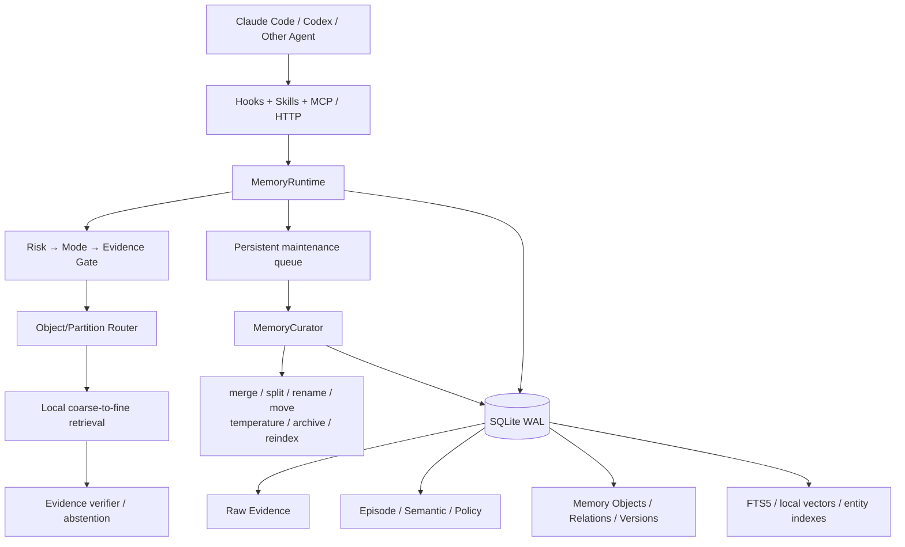
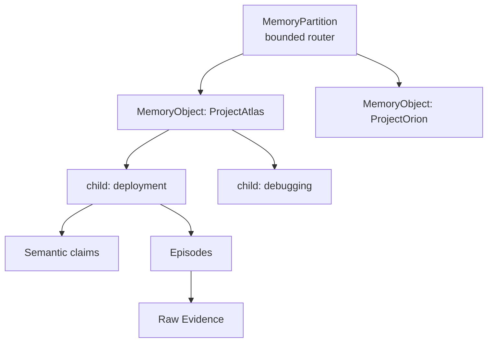
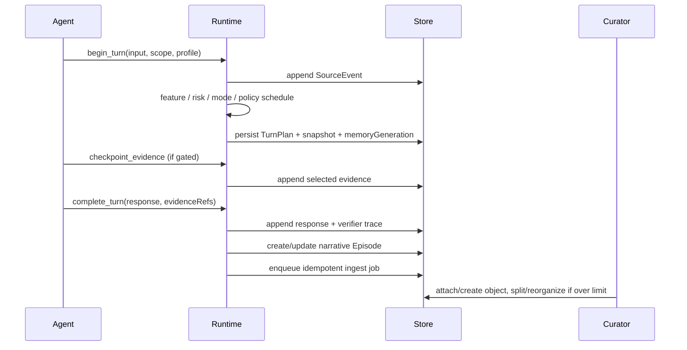
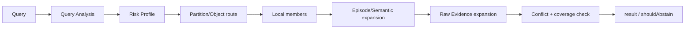

# memoryd 架构

本文描述 `0.1.0` 当前可运行实现。公共协议版本为 `1.2`，SQLite schema version 为 `7`。目标是在不替换既有 SourceEvent、WorldClaim、Episode、Policy 和风险门控链路的前提下，让记忆索引能够随规模与访问模式持续演化。

## 1. 设计不变量

1. `SourceEvent` 是 Raw Evidence 权威层。常规写入只能追加；显式 `forget` 是删除例外。
2. Episode、Semantic Memory、Memory Object、关系、摘要、FTS、embedding 和质量指标都必须可追溯或可重建。
3. 摘要只用于定位和路由，不能伪装成直接证据。
4. 当前文件、图片、测试和命令观察高于历史记忆；高污染风险必须先 checkpoint。
5. 事实、派生结论、模型推断和未解决冲突在返回结构中分开表示。
6. 维护操作保留原始节点与 evidence refs，写入版本和审计；可逆操作不允许版本号倒退。
7. 所有候选集、对象、分区、展开深度和后台批次都有配置上界。
8. 自我反思和 LLM 输出不能直接成为已确认事实或已授权 Policy。
9. user/workspace/session ACL、`snapshotRevision` 和 turn 内来源授权在服务端执行。
10. 管理动作不暴露为模型 MCP 工具；宿主安全、权限与 sandbox 始终高于记忆策略。

## 2. 组件



- `memoryd`：HTTP daemon，持有 `MemoryRuntime`、`MemoryStore` 和两个后台 worker。
- `memory-mcp`：stdio MCP 代理，通过 HTTP 调用 daemon，不单独打开数据库。
- `memoryctl`：管理、审计、Curator、导入导出、forget、reindex 和适配器安装。
- `MemoryStore`：SQLite WAL、FTS5、AES-256-GCM payload、ACL、revision、幂等与 migration。
- `MemoryCurator`：独立于正常问答的增量维护器；任务持久化、可重试、支持 dry-run 和回滚。
- `LocalHashEmbeddingProvider`：默认本地确定性 hash-ngram embedding，可替换或关闭。

## 3. 数据模型

### 3.1 权威与派生层

| 模型 | 角色 | 证据语义 |
|---|---|---|
| `RawEvidence` / `SourceEvent` | 用户/助手可见消息、选中工具证据、附件引用、checkpoint | 直接证据；常规路径不可覆盖 |
| `EpisodeMemory` | 一次交互或连续叙事片段，含时间、参与者、主题、任务/情绪状态 | `eventRefs` 指回 SourceEvent；summary 只定位 |
| `SemanticMemory` / `WorldClaim` | 稳定事实、偏好、项目约束和确认决策 | confidence、有效期、版本、来源与冲突状态 |
| `Policy` | 用户显式或人工批准的行为规则 | 独立作用域、版本、依赖和来源 |
| `MemoryObject` | 同一实体、项目、主题、作品、决策或问题的动态局部工作集 | 聚合 evidence refs；有 token/member/child 上界 |
| `MemoryRelation` | `related_to`、`caused_by`、`contradicts`、`supersedes`、`derived_from`、`part_of`、`discussed_in`、`similar_to`、`depends_on` | 一等图边，含 confidence、状态、版本、来源 |
| `MemoryVersion` | 派生记忆的 create/update/rename/merge/split/reorganize/archive/restore 历史 | 保存 before/after、算法版本、action ID |
| `Contradiction` | old/new claim、证据、preferred claim 与解决原因 | unresolved 时禁止静默 last-write-wins |
| `MemoryTemperature` | hot/warm/cold/archive 及访问统计 | 生命周期元数据，不删除原文 |

`EvidenceReference` 扩展 `SourceRef` 的角色语义；wire 层仍与原 SourceRef 兼容。所有压缩对象都保留稳定 ID、schema/version、时间、confidence、状态、summarizer/embedding 版本和 provenance。

### 3.2 对象与分区



分区按 user/workspace 建立根 namespace；session-scoped Semantic Memory 使用带 session ACL 的独立根分区，不能把私有事实摘要进 workspace Object。Episode 仍按既有语义允许同 workspace 跨 session 回忆。超过 `capacity` 时，Curator 把根分区变成 router，创建有界的 adaptive 子分区并迁移对象。后续 ingest 会先沿 routing key 选择叶分区，不会重新写回空的根 router。对象超过 token、成员、子节点、实体或质量阈值时，原对象保留为 router，成员迁入有界子对象。

这不是固定深度目录树：父子只是 `part_of` 和路由关系的一种；对象仍可通过其他关系形成图。`maxExpansionDepth` 和 bounded fan-out 防止图遍历失控。

Object 热路径不把所有对象摘要写入一个全局 FTS posting list。Router 先在有界 partition fan-out 中逐层选择叶分区，然后只读取这些分区内由 `capacity`/`maxCandidateCount` 限制的对象行并在本地打分。Schema 保留空的 `memory_objects_fts` 兼容表，但正常写入和 reindex 都不会填充它；既有 SourceEvent/WorldClaim/Episode FTS 只用于兼容接口和尚未完成对象化时的有界 fallback。

## 4. 写入流程



未选择的工具输出不会保存正文，只保留白名单元数据与 hash。显式事实纠错写 WorldClaim 新版本；显式行为要求写原作用域 Policy；非显式行为纠错进入 FailureCluster、Trigger candidate 和 Calibration shadow。

Memory Object 不在每次正常写入中同步做全库聚类。每个新 Episode/claim 只提交一个局部 ingest job；Curator 在有界候选中 attach 或 create，然后只检查受影响对象与分区。

## 5. 风险驱动的分阶段检索

`memory_retrieve` 是协议 1.2 新增的结构化 coarse-to-fine 接口。旧 `memory_recall` 继续兼容。



### 5.1 Query Analysis 与风险

Query Analysis 提取 entity、topic、time hint、任务类型和明确 archive 回溯意图。Risk Profile 包含：

- `factualRecall`
- `quoteRecall`
- `entityConfusion`
- `temporalConfusion`
- `contradictionRisk`
- `narrativeCompletionRisk`
- `lowEvidenceRisk`
- `inferenceAllowed`

风险决定 `retrievalDepth`、top-k 和置信表达：

- 普通分析：优先只加载 Object；
- 时间/叙事风险：展开到 Episode；
- 事实、原话或冲突问题：必须展开 Raw Evidence；
- 高污染 legacy risk 未 checkpoint：服务端返回 `STAGE_BLOCKED`。

### 5.2 路由与局部召回

第一阶段先按 partition routing key 选择有界叶分区，再在叶分区的有限对象行中做 title/summary/routing/entity lexical 打分。明确实体和标题命中高于公共主题词，避免相似项目串线。默认只让 hot/warm 对象进入无条件候选；cold 需要精确 title/routing/entity key 命中，archive 必须显式 `includeArchive` 或查询表达回溯意图。

路由后只遍历对象成员与有界子对象。尚未运行 Curator 的升级数据库可走一次有界 WorldClaim/Episode FTS fallback，不会退化成全量扫描。

### 5.3 Evidence-first 返回

每条 `MemoryRetrievalItem` 都带：

- `memoryType`：raw / episode / semantic / object；
- `sourceType`：direct / derived / inferred / unresolved_contradiction；
- score、confidence、timestamp；
- `evidenceRefs`、object/partition ID 和 contradiction ID。

`MemoryRetrievalResult` 还返回风险、查询分析、阶段 trace、证据覆盖率、未解决问题、冲突和 `shouldAbstain`。事实/原话检索没有足够可解析 Raw Evidence，或冲突没有 preferred claim 时，结果要求 abstain，而不是叙事补全。

`memory_get_sources` 只展开当前 turn checkpoint、活动 Policy 来源或已落盘 recall/retrieve trace 授权的 SourceRef。

## 6. 动态维护

### 6.1 Job 与审计

`maintenance_jobs` 的类型包括：

- `scan`、`ingest`
- `merge`、`split`、`rename`、`reorganize`
- `refresh_summary`
- `temperature`、`archive`
- `reindex`、`integrity_check`、`quality`

任务有稳定幂等键、pending/running/completed/failed 状态、attempt、lease、availableAt、错误和 dry-run。worker 只 claim 有界批次；过期 lease 可回收，失败按指数退避重试，达到上限后终止。

`maintenance_actions` 记录每个 planned/applied/rolled_back action 的 before/after、算法版本和 rollback token。`memory_audit_log` 记录 job 与 action 事件，内容 payload 加密。

daemon 默认每 15 秒消费队列。Raw Evidence 写入时增量更新 `memory_scope_registry`，worker 只按 workspace 数量发现维护作用域，不反复扫描持续增长的事件表；registry 按 `last_scheduled_at` 轮转有界批次，旧 workspace 不会被最近活跃 workspace 饿死。Runtime 为每个有记忆的 workspace 每小时生成至多一个幂等 periodic scan；新 Episode/claim 的 ingest job 会立即检查受影响对象的 split 与 partition capacity，因此规模上限不依赖全量扫描。

升级回填使用 SQL `NOT EXISTS` 直接选择最老的未分配 Episode/claim，再按批次交错处理；不会先截断“最近 N 条”后再过滤，因此旧数据不会在持续新写入下饥饿。

### 6.2 Merge

自动 merge 使用本地语义、主题和实体重叠。两个记录都明确命名不同实体时，分数被硬性封顶，避免“措辞相似”导致错误合并。

merge 会：

1. 创建新的聚合对象；
2. 把原对象标为 `merged`，不删除；
3. 新对象以 child member 和 `part_of` 关系引用原对象；
4. 合并但不覆盖 evidence refs；
5. 写 MemoryVersion、MaintenanceAction 和 audit；
6. 支持显式 rollback。

强制跨实体 merge 只通过管理 CLI `--force`，不由自动聚类执行。

### 6.3 Split

以下任一信号可建议 split：

- `maxNodeTokens`
- `maxObjectMembers`
- `maxChildCount`
- `maxEntitiesPerObject`
- precision proxy 低于阈值
- 受支持的子主题簇达到阈值
- 多次检索的 query hit 分散到过多同级对象
- locator summary 与当前成员证据的 fidelity 过低
- 对象反复进入路由、但最终只使用其中局部/其他对象内容
- expansion depth 超限

检索类信号只有达到 `minimumRetrievalSamples` 才参与决策，避免一次查询造成结构震荡。达到 `splitMinMembers` 后，Curator 先按明确实体/主题聚类；没有稳定标签时使用确定性平衡桶。父对象转为 router，子对象有 `targetObjectMembers` 上界；原成员在父对象标 removed，不删除 Episode/claim/Raw Evidence。

### 6.4 Rename、move 与 reindex

- rename 更新 title/routing keys，保留稳定 object ID，写新版本并可回滚；
- reorganize 把超容量分区变为 router，并把对象迁入子分区；
- split/merge 重建父子成员和 `part_of` 图边；
- refresh summary 从成员原文/claim 重建 locator；
- `memoryctl reindex` 重建 FTS、source links、narrative Episode、本地 embedding bucket 和 entity owner index；
- 已废弃或 rollback 创建的对象标 `deprecated`，不伪装成活跃节点。

## 7. Hot / Warm / Cold / Archive

热度综合：

- 最近访问/提及；
- access、retrieval、mention 次数；
- 用户明确长期记住；
- active project；
- pin；
- 时间衰减。

策略：

| Tier | 路由行为 |
|---|---|
| Hot | 完整摘要，优先路由 |
| Warm | 正常对象索引 |
| Cold | 稀疏摘要；只有精确 key 命中才进入候选 |
| Archive | 默认排除；显式回溯才展开 |

显式命中 cold/archive 会把温度聚合记录提升到 warm。归档不删除 Raw Evidence；删除只能通过 `forget`。

## 8. 冲突与版本

显式事实更正创建新 WorldClaim 版本。若前一版本在当前 turn snapshot 之后才出现，则新旧版本都标 disputed，并创建 unresolved `Contradiction`；不会根据写入顺序选择赢家。

顺序明确的用户更正也保留旧版本和 resolved Contradiction，并记录 preferred claim 与解决原因。时间变化事实可用 `validFrom/validTo` 和 `temporal/coexisting` 状态共存。

对象维护版本严格单调。rollback 恢复旧内容时创建新的 `restore` 版本，而不是把数据库版本号倒退；新增对象标 deprecated、新增关系 revoked、新增成员 removed、新分区 archived。

## 9. SQLite schema 与迁移

当前 schema v7：

- v1–v3：SourceEvent、turn、WorldClaim、Policy、Episode、纠错、trace、FTS、来源、tombstone；
- v4：session lifecycle、Trigger activation、learning jobs；
- v5：embedding bucket；
- v6：实体关系 owner 索引；
- v7：scope registry、partition/object/member/relation/version/contradiction/temperature、retrieval trace、maintenance job/action/audit、quality metrics 和 `memory_generation`。

迁移使用 `BEGIN IMMEDIATE`，每一版本成功后才推进 `PRAGMA user_version`；失败会 rollback 当前 migration。v6→v7 只新增表和 metadata，不重写 Raw Evidence。派生对象可以在升级后由 Curator 渐进生成。

加密 export/import 包含 v7 的对象、成员、分区、关系、版本、冲突和温度；FTS、embedding、图派生边和 cache 在导入后重建。tombstone 优先，乱序导入不能复活已删除实体。

## 10. 配置与容量指标

所有阈值来自 `MemoryEvolutionConfig`，对应 `MEMORYD_*` 环境变量，不写死在业务分支。重点配置：

| 类别 | 配置 |
|---|---|
| 对象上界 | `MAX_NODE_TOKENS`、`MAX_OBJECT_MEMBERS`、`TARGET_OBJECT_MEMBERS`、`MAX_CHILD_COUNT`、`MAX_ENTITIES_PER_OBJECT` |
| 检索上界 | `MAX_CANDIDATE_COUNT`、`MAX_ROUTED_OBJECTS`、`MAX_EXPANSION_DEPTH` |
| 质量阈值 | `MIN_PRECISION_PROXY`、`MIN_RECALL_PROXY`、`MIN_EVIDENCE_COVERAGE`、`MIN_SUBTOPIC_CLUSTERS`、`MAX_QUERY_HIT_DISPERSION`、`MIN_SUMMARY_FIDELITY`、`MIN_LOCAL_USE_RATIO`、`MIN_RETRIEVAL_SAMPLES`、`MAX_CONTRADICTION_RATE`、`MAX_STALE_SUMMARY_RATE`、`MAX_ORPHAN_RATE`、`MAX_MAINTENANCE_BACKLOG` |
| 生命周期 | `HOT_THRESHOLD`、`WARM_THRESHOLD`、`COLD_THRESHOLD`、`COLD_AFTER_DAYS`、`ARCHIVE_AFTER_DAYS` |
| Worker | `CURATOR_INTERVAL_MS`、`CURATOR_BATCH_SIZE`、`MAINTENANCE_LEASE_MS`、`MAINTENANCE_MAX_ATTEMPTS` |

`MemoryQualityMetrics` 持久化 candidate count、retrieval samples、子主题簇数、query-hit dispersion、summary fidelity、local-use ratio、precision/recall proxy、平均展开深度、evidence coverage、contradiction/stale/orphan rate 和 backlog。proxy 用于维护信号和回归观察，不宣称是标注集上的真实 precision/recall。

## 11. 调试与观测

```bash
memoryctl doctor
memoryctl inspect --all
memoryctl curate jobs
memoryctl curate scan --dry-run
memoryctl curate quality
memoryctl curate integrity_check
memoryctl curate split --object <id> --dry-run
memoryctl curate rollback <action-id>
memoryctl reindex
```

调试检索时查看：

1. TurnPlan 的 legacy risk、gate、`snapshotRevision` 和 `memoryGeneration`；
2. `MemoryRetrievalResult.trace` 的 routed/returned partition/object、阶段候选数和 expansion depth；
3. item 的 `sourceType` 与 evidence refs；
4. evidence coverage、unresolved contradiction 和 `shouldAbstain`；
5. `memoryctl inspect --all` 中的 temperature、quality、job 与 audit。

## 12. 安全与当前边界

- payload 先按已知凭据模式脱敏，再用 AES-256-GCM 加密；FTS 和部分路由字段是脱敏明文索引，不是整库加密。
- 默认 loopback + 可选服务级 Bearer token；当前是单个受信本地用户模型，不是多租户服务。
- 历史内容始终标为 untrusted evidence；只有已批准 Policy 是记忆侧行为规则。
- hook 失败进入加密 spool；普通任务可以降级继续，但不得声称成功召回。

仍未实现：

- 连续云同步、CRDT、多设备 workspace 自动重映射；
- 从任意对话自动确认结构化事实；
- 通用神经 embedding/ANN、LLM 聚类器和自动关系抽取；
- 任意深度知识图推理或全语义 verifier；
- 学习 Policy 的无人审批授权；
- 强多用户认证、远程 TLS、密钥轮换和自动备份。

扩展新记忆类型时，应实现：稳定 ID、provenance/source refs、ACL、版本/删除语义、局部索引、Curator materializer、质量指标和 bounded retrieval；不要把新类型直接加入一个无界全局索引。
